# Go-Harness-Tutorial

从零构建一个 Go 语言 Agent Harness 框架的完整教程。

## 背景

**智能体 = 大模型 + Harness**

大模型提供推理的"大脑"，Harness 提供执行、记忆与安全保障的"身体"。本教程教你动手实现后者——一个完整的、基于 Go 语言的 Agent Harness 系统。

本教程完全基于《智能体 Harness 工程指南》（yeasy.gitbook.io/harness_engineering_guide）中提出的工程原则，不依赖于任何现有 Agent 框架，从零开始逐层构建。

## 前置知识

- Go 语言基础（接口、结构体、goroutine、context 包）
- 了解大模型 API 基本概念（Chat Completion、Tool Call、Streaming）
- Go 1.26 环境

## Harness 工程五大原则

贯穿本教程的五大设计原则：

| 原则 | 核心思想 |
|------|---------|
| **约束优先** | 先设定 Agent 能做什么、不能做什么，再赋予能力 |
| **可验证性** | 每个步骤的输出都应可验证、可审计 |
| **渐进信任** | 从最小权限开始，逐步开放能力 |
| **故障假设** | 默认一切都会出错，设计容错机制 |
| **智能体工学** | 像工程学一样系统化构建，而非"提示词艺术" |

## 学习路线

```mermaid
graph LR
    subgraph P1["Part 1: 基础篇"]
        CH01["01 导论<br/>+ 脚手架"]
        CH02["02 架构<br/>全景"]
    end
    
    subgraph P2["Part 2: 核心子系统"]
        CH03["03 运行时<br/>引擎"]
        CH04["04 工具层"]
        CH05["05 记忆<br/>子系统"]
        CH06["06 模型<br/>集成"]
        CH07["07 输出<br/>治理"]
    end
    
    subgraph P3["Part 3: 系统集成"]
        CH08["08 编排<br/>引擎"]
        CH09["09 MCP<br/>协议"]
        CH10["10 生产化"]
        CH11["11 容错"]
    end
    
    subgraph P4["Part 4: 安全与实战"]
        CH12["12 安全<br/>体系"]
        CH13["13 JD 智能<br/>客服 🏆"]
    end
    
    P1 --> P2 --> P3 --> P4
    
    style P1 fill:#e8f4f8
    style P2 fill:#d4edda
    style P3 fill:#fff3cd
    style P4 fill:#f8d7da
```

| 部分 | 章节 | 核心内容 |
|------|------|---------|
| Part 1: 基础篇 | 第 1-2 章 | 概念 + 架构 |
| Part 2: 核心子系统 | 第 3-7 章 | 引擎 → 工具 → 记忆 → 模型 → 输出治理 |
| Part 3: 系统集成 | 第 8-11 章 | 编排 → MCP → 生产化 → 容错 |
| Part 4: 安全与实战 | 第 12-13 章 | 安全 → JD 智能客服 |

## 目录

| 章 | 主题 | 核心产出 |
|----|------|---------|
| 01 | [Harness 导论 + 项目脚手架](docs/01-introduction.md) | 项目结构、核心类型定义 |
| 02 | [参考架构全景](docs/02-architecture.md) | 六层架构设计、Harness 结构体 |
| 03 | [运行时引擎](docs/03-runtime-engine.md) | Agent 结构体、Run 循环、ToolCall 执行 |
| 04 | [工具层](docs/04-tool-layer.md) | Tool 接口、Registry、Calculator/File 实现 |
| 05 | [记忆子系统](docs/05-memory.md) | BufferMemory、消息窗口管理 |
| 06 | [模型集成](docs/06-model-integration.md) | Model 接口、OpenAI/DeepSeek Provider |
| 07 | [输出治理](docs/07-output-governance.md) | 格式校验、幻觉检测 |
| 08 | [编排引擎](docs/08-orchestration.md) | Team（3模式）+ Workflow（4节点） |
| 09 | [MCP 协议](docs/09-mcp-integration.md) | JSON-RPC 客户端、工具发现 |
| 10 | [生产化](docs/10-production.md) | 配置管理、结构化日志、插件注册 |
| 11 | [容错与可靠性](docs/11-reliability.md) | 重试、断路器、可观测性 |
| 12 | [安全体系](docs/12-security.md) | 权限、注入检测、PII 脱敏 |
| 13 | [🏆 JD 智能客服](docs/13-jd-customer-service.md) | 完整工程示例 |

## 配套源码

`src/` 目录包含完整的 Go 参考实现，每章的代码对应 `src/internal/` 下的子包。建议一边阅读教程一边对照源码。

## 参考资源

- [《智能体 Harness 工程指南》](https://yeasy.gitbook.io/harness_engineering_guide)
- [OpenAI API 文档](https://platform.openai.com/docs/api-reference)
- [MCP 协议规范](https://modelcontextprotocol.io)
