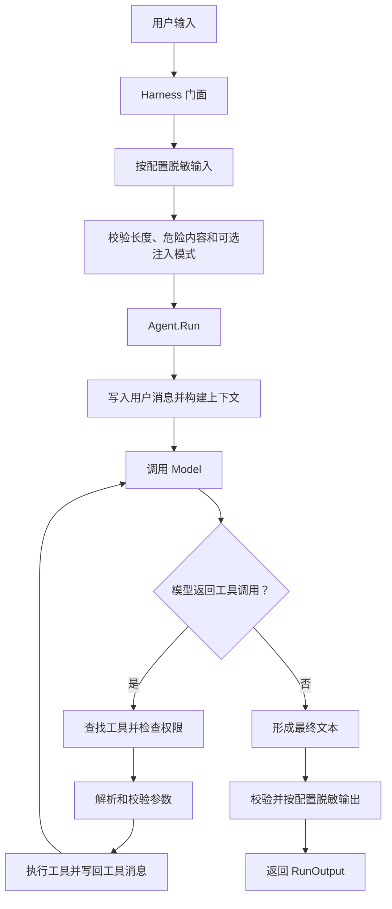

# 学习路线与设计决策总览

这份文档是 13 章教程的入口。它不急着介绍每个结构体，而是先回答一个更重要的问题：**为什么一个能调用大模型的程序，还需要 Harness？**

本文以当前仓库代码为准。阅读其他章节时，请区分三类内容：

- **已实现**：仓库中已有公开 API，并且可以直接运行。
- **教学示例**：为解释某个设计而简化的代码，思路与仓库一致，但不一定能原样替换源码。
- **扩展设计**：生产系统通常需要、但当前版本尚未内置的能力。

如果教程描述与代码冲突，代码和测试是事实来源；教程应随代码一起修订。

## 0.1 先建立正确的心智模型

大模型擅长理解自然语言和生成候选方案，但它不是一个可靠的执行器。它可能输出错误参数、请求不存在的工具、重复调用工具，或迟迟不给出最终答案。Harness 的工作，是用确定性的程序包住概率性的模型。

```text
概率性部分：理解意图、选择工具、组织答案
                    │
                    ▼
确定性边界：输入校验 → 有界循环 → 权限检查 → 参数校验 → 执行 → 输出治理
```

因此，设计 Harness 时不要从“怎样写一个更长的 Prompt”开始，而要从下面五个问题开始：

1. 模型可以提出什么动作？
2. 哪段代码决定动作是否允许？
3. 动作失败后，错误如何回到模型或调用方？
4. 循环在什么条件下必须停止？
5. 哪些状态属于一次运行、一次会话或整个服务？

这五个问题分别落到 `tool`、`security`、`engine`、`memory`、`workflow` 和根包 `agent` 中。

## 0.2 一次 Agent 调用究竟发生了什么

以 `Harness.RunAgent` 为入口，一次调用分成两个循环：外层是安全边界，内层是模型与工具的验证循环。



这个流程体现了三条核心不变量：

- 模型只能**请求**工具调用，不能绕过 Registry 直接执行代码。
- 每次运行都有 `MaxLoops` 上限，并受 `context.Context` 取消控制。
- 通过 Harness 入口运行时，输入和最终输出都经过治理；直接调用 `Agent.Run` 则由调用方承担这层责任。

最后一点很容易被初学者忽略。`Harness` 不是多余的包装，它是应用边界；`engine.Agent` 是可独立复用的运行内核。

## 0.3 为什么要分成这些包

仓库没有把所有类型放进根包，也没有在根包中为子包类型创建别名。这样做是为了让依赖方向保持清楚：

```text
types ← model / memory
model ← tool / mcp
model + memory + tool + types ← engine
engine + model ← workflow
所有公开子系统 ← 根包 agent
```

设计含义如下：

- `types` 只放跨层稳定协议，例如消息、工具调用和错误码。把业务配置塞进这里会让它变成“杂物包”。
- `model` 不依赖 `engine`，所以自定义模型可以在不知道运行循环细节的情况下实现。
- `tool` 依赖模型的工具定义协议，但工具本身不知道 Agent 怎样循环。
- `engine` 负责组装 Model、Memory 和 Tool，不反向污染底层接口。
- `workflow` 调用 Agent，却不让 Agent 知道自己是否位于 Team 或 Workflow 中。
- 根包 `agent` 负责依赖注入、安全边界和注册表，是 façade，不是所有公共类型的搬运站。

当你增加新功能时，可以用一个简单规则判断放在哪里：**谁拥有这项能力的生命周期，类型就优先放到谁的包中。**

### 公共库与上层应用的边界

这个仓库是通用 Harness，不是聊天产品，也不是某个领域的业务系统。调用方可以依赖它构建 Agent，但依赖方向只能从应用指向库：

| 公共 Harness 负责 | 上层应用负责 |
|---|---|
| Agent 有界循环、Task/Turn/Item 协议、检查点和取消 | 数据库或文件保存、任务列表、搜索、标题与归档 |
| Model、Tool、Memory 的通用接口 | 业务字段、查询参数和业务校验规则 |
| Registry、权限检查和输入输出治理 | 业务 Tool/MCP Server 及其鉴权 |
| Team、Workflow 和并发安全 State | 页面、SSE/WebSocket、断线补发和产品交互 |
| Sequence、结构化事件和可识别错误 | 用户、租户、权限、加密和数据保留策略 |

为什么不能把应用概念提前放进库？因为公共库一旦认识具体表结构、页面对象或产品流程，其他应用就必须携带无关依赖。`EventSink` 因此只是事件交付与确认协议，不是存储接口：库不会查询、修改或删除调用方数据，也不提供数据库、JSONL 实现或默认目录。

## 0.4 十二个关键设计决策

### 决策一：用接口隔离变化，而不是为了“抽象而抽象”

`Model`、`Memory`、`Tool`、`Node` 和安全组件使用接口，是因为它们确实存在多个实现或替换需求。`RunOutput` 等稳定结果则直接使用结构体，避免无意义的接口层。

判断是否需要接口时，可以问：

- 测试时是否需要替换它？
- 部署环境是否可能更换实现？
- 上层是否只需要一组稳定行为，而不应知道内部状态？

如果三个答案都是“否”，优先使用普通结构体。

### 决策二：`vendor` 与 `api_format` 分离

`vendor` 只表示供应商身份，`api_format` 才决定使用哪一种 HTTP 协议实现。二者不能绑定，因为一个供应商可能兼容多种协议，一个兼容端点也可能由不同供应商提供。

```text
vendor = deepseek          用于身份、日志和运维识别
api_format = anthropic_message  决定 BuildModel 的实现分支
base_url / model_id        明确描述实际连接目标
```

代价是配置项更多；收益是不会在代码里堆积“如果供应商是 X，就猜测 URL 和协议”的隐式规则。

### 决策三：工具调用参数保留原始 JSON 字符串

模型返回的工具参数先保存在 `ToolCallFunction.Arguments string` 中，运行时再解析为 `map[string]any`。原因是参数结构属于具体工具，跨层协议不应该提前绑定某个业务结构体。

执行顺序必须是：

```text
JSON 解析 → Tool.Validate → Tool.Execute → JSON 序列化结果 → 写回 Memory
```

解析失败、校验失败和执行失败是不同故障，不能合并成一句“工具失败”，否则上层无法决定是否重试或修正参数。

### 决策四：验证循环必须有界

模型可能连续请求工具，所以 Agent 不能只调用一次 Model；但无限循环又会造成成本和资源失控。`MaxLoops` 是安全预算，不只是性能参数。

当前循环的终止条件是：

- 模型返回零个 ToolCall：成功结束；
- `context.Context` 被取消：失败结束；
- 模型调用失败：失败结束；
- 达到 `MaxLoops`：以 `MAX_LOOPS_EXCEEDED` 失败结束。

工具执行失败目前会以 `error: ...` 工具消息写回上下文，让模型有机会解释、修正参数或选择其他工具。这是一种“让模型看到可恢复故障”的设计。

### 决策五：Memory 属于 Agent 实例，不自动等于用户会话

`Harness.CreateAgent` 会为每个 Agent 创建一个 `BufferMemory`。同一个 Agent 的多次 `Run` 会共享这份记忆，所以它天然支持连续上下文，却不能天然隔离多个用户。

```text
一个有状态 Agent 实例 + 多个用户调用
                ↓
Run Gate 将执行串行化，避免消息在单次 Run 中交错
                ↓
但后一个用户仍会看到前一个用户留下的历史，仍然属于会话串线
```

Run Gate 使用可被 Context 取消的通道信号量，而不是普通 Mutex：等待同一 Agent 的前一个 Run 完成时，请求仍能按截止时间退出。它解决的是“共享状态的一致性”，不解决“共享状态的租户隔离”。因此，Demo 可以复用一个 Agent；生产服务应按 Session 选择 Memory、为会话创建 Agent，或实现会话路由层。`MemoryConfig.Type` 当前只支持 `buffer`，其他实现属于扩展点。

### 决策六：Registry 将“模型看见的能力”与“程序能执行的能力”统一

注册到同一个 `tool.Registry` 的 Tool 同时提供：

- 给模型看的名称、描述和参数 Schema；
- 给运行时用的校验和执行方法。

这避免了“Prompt 中声明了一个工具，但程序没有对应实现”的双份配置。Registry 使用 `RWMutex`，读多写少的运行场景下可以并发查找；注册时拒绝 nil Tool、空名称、Definition 名称不一致和同名覆盖；`List` 与 `Names` 按名称排序，使发给模型的工具顺序保持确定。

共享 Registry 不等于所有 Agent 都应获得全部能力。`CreateAgent` 默认保持“看见整个 Registry”的原有行为；生产中的多 Agent 系统应优先使用 `CreateAgentWithTools` 声明最小工具集合。Engine 会在生成 Model 请求时过滤 ToolDefinition，并在真正执行前再次检查白名单。前者减少模型误选，后者防止恶意或错误的自定义 Model 直接请求隐藏工具。

### 决策七：权限检查放在执行前，而不是相信模型

工具是否可用不能由 Prompt 决定。`RequiredPermission` 将高风险内置工具映射到权限，`Agent.executeToolCall` 在参数解析和执行前调用权限检查。

当前模式语义是：

| 模式 | 启动时权限 | 适用场景 |
|---|---|---|
| `strict` | 不授予任何受控权限，调用方使用 `AllowPermissions` 明确开放 | 生产或最小权限环境 |
| `permissive` | 授予内置权限集合 | 本地开发和可信 Demo |

权限映射只覆盖已知高风险工具和 `mcp_` 前缀工具。自定义高风险 Tool 应扩展权限策略，不能因为“不在映射里”就认为已经安全。

### 决策八：Team 与 Workflow 解决不同层次的问题

`Team` 提供三种固定协作模式：顺序、并行、领导者汇总。它适合“同一输入交给一组 Agent”的问题。

当前 `Workflow` 不是通用 DAG 引擎。它按 `AddNode` 顺序执行顶层节点，并通过 `ConditionNode`、`LoopNode`、`ParallelNode` 组合出分支、循环和局部并发。这种结构更像可组合的控制流解释器：实现简单、行为容易预测，但没有任意边、拓扑排序或环检测；Task 模式只为这套既有控制流增加检查点协议。

选择原则：

- 只需固定多人协作：使用 Team；
- 需要显式步骤、分支、循环或共享 State：使用 Workflow；
- 需要任意 DAG 或分布式调度：在当前 Workflow 之上扩展；只需要现有控制流的安全检查点时使用 Task 模式。

### 决策九：MCP 初始化是显式 I/O

`agent.New` 只根据配置创建 MCP Client，不主动访问网络。调用方需要显式执行 `InitMCPClients(ctx)`，它会初始化客户端、发现全部工具，并为每个远端工具注册一个带命名空间的适配器：

```text
远端工具 search + 客户端名称 docs
              ↓
本地名称 mcp_docs_search
```

显式初始化使启动阶段的网络失败可被调用方控制，也让离线测试无需连接 MCP Server。

### 决策十：可靠性策略必须放在正确层级

普通同步 API 保持单次模型调用；Task 模式已经内置有预算的模型重试和按 Model 实例隔离的断路器。Tool 不由这套策略自动重试，因为 Tool 可能产生外部副作用。

不要在所有层同时重试。否则一次用户请求可能形成“网关重试 × Agent 重试 × Provider 重试”的乘法放大。通常应由最了解幂等性和错误分类的层负责：

- HTTP 状态与响应解析：Model Provider 负责分类；Task Runtime 消耗模型重试预算；
- 业务工具是否可重试：具体 Tool 或业务服务层；
- 整个工作流是否重放：应用层，需要幂等键和状态记录。

### 决策十一：公共库只管理自己的依赖，不修改进程全局状态

`agent.New` 会完成默认值归一化、配置校验和依赖组装，但不会调用 `slog.SetDefault`。原因是一个公共库可能与 Web 框架、数据库驱动和其他库运行在同一进程中；擅自替换全局 logger 会改变宿主程序的行为。

应用可用 `agent.WithLogger(logger)` 注入自己的 logger。未注入时，Harness 创建一个符合 `log_level` 的私有 logger。这里体现了两类配置的分工：

| 类型 | 例子 | 为什么这样传递 |
|---|---|---|
| 可序列化配置 | model、timeout、memory capacity、MCP URL | 适合 JSON、环境差异和启动校验 |
| 运行时依赖 | logger、安全策略实现、预构造 MCP Client | 含接口、连接或函数，适合 Functional Options 注入 |

把所有东西都塞进 JSON 会迫使库用反射或全局注册表寻找实现；把所有东西都写成 Option 又会失去可审计的部署配置。两种机制组合，边界更清楚。

### 决策十二：运行事件不等于聊天记录

Task Runtime 发出的是完整的运行事实，上层聊天应用保存的是经过产品规则筛选的正式记录。两者不能合并成一个布尔字段：文本增量和重试等待适合实时显示，用户消息、最终回答、询问与答案适合进入正式记录，检查点只供恢复使用。库用 `best_effort` 与 `required_ack` 描述交付强度，但最终保存和展示规则由上层决定。

所谓“正在思考”也不是模型隐藏推理。库只允许输出引擎阶段和不超过 200 字的用户可读进度摘要；隐藏推理既不输出，也不写入检查点。客户端耗时根据 `turn.started` 本地计算，结束后固定使用事件中的 `ElapsedMS`。

## 0.5 当前能力边界

| 能力 | 当前状态 | 初学者应记住的边界 |
|---|---|---|
| Agent 工具循环 | 已实现 | 最大循环默认 10，可按单次 Run 覆盖 |
| 流式输出 | 已实现 | 回调接收文本片段，最终仍返回完整 `RunOutput` |
| BufferMemory | 已实现 | 旧同步 API 的 Agent 内共享记忆 |
| Task Runtime | 已实现 | 调用方提供 TaskID；异步 Turn 不随客户端断开自动取消 |
| Task 会话隔离 | 已实现 | 每个 `(TaskID, AgentID)` 使用独立 SummaryMemory 和运行闸门 |
| 结构化交互 | 已实现 | `request_user_input` 形成安全检查点并在原 Turn/ToolCall 上继续 |
| 自定义 Model/Tool/Memory | 已实现 | 从所属子包导入，根包不做类型别名 |
| Team | 已实现 | 三种固定模式；并行结果按 Agent 顺序合并 |
| Workflow | 已实现 | 顺序顶层节点 + 可组合控制节点，不是通用 DAG |
| 输入/输出治理 | 已实现 | 通过 Harness 入口才自动执行 |
| 权限管理 | 已实现 | 只对映射到权限的工具生效 |
| MCP HTTP 工具发现 | 已实现 | 必须显式初始化；Stdio 未实现 |
| 多模型 HTTP 协议 | 已实现 | 协议由 `api_format` 选择，不根据 `vendor` 猜测 |
| Model HTTP 防御 | 已实现 | 普通/错误响应有大小上限；超时、取消、429 可分类；支持注入 HTTP Client/Header |
| 安全组件创建 | 已实现 | 使用返回 error 的 `Create*`；多 Agent 用 `CreateAgentWithTools` 缩小能力 |
| 内置文件/HTTP 工具 | 已实现 | 文件限制在目录根且阻止越界链接；HTTP 默认拒绝私网并限制重定向、超时、正文 |
| 自动重试/断路器 | Task 模式已实现 | 默认共 5 次模型尝试；旧同步 API 仍为一次；Tool 不自动重试 |
| Summary Memory | Task 模式已实现 | 50 条触发、保留最近 20 条、100 条硬上限；调用方决定是否保存 |
| 持久化 | 上层职责 | 库只发 `checkpoint.ready`，不提供数据库、文件实现或默认目录 |
| RunID 自动关联 | 部分实现 | Agent 自动生成 RunID；Session/User 由应用写入，父子 Run 与 Workflow/Team 全链路仍待扩展 |

## 0.6 推荐学习顺序

### 第一遍：先跑通，不改代码

1. 阅读本文和第 1 章，理解 Harness 的边界。
2. 使用 Mock 运行 README 的最小示例。
3. 运行 JD Demo，观察 Agent、Workflow 和安全日志。

```powershell
go test ./...
go run ./cmd/jd-cs-service
```

Mock 的价值不是模拟模型智能，而是让组装、注册、运行和错误路径在无网络、无密钥时仍可验证。

### 第二遍：顺着一条请求读源码

按以下顺序打开代码：

1. `harness.go`：应用边界和依赖组装；
2. `engine/agent.go`：验证循环；
3. `model/interface.go`：运行时与供应商的协议；
4. `tool/interface.go` 与 `tool/registry.go`：能力声明和执行；
5. `memory/buffer.go`：上下文所有权与裁剪；
6. `workflow/workflow.go`：组合控制流；
7. `security/`：确定性安全边界。

每读一个函数，都问三件事：输入是否被复制或共享、错误交给谁处理、取消信号是否继续向下传播。

### 第三遍：做一个最小扩展

建议先实现只读 Tool，例如查询静态库存：

1. 用 `BaseTool` 描述名称和 Schema；
2. 在 `Execute` 中实现业务逻辑；
3. 写 Tool 单元测试，覆盖缺参和正常结果；
4. 注册到 Harness；
5. 用 Mock 或可控 Model 验证一次 ToolCall 循环。

先做只读工具，是为了把“模型能调用”与“模型可以修改外部状态”分开学习。

### 第四遍：再考虑生产扩展

生产化不是简单地把 Mock 换成真实模型。至少需要回答：

- Session 如何隔离？
- 写操作如何鉴权、审计和保证幂等？
- Provider 的超时和重试预算是多少？
- 日志中哪些字段可能包含敏感信息？
- Workflow 失败后从头重跑还是从步骤恢复？
- 失败时需要保留哪些结构化错误、RunID 和安全日志，才能完成排查？

这些问题没有统一默认答案，因此当前库以接口和小型实现提供扩展点，而没有把某一套基础设施写死。

## 0.7 章节导航：每章真正要回答的问题

| 章节 | 不只是学习 API，而是回答 |
|---|---|
| 01 工程导论 | 为什么模型外面必须有确定性边界？ |
| 02 架构全景 | 依赖如何单向流动，谁拥有生命周期？ |
| 03 运行时引擎 | 工具循环怎样继续，又怎样可靠停止？ |
| 04 工具层 | 如何把模型建议变成可校验、可授权的动作？ |
| 05 记忆 | 上下文属于谁，何时裁剪，如何隔离会话？ |
| 06 模型集成 | 如何隔离供应商协议差异，又避免隐式猜测？ |
| 07 输出治理 | 哪些检查应放在模型调用前后？ |
| 08 编排 | 固定协作与显式流程应如何选择？ |
| 09 MCP | 如何把远端能力适配为本地 Tool，同时保留安全边界？ |
| 10 生产化 | 配置、日志和注册机制怎样支持环境变化？ |
| 11 可靠性 | 哪些错误能重试，预算和幂等性由谁负责？ |
| 12 安全 | Prompt 约束与代码强制策略的边界在哪里？ |
| 13 JD 客服 | 如何把前述决策组合成一个可运行的业务示例？ |

## 0.8 常见误区与排查顺序

### “工具注册了，为什么模型没有调用？”

依次检查 Tool 是否注册到 Agent 使用的同一个 Registry、`Definition` 是否清晰、参数 Schema 是否正确、Model Provider 是否支持工具调用。工具“可见”不等于模型“一定选择”。

### “配置了工具，为什么执行时权限不足？”

`allowed_tools` 只决定是否注册内置 Tool，权限系统决定是否允许执行。`strict` 模式下还要显式调用 `AllowPermissions`。

### “两个用户为什么看到了彼此上下文？”

检查是否复用了同一个 Agent。Memory 属于 Agent 实例，不会自动按 `SessionID` 分片。同一 Agent 的 Run 虽然会串行执行以防消息交错，但历史仍然共享；并发安全不等于租户隔离。

### “为什么直接调用 Agent.Run 没有脱敏？”

安全治理位于 Harness façade。直接使用 engine 是高级扩展入口，调用方必须自行注入权限检查并处理输入输出治理。

### “为什么 Workflow 没有按图的边跳转？”

当前 Workflow 顶层按添加顺序执行。分支关系必须通过 ConditionNode 等组合节点表达，它不是任意边驱动的 DAG 调度器。

### “设置了 mcp_clients，为什么 Registry 中没有远端工具？”

创建 Harness 后还需要调用 `InitMCPClients(ctx)`。配置阶段不自动执行网络 I/O。

### “为什么修改 log_level 没有改变应用的 slog.Default？”

这是有意的库边界。Harness 只为自己的组件创建 logger，不修改宿主进程全局状态。需要统一日志格式时，由应用创建 logger 并通过 `agent.WithLogger` 注入。

## 0.9 如何维护教程与代码一致

修改公共 API 时，应同时完成四件事：

1. 更新所属包的源码和测试；
2. 搜索教程中的旧符号与旧行为描述；
3. 把“已实现”和“扩展设计”分开表述；
4. 运行 `go test ./...`、`go test -race ./...` 和 `go vet ./...`。

教程中的代码片段如果为了教学省略了锁、错误处理或字段，应明确写成“简化示意”。对初学者而言，最危险的不是代码少，而是不知道哪些部分被省略了。

## 0.10 初学者做设计评审时可以问什么

面对一个新需求，例如“增加外部实时数据查询工具”，不要立刻开始写 HTTP 请求。先按下面顺序做一次小型设计评审：

1. **能力归属**：这是 Model、Tool、Memory 还是 Workflow 的职责？实时数据查询通常是 Tool；远端标准化接入可以是 MCP Tool。
2. **输入契约**：参数有哪些类型、范围和互斥关系？Schema 是否能让模型在调用前就看懂约束？
3. **权限边界**：只读查询与控制指令是否分开授权？不能只靠工具描述里的“请勿修改”。
4. **生命周期**：连接、缓存和会话由谁创建、复用和关闭？公共库是否需要暴露 `Close`？
5. **失败语义**：超时、数据过期、无数据、权限不足分别返回什么？哪些错误能反馈给模型修正，哪些必须立即终止？
6. **预算**：一次 Run 最多多少轮、多少次远端调用、多少 Token、总截止时间是多少？
7. **关联标识**：RunID、SessionID 和上游 request ID 如何贯穿 Model、Tool 与 MCP？
8. **诊断证据**：失败时要保留哪些错误码、上游 request ID 和安全日志？哪些敏感字段不能写入日志？
9. **并发模型**：对象是否会被多个 goroutine 共享？哪些字段不可变，哪些字段需要锁，慢 I/O 是否在锁外？
10. **能力边界**：当前实现做了什么、没做什么？扩展方案要明确标注，避免读者误认为已经可用。

这十个问题基本对应本仓库的包边界。能回答它们，才算理解了设计；只会复制构造函数，还不能判断系统在异常和并发下会发生什么。
