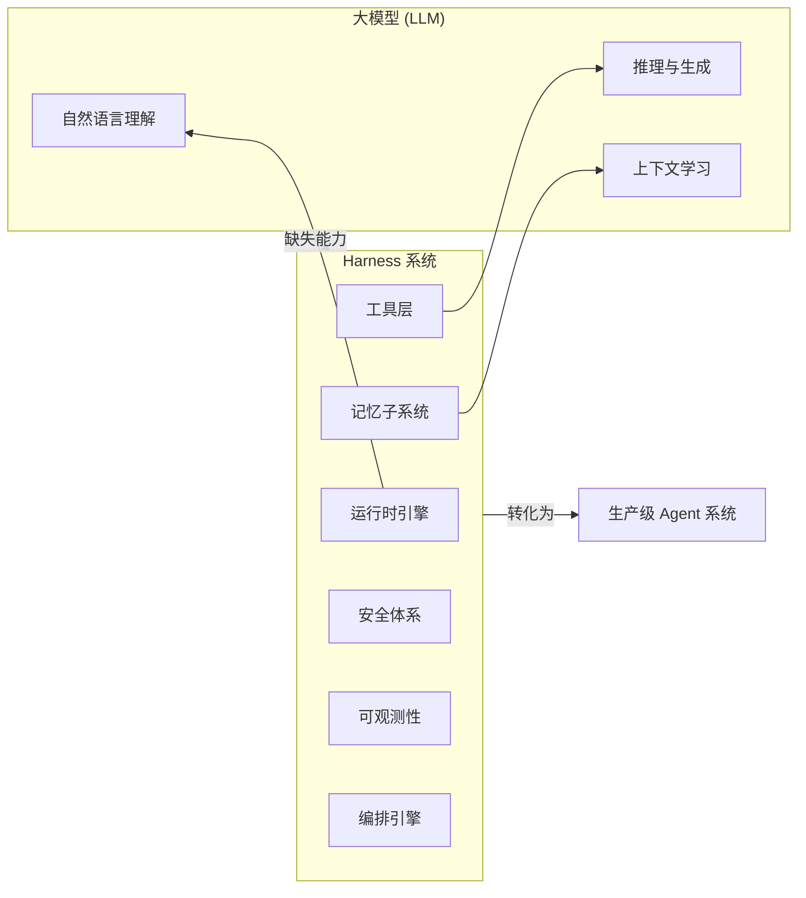
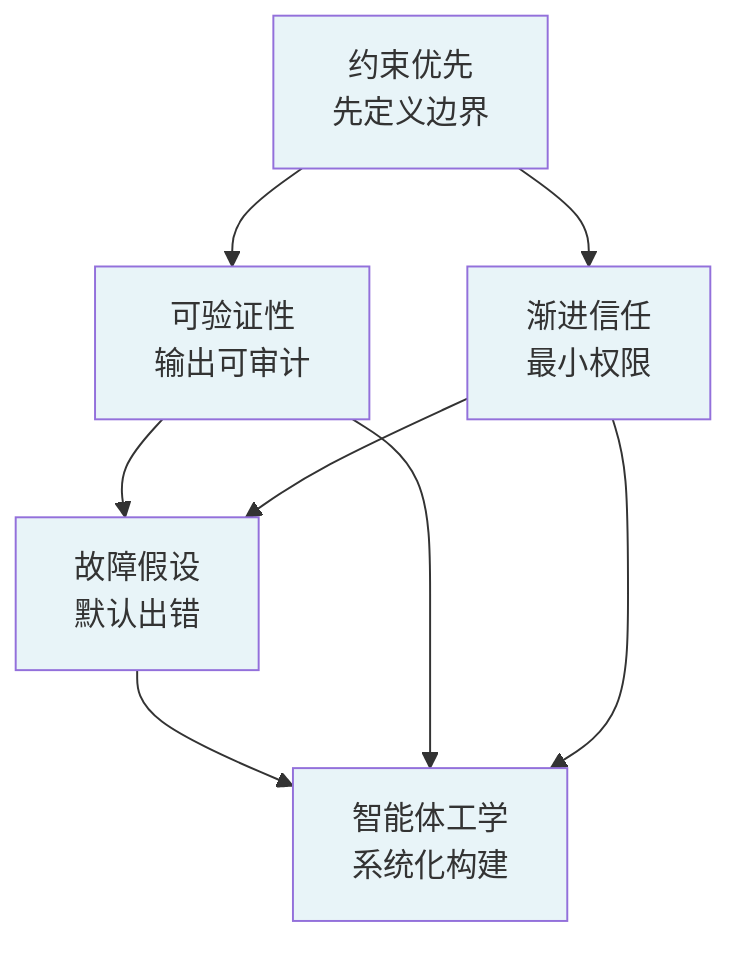
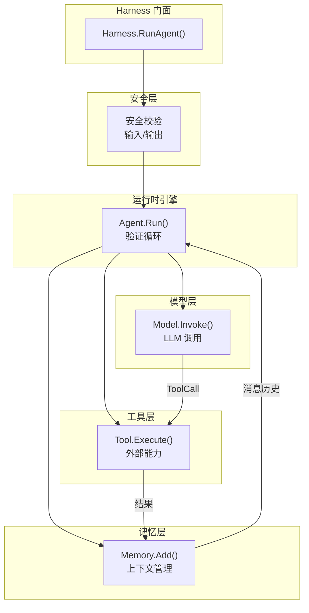

# 第 1 章 Harness 工程导论 + 项目脚手架

## 1.1 为什么需要 Harness？

### 1.1.1 大模型的能力边界

大语言模型（LLM）本身只是一个"大脑"——它能理解语言、进行推理、生成文本，但它缺乏以下几个关键能力：

| 缺失能力 | 表现 | 后果 |
|---------|------|------|
| 记忆持久性 | 每次对话是独立的，关闭即遗忘 | 无法维护长期用户上下文 |
| 工具调用 | 无法直接操作外部系统 | 无法查数据库、发请求、读写文件 |
| 可靠性保障 | 输出可能包含幻觉、格式错误 | 不可直接用于生产 |
| 安全控制 | 可以被 Prompt 注入攻击 | 存在数据泄露风险 |
| 可观测性 | 黑盒运行，无法追踪决策过程 | 问题排查困难 |

### 1.1.2 Harness 的定位

Harness 就是为了填补这些缺失能力而存在的工程系统。它像一个"缰绳系统"——骑手通过缰绳驾驭烈马，Harness 将大模型的推理能力转化为**可靠、可控、可观测**的生产级系统。

用图表示 Harness 如何填补大模型的能力缺口：



### 设计思路：为什么用"Harness"这个比喻？

"Harness" 一词源于骑马——缰绳（rein）+ 马鞍（saddle）组成的系统。骑手通过缰绳控制烈马的方向和速度，马鞍提供稳定的支撑。对应到 Agent 系统：

| 骑马场景 | Agent 场景 |
|---------|-----------|
| 烈马（奔腾之力） | 大模型（推理能力） |
| 缰绳（控制方向） | 运行时引擎（控制执行流） |
| 马鞍（稳定支撑） | 工具层 + 记忆（提供执行基础） |
| 马镫（安全保障） | 安全体系（约束边界） |
| 马具（可观测） | 日志 + Metrics（可追踪） |

这个比喻帮助理解 Harness 的核心定位：**不是替代大模型，而是驾驭它**。

---

## 1.2 Harness 工程五大原则详解

### 1.2.1 约束优先

> 先设定 Agent 能做什么、不能做什么，再赋予能力。

**工程含义**：在设计 Agent 系统时，首先定义它的**边界**——能访问哪些数据、能调用哪些 API、能执行哪些操作。而不是先给它所有能力再试图限制。

**代码中的体现**：
- 工具注册时明确声明参数 Schema
- 权限系统默认拒绝所有操作，只开放明确允许的
- 文件操作限定在沙箱目录内

### 1.2.2 可验证性

> 每个步骤的输出都应可验证、可审计。

**工程含义**：Agent 的每一步决策和执行结果都应有迹可循。包括模型返回的原始内容、工具调用的输入输出、Token 消耗量等。

**代码中的体现**：
- `RunOutput` 结构体携带完整执行记录
- 日志记录每次模型调用和工具执行
- Message 历史完整保留，可回溯整个推理过程

### 1.2.3 渐进信任

> 从最小权限开始，逐步开放能力。

**工程含义**：用户对 Agent 的信任是逐步建立的。系统初始状态下只开放最安全的能力（如只读查询），随着使用场景的验证逐步开放写入能力。

**代码中的体现**：
- PermissionManager 的 Role 机制（Guest→User→Admin）
- 生产环境默认 "strict" 模式
- 工具权限独立控制

### 1.2.4 故障假设

> 默认一切都会出错，设计容错机制。

**工程含义**：网络可能断开、API 可能超时、模型可能返回乱码、工具可能崩溃。设计时假设所有外部依赖都不可靠。

**代码中的体现**：
- Context 超时控制贯穿所有外部调用
- 指数退避重试机制
- 断路器防止级联故障
- 每个 error 都携带可识别的错误码

### 1.2.5 智能体工学

> 像工程学一样系统化构建，而非"提示词艺术"。

**工程含义**：Agent 系统的构建应该遵循软件工程的最佳实践——模块化、接口化、可测试、可维护。而不是依赖"神奇的提示词"。

**代码中的体现**：
- 每个子系统通过接口解耦
- Config 结构体驱动行为
- 标准日志 + 结构化错误
- 可单元测试的独立组件

### 五大原则的关系图



五大原则不是独立的，而是相互支撑的体系：
- **约束优先**定义边界 → **渐进信任**控制开放速度
- **可验证性**提供审计基础 → **故障假设**利用审计数据做容错
- **智能体工学**将以上原则系统化落地

---

## 1.3 Harness 六大子系统概览

```
┌──────────────────────────────────────────────────────────┐
│                       Harness                             │
│  ┌──────────────┐  ┌──────────────┐  ┌──────────────┐    │
│  │  运行时引擎    │  │   工具层      │  │  记忆子系统    │    │
│  │  (Engine)     │  │  (Tool)      │  │  (Memory)    │    │
│  │              │  │              │  │              │    │
│  │  Agent.Run() │  │  Registry    │  │  Buffer      │    │
│  │  Run Loop    │  │  Execute     │  │  Snapshot    │    │
│  └──────┬───────┘  └──────┬───────┘  └──────┬───────┘    │
│         │                 │                 │            │
│  ┌──────┴───────┐  ┌──────┴───────┐  ┌──────┴───────┐    │
│  │  模型集成     │  │   编排引擎    │  │   安全体系    │    │
│  │  (Model)     │  │  (Orch.)     │  │  (Security)  │    │
│  │              │  │              │  │              │    │
│  │  OpenAI      │  │  Team        │  │  权限         │    │
│  │  DeepSeek    │  │  Workflow    │  │  脱敏         │    │
│  └──────────────┘  └──────────────┘  └──────────────┘    │
│                                                          │
│  ┌──────────────────────────────────────────────────┐    │
│  │           可观测性层 (Observability)               │    │
│  │   slog 日志  |  结构化错误  |  Metrics             │    │
│  └──────────────────────────────────────────────────┘    │
└──────────────────────────────────────────────────────────┘
```

### 子系统交互图



这个图展示了数据在子系统间的流转路径。注意箭头方向——模型返回 ToolCall 时控制流从引擎流向工具，工具结果通过记忆回流到引擎。

每个子系统将在后续章节中逐一实现。

---

## 1.4 搭建项目脚手架

我们从零开始创建项目目录和 Go 模块。

### 1.4.1 创建目录结构

```bash
mkdir go-harness-tutorial
cd go-harness-tutorial

# 文档目录
mkdir docs

# 源码主目录
mkdir -p src/pkg/types          # 共享类型
mkdir -p src/internal/engine    # 运行时引擎
mkdir -p src/internal/tool/builtin  # 工具层
mkdir -p src/internal/memory    # 记忆子系统
mkdir -p src/internal/model     # 模型集成
mkdir -p src/internal/orchestrator  # 编排引擎
mkdir -p src/internal/mcpclient # MCP 协议
mkdir -p src/internal/security  # 安全体系
mkdir -p src/internal/harness   # Harness 组装
mkdir -p src/internal/examples/jd_cs  # 京东客服
mkdir -p src/cmd/jd-cs-service  # 可运行入口
```

### 1.4.2 初始化 Go 模块

```bash
cd src
go mod init go-harness-tutorial
```

### 1.4.3 目录结构说明

```
go-harness-tutorial/
├── docs/                ← 教程文档（13 章）
├── src/                 ← 完整 Go 源码
│   ├── pkg/types/       ← 共享类型定义
│   │   ├── message.go   ← 消息模型
│   │   ├── errors.go    ← 结构化错误
│   │   └── context.go   ← 运行上下文
│   ├── internal/        ← 核心实现（不对外导出）
│   │   ├── engine/      ← 运行时引擎
│   │   ├── tool/        ← 工具层
│   │   ├── memory/      ← 记忆
│   │   ├── model/       ← 模型集成
│   │   ├── orchestrator/← 编排
│   │   ├── mcpclient/   ← MCP 客户端
│   │   ├── security/    ← 安全
│   │   ├── harness/     ← 组装
│   │   └── examples/jd_cs/ ← 京东客服
│   └── cmd/             ← 可执行入口
└── README.md
```

这种结构遵循 Go 项目的标准布局：
- `internal/` 目录确保这些包不会被外部项目导入（Go 编译器强制）
- `pkg/` 目录存放可能被外部引用的类型
- `cmd/` 目录存放可执行文件的 main 函数

---

## 1.5 定义核心类型

核心类型是所有子系统的共享基础。它们定义在 `pkg/types/` 中。

### 1.5.1 消息模型（message.go）

Agent 系统中所有数据以"消息"的形式流转。消息模型是框架的数据核心：

```go
package types

import "time"

// Role 定义消息的角色类型
type Role string

const (
	RoleSystem    Role = "system"     // 系统提示词
	RoleUser      Role = "user"       // 用户输入
	RoleAssistant Role = "assistant"  // 模型回复
	RoleTool      Role = "tool"       // 工具执行结果
)

// Message 是 Agent 系统中最小数据单元
type Message struct {
	Role       Role       `json:"role"`                  // 消息角色
	Content    string     `json:"content"`               // 文本内容
	ToolCallID string     `json:"tool_call_id,omitempty"`// 工具调用 ID（用于 RoleTool）
	ToolCalls  []ToolCall `json:"tool_calls,omitempty"`  // 工具调用列表（用于 RoleAssistant）
	Name       string     `json:"name,omitempty"`        // 发送者名称
	CreatedAt  time.Time  `json:"created_at"`            // 创建时间
}
```

**设计决策分析**：

为什么选择四个角色？
- 这是 OpenAI Chat Completion API 的标准角色体系。使用相同的角色名意味着向 API 发送消息时无需转换，减少出错可能。

为什么 `ToolCallID` 是可选字段？
- 只有 `RoleTool` 的消息需要关联到具体的工具调用。这是 LLM API 的要求——工具结果必须通过 `tool_call_id` 与之前的调用配对。

为什么不用 `interface{}` 作为 Content 类型？
- 某些框架（如 LangChain）的 Content 支持多模态（文本+图片），用 `interface{}` 承载。但我们为了简单明确，统一使用字符串。图片等二进制数据通过工具调用获取。

### 1.5.2 工具调用结构（message.go）

```go
// ToolCall 表示模型请求执行的一个工具调用
type ToolCall struct {
	ID       string           `json:"id"`       // 唯一标识
	Type     string           `json:"type"`      // 固定为 "function"
	Function ToolCallFunction `json:"function"`  // 函数详情
}

// ToolCallFunction 描述要调用的函数
type ToolCallFunction struct {
	Name      string `json:"name"`      // 函数名
	Arguments string `json:"arguments"`  // JSON 格式的参数
}
```

**关键点**：`Arguments` 是 JSON 编码的字符串，不是结构体。这是因为模型返回的参数格式是不确定的，保留原始 JSON 字符串可以让工具层自行解析和校验。

### 1.5.3 Token 用量（message.go）

```go
type Usage struct {
	PromptTokens     int `json:"prompt_tokens"`
	CompletionTokens int `json:"completion_tokens"`
	TotalTokens      int `json:"total_tokens"`
}
```

记录 Token 用量用于成本追踪和性能分析。

### 1.5.4 结构化错误体系（errors.go）

Go 语言没有异常（Exception），错误是值。因此需要设计一套结构化的错误类型，让上层可以按错误码做策略决策。

```go
package types

import "fmt"

// ErrorCode 定义标准错误码
type ErrorCode string

const (
	ErrModelTimeout       ErrorCode = "MODEL_TIMEOUT"        // 模型调用超时
	ErrToolError          ErrorCode = "TOOL_ERROR"           // 工具执行错误
	ErrInvalidInput       ErrorCode = "INVALID_INPUT"        // 无效输入
	ErrInvalidConfig      ErrorCode = "INVALID_CONFIG"       // 配置错误
	ErrAPIError           ErrorCode = "API_ERROR"            // API 错误
	ErrRateLimit          ErrorCode = "RATE_LIMIT"           // 限流
	ErrRunCancelled       ErrorCode = "RUN_CANCELLED"        // 运行取消
	ErrSecurityViolation  ErrorCode = "SECURITY_VIOLATION"   // 安全违规
	ErrMaxLoopsExceeded   ErrorCode = "MAX_LOOPS_EXCEEDED"   // 超过最大循环次数
)

// HarnessError 是贯穿整个框架的结构化错误类型
type HarnessError struct {
	Code    ErrorCode `json:"code"`           // 错误码（用于策略判断）
	Message string    `json:"message"`         // 人类可读的错误描述
	Err     error     `json:"-"`              // 内部错误（不序列化，避免泄露）
}

func (e *HarnessError) Error() string {
	if e.Err != nil {
		return fmt.Sprintf("[%s] %s: %v", e.Code, e.Message, e.Err)
	}
	return fmt.Sprintf("[%s] %s", e.Code, e.Message)
}

func (e *HarnessError) Unwrap() error {
	return e.Err
}
```

**为什么设计自己的错误类型？**

1. **策略决策**：上层代码可以根据 `Code` 决定如何处理——`ErrRateLimit` 应重试，`ErrInvalidInput` 不应重试
2. **结构化日志**：错误码可以直接作为日志字段，方便告警和聚合
3. **避免泄露**：`Err` 字段用 `json:"-"` 标记，确保序列化时不暴露内部错误详情

**Helper 函数**：

```go
func NewError(code ErrorCode, msg string) *HarnessError {
	return &HarnessError{Code: code, Message: msg}
}

func WrapError(code ErrorCode, msg string, err error) *HarnessError {
	return &HarnessError{Code: code, Message: msg, Err: err}
}
```

### 1.5.5 运行上下文（context.go）

```go
package types

// RunContext 携带一次 Agent 运行的元信息
type RunContext struct {
	RunID       string         `json:"run_id"`
	SessionID   string         `json:"session_id"`
	UserID      string         `json:"user_id"`
	AgentID     string         `json:"agent_id"`
	TeamID      string         `json:"team_id,omitempty"`
	WorkflowID  string         `json:"workflow_id,omitempty"`
	ParentRunID string         `json:"parent_run_id,omitempty"`
	Metadata    map[string]any `json:"metadata,omitempty"`
}
```

**设计意图**：`RunContext` 携带跨系统调用的追踪信息。当 Agent 被 Team 或 Workflow 调用时，父级 ID 会被传播到子 Agent 的执行链路中，形成完整的调用链，便于调试和监控。

---

## 1.6 Go 1.26 关键特性说明

本教程使用 Go 1.26，以下是主要用到的新特性：

| 特性 | Go 版本 | 用途 |
|------|---------|------|
| `log/slog` | 1.21+ | 结构化日志，替代 `log` 包 |
| 泛型 | 1.18+ | 简化集合操作 |
| `context` 改进 | 持续 | 更好的取消链 |
| `sync.OnceValue` | 1.21+ | 懒加载单例 |

---

## 1.7 本章小结

- 理解了为什么需要 Harness 工程——填补大模型缺失的执行、记忆、安全、可观测能力
- 深入学习了五大工程原则：约束优先、可验证性、渐进信任、故障假设、智能体工学
- 创建了项目的完整目录结构
- 定义了核心类型系统：消息模型、错误体系、运行上下文

**架构决策记录**：
1. 选择 OpenAI 标准的四角色消息体系，简化 API 适配
2. 选择结构化错误类型而非 panic，符合 Go 工程实践
3. ToolCall.Arguments 保留原始 JSON 字符串，交给工具层解析

---

## 练习

1. 给 `Message` 添加 `Metadata map[string]any` 字段，用于携带自定义元数据（如推理过程、置信度）
2. 给 `HarnessError` 添加 `IsRetryable() bool` 方法：`ErrRateLimit` 和 `ErrModelTimeout` 返回 `true`，其他返回 `false`
3. 在 `go.mod` 中设置正确的 Go 版本（1.26），然后运行 `go vet ./...` 验证代码正确性
