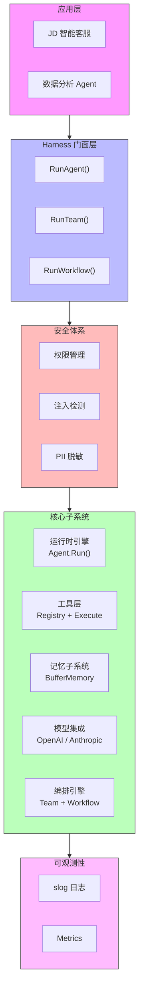
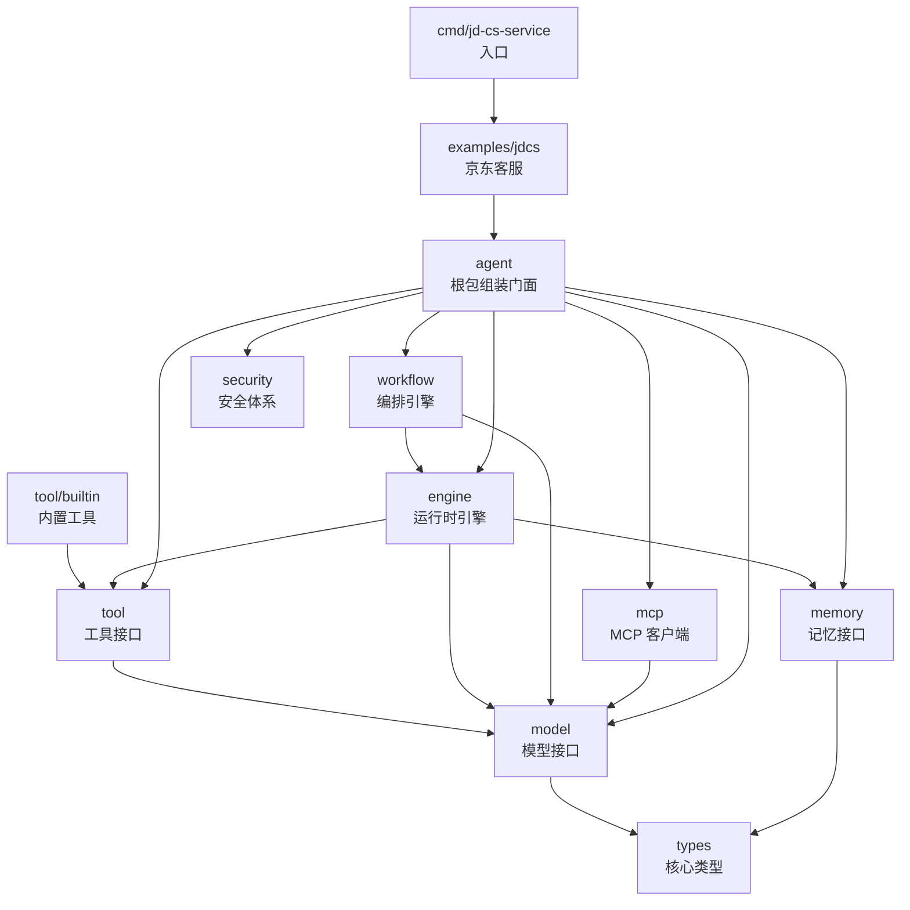

# 第 2 章 参考架构全景

### 设计思路：为什么从接口开始？

传统开发是"先实现后抽象"。但 Harness 系统的复杂度要求我们**先定义接口骨架，再填充实现**。原因有三：

1. **子系统可独立开发**：只要接口确定，Model、Tool、Memory 可以并行实现
2. **测试友好**：MockModel、MockTool 都基于接口，无需真实 API
3. **未来可替换**：换成其他 LLM 提供商只需实现接口，上层代码不变

## 2.1 六层架构设计

在动手编码之前，我们先定义完整的 Harness 架构。所有子系统通过**接口**解耦，通过**配置**驱动，通过**上下文**关联。

### 2.1.1 分层架构图

```
┌──────────────────────────────────────────────────────────────┐
│                     应用层 (Application)                      │
│            JD 智能客服  |  数据分析 Agent  |  ...              │
├──────────────────────────────────────────────────────────────┤
│                      Harness 门面层                           │
│  统一 API: RunAgent()  RunTeam()  RunWorkflow()              │
│  职责: 安全校验 → 委派执行 → 输出处理                           │
├──────────┬───────────┬───────────┬───────────┬───────────────┤
│  运行时引擎 │   工具层   │  记忆子系统  │  模型集成   │   编排引擎    │
│  (Engine) │  (Tool)   │ (Memory)  │  (Model)  │  (Orch.)     │
│           │           │           │           │              │
│  Agent    │  Registry │  Buffer   │  OpenAI   │  Team        │
│  Run Loop │  Execute  │  Summary  │  Anthropic│  Workflow    │
├──────────┴───────────┴───────────┴───────────┴───────────────┤
│                        安全体系 (Security)                     │
│  权限管理  |  Prompt 注入检测  |  PII 脱敏  |  路径校验         │
├──────────────────────────────────────────────────────────────┤
│                        可观测性 (Observability)                │
│  结构化日志 (slog)  |  错误码  |  Metrics                      │
└──────────────────────────────────────────────────────────────┘
```



### 2.1.2 数据流

```
用户输入
   │
   ▼
┌─────────────┐
│  安全校验层   │  ← 注入检测、长度校验、输入脱敏
└──────┬──────┘
       ▼
┌─────────────┐
│  运行时引擎   │  ← Agent.Run()
│              │
│  1. 添加到记忆 ├──→ 记忆子系统
│  2. 构建消息   │
│  3. 调用模型   ├──→ 模型集成层
│  4. 处理结果   │
│     ├─ 有 ToolCall ──→ 工具层 → 结果写回记忆 → 回到 3
│     └─ 有文本输出 ──→ 结束
└──────┬──────┘
       ▼
┌─────────────┐
│  输出处理层   │  ← 输出校验、脱敏
└──────┬──────┘
       ▼
   返回结果
```

---

## 2.2 接口设计（系统骨架）

接口是 Go 语言中实现松耦合的核心机制。我们先定义所有子系统的接口，后续章节逐一实现。

### 2.2.1 运行时引擎接口

```go
// Runnable 定义了一个可执行的 Agent
type Runnable interface {
	// Run 执行一次 Agent 运行
	Run(ctx context.Context, input string, opts ...RunOption) *RunOutput
}
```

### 2.2.2 工具接口

```go
// Tool 定义一个可被 Agent 调用的工具
type Tool interface {
	Name() string                                     // 工具名称（唯一标识）
	Description() string                              // 工具描述
	Definition() model.ToolDefinition                 // 返回模型可识别的工具定义
	Validate(args map[string]any) error               // 参数校验
	Execute(ctx context.Context, args map[string]any) (any, error)  // 执行
}
```

### 2.2.3 记忆接口

```go
// Memory 管理 Agent 对话历史
type Memory interface {
	Add(msg types.Message)             // 添加消息
	Get(index int) (types.Message, bool) // 按索引获取
	Recent(n int) []types.Message        // 获取最近 n 条
	Snapshot() []types.Message           // 获取全部（副本）
	Clear()                              // 清空
	Len() int                            // 当前消息数
}
```

### 2.2.4 模型接口

```go
// Model 封装大语言模型调用
type Model interface {
	Invoke(ctx context.Context, req *InvokeRequest) (*InvokeResponse, error)
	InvokeStream(ctx context.Context, req *InvokeRequest) (<-chan ResponseChunk, error)
	Provider() string   // 提供商名称（如 "openai"）
	ModelID() string    // 模型标识（如 "gpt-4o-mini"）
}
```

### 2.2.5 编排接口

```go
// 团队协作
type TeamRunnable interface {
	Run(ctx context.Context, input string) *TeamOutput
}

// 工作流
type WorkflowRunnable interface {
	Run(ctx context.Context, input string) *WorkflowResult
}
```

### 2.2.6 安全接口

```go
type Security interface {
	ValidateInput(input string) error     // 输入校验
	ValidateOutput(output string) error    // 输出校验
	CheckPermission(perm string) error     // 权限检查
	Sanitize(input string) string          // PII 脱敏
}
```

---

## 2.3 Harness 门面设计

门面模式（Facade Pattern）为子系统提供统一的调用入口。`Harness` 结构体封装了所有子系统的生命周期：

### 2.3.1 Harness 结构体定义

```go
package agent

type Harness struct {
	config            Config
	model             model.Model
	toolRegistry      *tool.Registry
	permissionManager security.PermissionManager
	inputValidator    security.InputValidator
	outputValidator   security.OutputValidator
	sanitizer         security.Sanitizer
	mcpClients        map[string]*mcp.Client
	agents            map[string]*engine.Agent
	teams             map[string]*workflow.Team
	workflows         map[string]*workflow.Workflow
	mu                 sync.RWMutex
}
```

这些字段属于实现细节。消费者通过 `RegisterTool`、`Agent`、`Team`、`Workflow` 和运行方法访问能力，而不是直接修改映射或安全组件。

**为什么是门面模式？**

- **简化调用**：用户只需要一个 `Harness` 实例，通过 `RunAgent()`、`RunTeam()`、`RunWorkflow()` 三个方法即可完成所有操作
- **统一生命周期**：所有子系统的初始化、配置、关闭由 `Harness` 管理
- **安全保证**：`RunAgent()` 内部自动执行安全校验，用户无需手动调用

### 2.3.2 RunAgent 的安全流程

```go
func (h *Harness) RunAgent(ctx context.Context, name, input string, opts ...engine.RunOption) *engine.RunOutput {
	// 步骤 1：输入脱敏（去除手机号、身份证等敏感信息）
	sanitizedInput := h.Sanitize(input)

	// 步骤 2：输入校验（长度、注入检测）
	if err := h.ValidateInput(sanitizedInput); err != nil {
		return &engine.RunOutput{
			Success: false,
			Error:   err.Error(),
		}
	}

	// 步骤 3：查找 Agent
	runtimeAgent, ok := h.Agent(name)
	if !ok {
		return &engine.RunOutput{
			Success: false,
			Error:   fmt.Sprintf("agent %q not found", name),
		}
	}

	// 步骤 4：执行 Agent
	output := runtimeAgent.Run(ctx, sanitizedInput, opts...)

	// 步骤 5：输出脱敏
	if output.Success {
		if err := h.ValidateOutput(output.Content); err != nil {
			return &engine.RunOutput{Success: false, Error: err.Error()}
		}
		output.Content = h.Sanitize(output.Content)
	}

	return output
}
```

### 2.3.3 New() 构造函数

```go
func New(cfg Config, options ...Option) (*Harness, error) {
	h := &Harness{
		config:            cfg,
		toolRegistry:      tool.NewRegistry(),
		permissionManager: security.NewPermissionManager(),
		inputValidator:    security.NewInputValidator(),
		outputValidator:   security.NewOutputValidator(),
		sanitizer:         security.NewSanitizer(),
		mcpClients:        make(map[string]*mcp.Client),
		agents:            make(map[string]*engine.Agent),
		teams:             make(map[string]*workflow.Team),
		workflows:         make(map[string]*workflow.Workflow),
	}

	// 设置日志级别
	h.setupLogger(cfg.LogLevel)

	// 构建模型
	model, err := cfg.DefaultModel.BuildModel()
	if err != nil {
		return nil, fmt.Errorf("build model: %w", err)
	}
	h.model = model

	// 设置权限模式
	if cfg.PermissionMode == "strict" {
		h.permissionManager.SetRole(security.RoleUser)
	}

	// 注册内置工具
	for _, name := range cfg.AllowedTools {
		h.registerBuiltinTool(name)
	}

	return h, nil
}
```

---

## 2.4 配置驱动设计

### 2.4.1 Config 结构体

```go
type Config struct {
	Version        string          `json:"version"`           // 配置版本
	Name           string          `json:"name"`              // 服务名称
	LogLevel       string          `json:"log_level"`         // debug/info/warn/error
	DefaultModel   ModelConfig     `json:"default_model"`     // 默认模型
	AllowedTools   []string        `json:"allowed_tools"`     // 允许的内置工具
	MemoryConfig   MemoryConfig    `json:"memory"`            // 记忆配置
	PermissionMode string          `json:"permission_mode"`   // strict 或 permissive
	MCPClients     []MCPClientConfig `json:"mcp_clients"`
	Security       SecurityConfig  `json:"security"`
}
```

### 2.4.2 默认配置

```go
func DefaultConfig() Config {
	return Config{
		Version:        "0.2.0",
		Name:           "tracklogic-agent",
		LogLevel:       "info",
		DefaultModel: ModelConfig{
			Vendor:    "openai",
			APIFormat: "openai_response",
			ModelID:   "gpt-4o-mini",
			Timeout:   60,
		},
		MemoryConfig: MemoryConfig{
			Type:     "buffer",
			Capacity: 50,
		},
		PermissionMode: "permissive",
	}
}
```

**为什么默认是 permissive？** 开发阶段过于严格的安全策略会影响迭代速度。生产环境中应改为 `"strict"`。

### 2.4.3 从文件加载配置

```go
func LoadConfig(path string) (Config, error) {
	cfg := DefaultConfig()
	data, err := os.ReadFile(path)
	if err != nil {
		if os.IsNotExist(err) {
			slog.Warn("config file not found, using defaults", "path", path)
			return cfg, nil
		}
		return cfg, fmt.Errorf("read config: %w", err)
	}
	if err := json.Unmarshal(data, &cfg); err != nil {
		return cfg, fmt.Errorf("parse config: %w", err)
	}
	return cfg, nil
}
```

配置加载策略：**先默认后覆盖**。确保即使配置文件缺失也能以合理默认值启动。

---

## 2.5 依赖关系图

```text
types ← model / memory
model ← tool
model + memory + tool ← engine
engine + model ← workflow
model ← mcp
以上公开包 + mcp ← 根包 agent
根包 agent + 公开扩展包 ← examples
```



注意箭头方向：箭头从调用方指向其依赖。`types` 位于最底层，被多个公开包依赖。

**设计要点**：
- `types` 位于最底层，不依赖其他项目包
- 上层可以依赖下层，下层不能依赖上层
- 根包 `agent` 是组装中心，依赖所有子系统
- 应用示例（`jdcs`）依赖根包和公开扩展包，但库不依赖任何示例

---

## 2.6 本章小结

- 设计了 Harness 的六层架构，明确了每层的职责
- 为每个子系统定义了 Go 接口（系统骨架）
- 设计了 Harness 门面结构体，统一管理子系统的生命周期
- 建立了配置驱动模式（默认值 + 文件覆盖）

**架构决策记录**：
1. 门面模式：提供统一 API `RunAgent/RunTeam/RunWorkflow`，内部自动完成安全校验
2. 接口先于实现：先定义 `Tool`、`Model`、`Memory` 等接口，后续章节再填充具体实现
3. Config 驱动：所有行为可配置，不硬编码

---

## 练习

1. 为 `Config` 添加 `Plugins []PluginConfig` 字段，用于后续扩展插件系统
2. 修改 `Harness.RunAgent` 方法，在调用 Agent 前后添加 `BeforeRun` 和 `AfterRun` 回调钩子
3. 仿照 `RunAgent` 实现 `RunTeam` 方法
