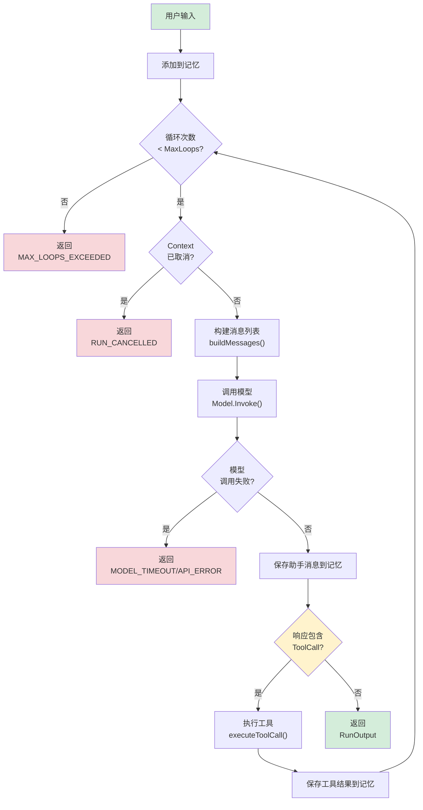
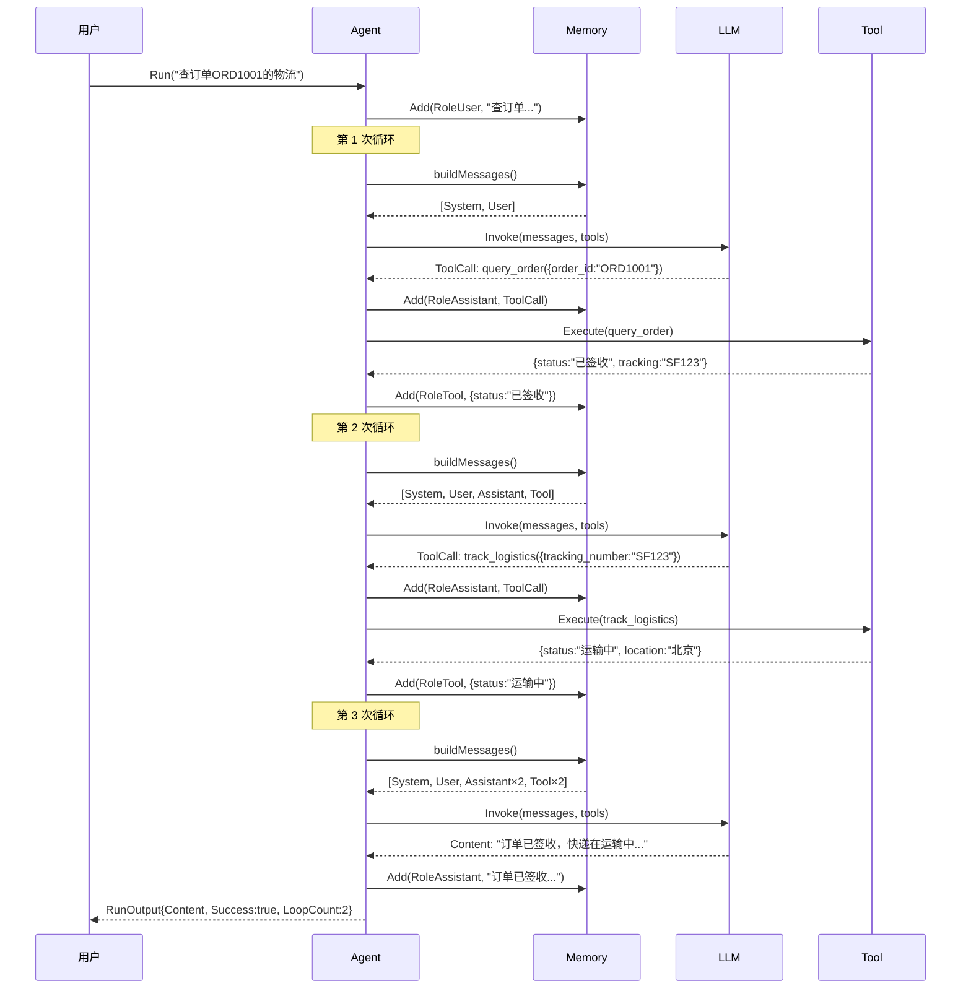

# 第 3 章 运行时引擎

### 设计思路：验证循环的由来

为什么 Agent 的运行不是简单的"输入→模型→输出"？因为**模型无法一步完成复杂任务**。

考虑用户说"帮我查订单 ORD1001 的物流"：
1. 模型需要先知道有 `query_order` 工具可调用
2. 调用 `query_order` 获取订单信息
3. 从结果中提取快递单号
4. 再调用 `track_logistics` 获取物流
5. 综合结果回答用户

这个过程至少需要**两轮推理+执行循环**。"验证循环"（Validation Loop）就是为此设计的——每次循环验证模型是否已经完成任务，没有则继续执行。

运行时引擎是 Harness 最核心的子系统——它是 Agent 的"心跳"，负责驱动整个推理-执行循环。

---

## 3.1 引擎的核心职责

运行时引擎解决一个核心问题：**如何将大模型的推理能力转化为有序的执行过程**？

### 3.1.1 验证循环模型

大模型单次调用（一次 Chat Completion）只能完成"生成文本"这一动作。要完成一个复杂的任务（如"帮我查订单并退款"），需要模型多次调用工具、多次推理。这就是**验证循环**（Validation Loop）的概念：

```
用户输入
   │
   ▼
┌────────────────────────────────────────────────────┐
│                   验证循环                            │
│                                                      │
│  ┌──────┐    ┌──────────┐    ┌──────────┐          │
│  │ 推理  │───→│ 包含工具？ │───→│  执行工具  │──→┐    │
│  │(模型) │    │          │    │ (Tool)   │    │    │
│  └──────┘    └─────┬────┘    └──────────┘    │    │
│                    │                        │    │
│                    │ 否                     │    │
│                    ▼                        │    │
│              ┌──────────┐                   │    │
│              │ 返回结果  │                   │    │
│              └──────────┘                   │    │
│                                             │    │
│                    └────────────────────────┘    │
│                        （将工具结果注入记忆，继续循环） │
└────────────────────────────────────────────────────┘
```



**关键节点说明**：
- **黄色节点**（HasToolCall）：是循环的分叉点——有 ToolCall 则继续循环，否则终止
- **红色节点**：所有提前终止的路径，都返回 `Success: false`
- **绿色节点**：正常结束的两条路径

每次循环的步骤：
1. **推理**：模型根据完整的历史消息生成响应
2. **决策**：分析模型响应是否包含工具调用（ToolCall）
3. **执行**：如果包含 ToolCall，调用对应工具并将结果写回记忆
4. **继续**：携带工具结果进入下一轮循环（回到步骤 1）
5. **终止**：模型直接输出文本内容（无 ToolCall），循环结束

### 3.1.2 为什么需要循环？

**原因一：模型无法一步完成复杂任务**

比如用户说"帮我查订单 ORD1001 的物流信息"，模型需要：
1. 先调用 `query_order("ORD1001")` 获取订单信息
2. 从返回中提取快递单号 `SF1234567890`
3. 再调用 `track_logistics("SF1234567890")` 获取物流
4. 最后综合结果回答用户

这需要至少两轮推理-执行循环。

**原因二：工具返回不可预测**

工具可能返回错误、返回空数据、返回格式异常。Agent 需要能够基于工具返回的内容做出进一步的决策——是重试？是换一种方式？是告知用户？这都需要循环来承载。

### 3.1.3 循环终止条件

| 条件 | 行为 | 原因 |
|------|------|------|
| 模型输出文本内容 | 正常终止 | 模型认为已经完成，直接回答 |
| 达到最大循环次数 | 强制终止 | 防止无限循环（模型可能陷入死循环） |
| Context 取消 | 立即终止 | 外部取消信号（超时、用户取消） |
| 工具执行错误 | 返回错误 | 无法继续执行 |

---

## 3.2 Agent 结构体设计

```go
type Agent struct {
	Name         string           // Agent 名称（日志和追踪用）
	SystemPrompt string           // 系统提示词（每次运行注入）
	Model        model.Model      // 底层 LLM 模型（可被 Team 替换）
	ToolRegistry *tool.Registry   // 可用工具注册表
	Memory       memory.Memory    // 会话记忆存储
	MaxLoops     int              // 最大循环次数
	logger       *slog.Logger     // 结构化日志
}
```

### 字段设计分析

**为什么 Agent 持有 Model 接口而非具体实现？**

这是**策略模式**——Agent 不关心底层是 OpenAI 还是 Anthropic，只依赖 `model.Model` 接口。这带来了两个好处：
1. 在 Team 模式下可以动态替换 Model（模型继承）
2. 测试时可以注入 MockModel，无需真实 API 调用

**为什么 ToolRegistry 是指针？**

Registry 在多 Agent 间共享。多个 Agent 可能使用相同的工具集，通过指针引用避免重复注册。

**为什么 Agent 持有 Memory？**

Agent 的运行不是孤立事件。连续的 Run 调用共享同一个 Memory 实例，形成对话上下文。

**为什么 logger 是 private 字段？**

日志实现是内部细节，不应暴露给调用方。用户通过 Harness 的 `Config.LogLevel` 控制日志行为。

---

## 3.3 Agent 配置

```go
// AgentConfig 用于创建 Agent 实例
type AgentConfig struct {
	Name         string          // Agent 名称
	SystemPrompt string          // 系统提示词
	Model        model.Model     // LLM 模型
	ToolRegistry *tool.Registry  // 工具注册表
	Memory       memory.Memory   // 记忆（可选，默认使用 BufferMemory）
	MaxLoops     int             // 最大循环次数（默认 10）
}
```

### Run 选项模式（Functional Options）

使用函数选项模式允许调用方在每次运行时灵活配置，而不需要修改 Agent 结构体：

```go
// RunOption 是函数选项类型
type RunOption func(*runConfig)

type runConfig struct {
	maxLoops    int           // 本次运行的最大循环次数
	streamFunc  func(string)  // 流式回调函数
	temperature float64       // 模型温度参数
	maxTokens   int           // 最大 Token 数
}

func WithMaxLoops(n int) RunOption {
	return func(c *runConfig) { c.maxLoops = n }
}

func WithStream(fn func(chunk string)) RunOption {
	return func(c *runConfig) { c.streamFunc = fn }
}

func WithTemperature(t float64) RunOption {
	return func(c *runConfig) { c.temperature = t }
}
```

**默认值**：
- maxLoops: 10（避免无限循环）
- temperature: 0.7（平衡创造性和确定性）
- maxTokens: 4096

---

## 3.4 Run 方法详解（核心循环）

这是整个框架中最重要的一段代码。每次 `Run()` 调用都是一个完整的验证循环。

```go
func (a *Agent) Run(ctx context.Context, input string, opts ...RunOption) *RunOutput {
	// ── 阶段 1：初始化 ──
	// 解析选项，将默认配置与用户传入的选项合并
	cfg := &runConfig{
		maxLoops:    a.MaxLoops,
		temperature: 0.7,
		maxTokens:   4096,
	}
	for _, opt := range opts {
		opt(cfg)
	}

	start := time.Now()
	a.logger.Info("agent run started", "input", truncate(input, 100))

	// 将用户输入添加到记忆
	a.Memory.Add(types.Message{
		Role:      types.RoleUser,
		Content:   input,
		CreatedAt: time.Now(),
	})

	var lastContent string
	totalTokens := 0
	loopCount := 0

	// ── 阶段 2：验证循环 ──
	for loopCount < cfg.maxLoops {
		loopCount++

		// 2a. 检查取消信号
		select {
		case <-ctx.Done():
			a.logger.Warn("run cancelled", "loop", loopCount)
			return &RunOutput{
				Success:   false,
				Error:     "context cancelled",
				LoopCount: loopCount,
			}
		default:
		}

		// 2b. 构建消息列表（System Prompt + 历史消息）
		msgs := a.buildMessages()

		// 2c. 构建工具定义（从 Registry 转换为模型格式）
		toolDefs := a.buildToolDefinitions()

		// 2d. 调用模型
		req := &model.InvokeRequest{
			Messages:    msgs,
			Tools:       toolDefs,
			Temperature: cfg.temperature,
			MaxTokens:   cfg.maxTokens,
		}

		resp, err := a.Model.Invoke(ctx, req)
		if err != nil {
			a.logger.Error("model invoke failed", "error", err)
			return &RunOutput{
				Success:   false,
				Error:     err.Error(),
				LoopCount: loopCount,
			}
		}

		if resp.Usage != nil {
			totalTokens += resp.Usage.TotalTokens
		}

		// 2e. 将模型响应加入记忆
		assistantMsg := types.Message{
			Role:      types.RoleAssistant,
			Content:   resp.Content,
			ToolCalls: resp.ToolCalls,
			CreatedAt: time.Now(),
		}
		a.Memory.Add(assistantMsg)

		// 2f. 检查是否有工具调用
		if len(resp.ToolCalls) > 0 {
			a.logger.Info("processing tool calls",
				"count", len(resp.ToolCalls),
				"loop", loopCount)

			for _, tc := range resp.ToolCalls {
				// 执行每个工具调用
				result, err := a.executeToolCall(ctx, tc)
				resultStr := result
				if err != nil {
					resultStr = fmt.Sprintf("error: %v", err)
					a.logger.Error("tool execution failed",
						"tool", tc.Function.Name,
						"error", err)
				}

				// 将工具执行结果加入记忆
				toolMsg := types.Message{
					Role:       types.RoleTool,
					Content:    resultStr,
					ToolCallID: tc.ID,
					Name:       tc.Function.Name,
					CreatedAt:  time.Now(),
				}
				a.Memory.Add(toolMsg)
			}

			// 有 ToolCall → 继续循环
			continue
		}

		// 2g. 模型直接输出内容 → 终止循环
		lastContent = resp.Content

		a.logger.Info("agent run completed",
			"loops", loopCount,
			"tokens", totalTokens,
			"duration", time.Since(start))

		return &RunOutput{
			Content:     lastContent,
			Success:     true,
			TotalTokens: totalTokens,
			LoopCount:   loopCount,
		}
	}

	// ── 阶段 3：超出最大循环次数 ──
	a.logger.Warn("max loops exceeded", "maxLoops", a.MaxLoops)
	return &RunOutput{
		Content:   lastContent,
		Success:   false,
		Error:     "max loops exceeded",
		LoopCount: a.MaxLoops,
	}
}
```

### 关键控制流程分析

**1. Context 取消检查**（第 2a 步）

每次循环入口都检查 `ctx.Done()`。这确保了：
- 外部超时（30s 超时）能及时终止
- 用户手动取消能立即响应
- Team 取消能传播到子 Agent

**2. 消息构建**（第 2b 步）

`buildMessages()` 负责组装发送给模型的完整消息列表。关键逻辑：

```go
func (a *Agent) buildMessages() []types.Message {
	msgs := a.Memory.Snapshot()

	// 如果设置了 System Prompt，确保它在消息列表最前面
	if a.SystemPrompt != "" {
		hasSystem := false
		for _, m := range msgs {
			if m.Role == types.RoleSystem {
				hasSystem = true
				break
			}
		}
		if !hasSystem {
			systemMsg := types.Message{
				Role:      types.RoleSystem,
				Content:   a.SystemPrompt,
				CreatedAt: time.Now(),
			}
			return append([]types.Message{systemMsg}, msgs...)
		}
	}
	return msgs
}
```

**为什么每次都要重新插入 System Prompt？**

因为记忆子系统可能在之前的循环中被工具结果填满（超过容量后被裁剪），System Prompt 可能被丢弃。每次运行都重新注入确保 System Prompt 始终存在。

**3. 工具定义构建**（第 2c 步）

```go
func (a *Agent) buildToolDefinitions() []model.ToolDefinition {
	if a.ToolRegistry == nil {
		return nil
	}
	tools := a.ToolRegistry.List()
	defs := make([]model.ToolDefinition, 0, len(tools))
	for _, t := range tools {
		defs = append(defs, t.Definition())
	}
	return defs
}
```

**为什么不在 Agent 初始化时缓存工具定义？**

因为工具定义是动态的——MCP 客户端可能在运行时发现新工具，或者安全策略可能动态生效。每次运行都重新查询 Registry 是最安全的选择。

---

## 3.5 工具调用执行

当模型返回 ToolCall 时，Agent 需要找到对应的工具、校验参数、执行、并返回结果。

```go
func (a *Agent) executeToolCall(ctx context.Context, tc types.ToolCall) (string, error) {
	// 步骤 1：在 Registry 中查找工具
	t, ok := a.ToolRegistry.Get(tc.Function.Name)
	if !ok {
		return "", types.NewError(types.ErrToolError,
			fmt.Sprintf("tool %q not found", tc.Function.Name))
	}

	// 步骤 2：解析参数（模型返回的是 JSON 字符串）
	var args map[string]any
	if err := json.Unmarshal([]byte(tc.Function.Arguments), &args); err != nil {
		return "", types.WrapError(types.ErrInvalidInput,
			"failed to parse tool arguments", err)
	}

	// 步骤 3：参数校验
	if err := t.Validate(args); err != nil {
		return "", types.WrapError(types.ErrInvalidInput,
			"tool argument validation failed", err)
	}

	// 步骤 4：执行工具
	result, err := t.Execute(ctx, args)
	if err != nil {
		return "", err
	}

	// 步骤 5：序列化结果
	resultJSON, err := json.Marshal(result)
	if err != nil {
		return "", types.WrapError(types.ErrToolError,
			"failed to marshal tool result", err)
	}

	return string(resultJSON), nil
}
```

**为什么结果要序列化为 JSON？**

因为工具结果需要作为 `RoleTool` 消息写回记忆，而消息的 `Content` 字段是 `string` 类型。JSON 格式是最通用的序列化方式，既能保留结构化数据，又能让模型轻松理解。

---

## 3.6 RunOutput 设计

```go
type RunOutput struct {
	Content     string   `json:"content"`      // 最终输出文本
	Success     bool     `json:"success"`       // 是否成功
	Error       string   `json:"error,omitempty"`  // 错误信息
	TotalTokens int      `json:"total_tokens"`  // 总 Token 消耗
	LoopCount   int      `json:"loop_count"`    // 实际循环次数
}
```

`RunOutput` 不仅返回文本内容，还携带了元信息——成功与否、Token 消耗、循环次数。这些信息对外部监控和调试至关重要。

---

## 3.7 完整调用示例

```go
package main

import (
	"context"
	"fmt"
	"log/slog"
	"os"

	"go-harness-tutorial/internal/engine"
	"go-harness-tutorial/internal/memory"
	"go-harness-tutorial/internal/model"
	"go-harness-tutorial/internal/tool"
	"go-harness-tutorial/internal/tool/builtin"
)

func main() {
	// 1. 创建模型
	m := model.NewOpenAI(model.OpenAIConfig{
		APIKey:  os.Getenv("OPENAI_API_KEY"),
		ModelID: "gpt-4o-mini",
	})

	// 2. 注册工具
	registry := tool.NewRegistry()
	registry.MustRegister(builtin.NewCalculator())

	// 3. 创建 Agent
	agent := engine.NewAgent(engine.AgentConfig{
		Name:         "MathHelper",
		SystemPrompt: "你是数学助手。使用计算器工具回答数学问题。",
		Model:        m,
		ToolRegistry: registry,
		Memory:       memory.NewBufferMemory(50),
		MaxLoops:     5,
	})

	// 4. 运行
	output := agent.Run(
		context.Background(),
		"请计算 (25 * 4 + 15) / 5 的结果",
	)

	if output.Success {
		fmt.Printf("回答: %s\n", output.Content)
		fmt.Printf("Token 消耗: %d\n", output.TotalTokens)
		fmt.Printf("循环次数: %d\n", output.LoopCount)
	} else {
		fmt.Printf("失败: %s\n", output.Error)
	}
}
```

### 时序图：一次完整的 Agent Run



注意每一轮循环中 `buildMessages()` 返回的列表越来越长——这就是为什么需要 Memory 的裁剪机制。

---

## 3.8 边缘情况处理

### 3.8.1 空 ToolCall 列表

模型可能返回空的 ToolCalls 数组（`[]`）而非 null。两种情况的处理方式相同——视为无 ToolCall。

### 3.8.2 重复的 ToolCall

模型可能在多轮循环中反复调用同一个工具。这是正常行为——模型可能需要多次获取数据。只要不超过 `MaxLoops`，就应该允许。

### 3.8.3 工具不存在

Agent 注册的工具集在运行期间可能发生变化。如果模型调用了已注销的工具，Agent 应返回明确错误消息给模型（而非 panic），让模型重新选择。

### 3.8.4 循环陷入死锁

极端情况下，模型可能反复调用同一个工具并返回相同结果，形成无限循环。`MaxLoops` 是最终的兜底机制。

---

## 3.9 本章小结

- 理解了验证循环的概念：推理 → 决策 → 执行 → 循环/终止
- 实现了 Agent 结构体，包含 Model、Memory、ToolRegistry 等核心字段
- 实现了 `Run()` 方法的完整验证循环
- 实现了工具调用的查找、校验、执行、结果写回流程
- 理解了 Context 取消、MaxLoops 兜底等安全机制

**架构决策记录**：
1. Agent 持有 Model 接口而非实现，支持运行时替换（策略模式）
2. 函数选项模式提供灵活的运行时配置
3. 工具结果序列化为 JSON 字符串存入记忆

---

## 练习

1. 给 Agent 添加 `PreRun` 和 `PostRun` 钩子，在 Run 前后执行自定义逻辑
2. 实现 `WithStream` 选项：当启用时，通过回调函数逐步输出模型内容（而非等待完整结果）
3. 为 `RunOutput` 添加 `Messages []types.Message` 字段，返回本次运行的所有消息记录
4. 实现一个简单的 `maxLoops` 检测机制：当连续 3 次调用同一个工具且参数相同时，强制终止
