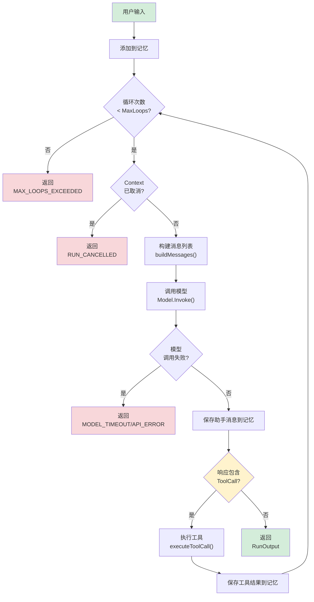

# 第 3 章 运行时引擎

### 设计思路：验证循环的由来

为什么 Agent 的运行不是简单的"输入→模型→输出"？因为**模型无法一步完成复杂任务**。

考虑用户说"帮我查订单 ORD1001 的物流"：
1. 模型需要先知道有 `query_order` 工具可调用
2. 调用 `query_order` 获取订单信息
3. 从结果中提取快递单号
4. 再调用 `track_logistics` 获取物流
5. 综合结果回答用户

这个过程至少需要**两轮推理+执行循环**。"验证循环"（Validation Loop）就是为此设计的——每次循环验证模型是否已经完成任务，没有则继续执行。

运行时引擎是 Harness 最核心的子系统——它是 Agent 的"心跳"，负责驱动整个推理-执行循环。

---

## 3.1 引擎的核心职责

运行时引擎解决一个核心问题：**如何将大模型的推理能力转化为有序的执行过程**？

### 3.1.1 验证循环模型

大模型单次调用（一次 Chat Completion）只能完成"生成文本"这一动作。要完成一个复杂的任务（如"帮我查订单并退款"），需要模型多次调用工具、多次推理。这就是**验证循环**（Validation Loop）的概念：

```
用户输入
   │
   ▼
┌────────────────────────────────────────────────────┐
│                   验证循环                            │
│                                                      │
│  ┌──────┐    ┌──────────┐    ┌──────────┐          │
│  │ 推理  │───→│ 包含工具？ │───→│  执行工具  │──→┐    │
│  │(模型) │    │          │    │ (Tool)   │    │    │
│  └──────┘    └─────┬────┘    └──────────┘    │    │
│                    │                        │    │
│                    │ 否                     │    │
│                    ▼                        │    │
│              ┌──────────┐                   │    │
│              │ 返回结果  │                   │    │
│              └──────────┘                   │    │
│                                             │    │
│                    └────────────────────────┘    │
│                        （将工具结果注入记忆，继续循环） │
└────────────────────────────────────────────────────┘
```



**关键节点说明**：
- **黄色节点**（HasToolCall）：是循环的分叉点——有 ToolCall 则继续循环，否则终止
- **红色节点**：所有提前终止的路径，都返回 `Success: false`
- **绿色节点**：正常结束的两条路径

每次循环的步骤：
1. **推理**：模型根据完整的历史消息生成响应
2. **决策**：分析模型响应是否包含工具调用（ToolCall）
3. **执行**：如果包含 ToolCall，调用对应工具并将结果写回记忆
4. **继续**：携带工具结果进入下一轮循环（回到步骤 1）
5. **终止**：模型直接输出文本内容（无 ToolCall），循环结束

### 3.1.2 为什么需要循环？

**原因一：模型无法一步完成复杂任务**

比如用户说"帮我查订单 ORD1001 的物流信息"，模型需要：
1. 先调用 `query_order("ORD1001")` 获取订单信息
2. 从返回中提取快递单号 `SF1234567890`
3. 再调用 `track_logistics("SF1234567890")` 获取物流
4. 最后综合结果回答用户

这需要至少两轮推理-执行循环。

**原因二：工具返回不可预测**

工具可能返回错误、返回空数据、返回格式异常。Agent 需要能够基于工具返回的内容做出进一步的决策——是重试？是换一种方式？是告知用户？这都需要循环来承载。

### 3.1.3 循环终止条件

| 条件 | 行为 | 原因 |
|------|------|------|
| 模型输出文本内容 | 正常终止 | 模型认为已经完成，直接回答 |
| 达到最大循环次数 | 强制终止 | 防止无限循环（模型可能陷入死循环） |
| Context 取消 | 立即终止 | 外部取消信号（超时、用户取消） |
| 工具执行错误 | 写成 `error: ...` 的 Tool 消息并继续 | 让模型有机会修正参数、换工具或解释失败 |

工具错误不会立即把 `Run` 标记失败，这是验证循环的重要取舍：可恢复错误交给下一轮推理，最终仍由 Context 和 MaxLoops 限制成本。如果业务要求某类错误必须立即终止，应在 Tool/Agent 扩展策略中显式分类。

---

## 3.2 Agent 结构体设计

```go
type Agent struct {
	mu                  sync.RWMutex // 保护可变配置引用
	runGate             chan struct{} // 串行化共享 Memory 的完整 Run
	name                string
	systemPrompt        string
	model               model.Model
	toolRegistry        *tool.Registry
	memory              memory.Memory
	maxLoops            int
	checkToolPermission func(string) error
	logger              *slog.Logger
}
```

### 字段设计分析

**为什么 Agent 持有 Model 接口而非具体实现？**

这是**策略模式**——Agent 不关心底层是 OpenAI 还是 Anthropic，只依赖 `model.Model` 接口。这带来了两个好处：
1. 在 Team 模式下可以动态替换 Model（模型继承）
2. 测试时可以注入 MockModel，无需真实 API 调用

**为什么 ToolRegistry 是指针？**

Registry 在多 Agent 间共享。多个 Agent 可能使用相同的工具集，通过指针引用避免重复注册。

**为什么 Agent 持有 Memory？**

Agent 的运行不是孤立事件。连续的 Run 调用共享同一个 Memory 实例，形成对话上下文。

**为什么还需要 runGate，Memory 自己不是已经有锁了吗？**

Memory 的锁只能保证单次 `Add`/`Snapshot` 不发生数据竞争，不能保证“一次 User → Model → Tool → Model”的多步事务不与另一个 Run 交错。`runGate` 把同一有状态 Agent 的完整 Run 串行化；它使用容量为 1 的通道，因此等待者可以同时监听 `ctx.Done()`，在截止时间到达时退出。不同 Agent 仍可并发运行。

**为什么 logger 是 private 字段？**

日志对象不暴露为可变字段。用户可以通过 Harness 的 `Config.LogLevel` 使用默认 logger，也可以用 `agent.WithLogger` 注入应用 logger。

---

## 3.3 Agent 配置

```go
// AgentConfig 用于创建 Agent 实例
type AgentConfig struct {
	Name         string          // Agent 名称
	SystemPrompt string          // 系统提示词
	Model        model.Model     // LLM 模型
	ToolRegistry *tool.Registry  // 工具注册表
	RestrictTools bool           // 是否启用 Agent 级工具白名单
	AllowedTools []string        // 白名单；启用后可为空，表示无工具
	Memory       memory.Memory   // 记忆（可选，默认使用 BufferMemory）
	MaxLoops     int             // 最大循环次数（默认 10）
	CheckToolPermission func(string) error
	Logger       *slog.Logger
}
```

### Run 选项模式（Functional Options）

使用函数选项模式允许调用方在每次运行时灵活配置，而不需要修改 Agent 结构体：

```go
// RunOption 是函数选项类型
type RunOption func(*runConfig)

type runConfig struct {
	maxLoops    int           // 本次运行的最大循环次数
	streamFunc  func(string)  // 流式回调函数
	temperature float64       // 模型温度参数
	maxTokens   int           // 最大 Token 数
}

func WithMaxLoops(n int) RunOption {
	return func(c *runConfig) { c.maxLoops = n }
}

func WithStream(fn func(chunk string)) RunOption {
	return func(c *runConfig) { c.streamFunc = fn }
}

func WithTemperature(t float64) RunOption {
	return func(c *runConfig) { c.temperature = t }
}
```

**默认值**：
- maxLoops: 10（避免无限循环）
- temperature: 0.7（平衡创造性和确定性）
- maxTokens: 4096

Option 在进入 Memory 和 Model 前统一校验：`maxLoops > 0`、`maxTokens > 0`、temperature 位于 `[0,2]`，并且本次 Model 非 nil。非法 Option 返回 `INVALID_CONFIG`，不会出现“循环零次后误报 max loops”或运行到 Provider 才 panic。

`RestrictTools=false` 保留兼容行为：Agent 看见 Registry 中的全部工具。启用后，`AllowedTools` 是精确能力集合；`buildToolDefinitions` 只发送白名单定义，`executeToolCall` 也会拒绝白名单外的名称。可见性过滤是引导模型，执行检查才是安全边界。

---

## 3.4 Run 方法详解（核心循环）

这是整个框架中最重要的一段代码。每次 `Run()` 调用都是一个完整的验证循环。

```go
// 教学展开版：为突出循环，下面使用了 a.Model/a.Memory/a.MaxLoops 等
// 可读名称。真实 Agent 字段是私有的，并通过短时间持有 RWMutex 读取。
func (a *Agent) Run(ctx context.Context, input string, opts ...RunOption) *RunOutput {
	// ── 阶段 1：初始化 ──
	ctx, runID := ensureRunContext(ctx, a.Name())
	if err := a.acquireRun(ctx); err != nil {
		return cancelledOutput(runID, err) // 教学简写
	}
	defer a.releaseRun()

	// 解析选项，将默认配置与用户传入的选项合并
	cfg := &runConfig{
		maxLoops:    a.MaxLoops,
		temperature: 0.7,
		maxTokens:   4096,
	}
	for _, opt := range opts {
		if opt != nil { opt(cfg) }
	}
	if err := validateRunConfig(cfg); err != nil {
		return failedOutput(runID, err) // 教学简写
	}

	start := time.Now()
	a.logger.Info("agent run started", "input", truncate(input, 100))

	// 将用户输入添加到记忆
	a.Memory.Add(types.Message{
		Role:      types.RoleUser,
		Content:   input,
		CreatedAt: time.Now(),
	})

	var lastContent string
	var allToolCalls []types.ToolCall
	totalTokens := 0
	loopCount := 0

	// ── 阶段 2：验证循环 ──
	for loopCount < cfg.maxLoops {
		loopCount++

		// 2a. 检查取消信号
		select {
		case <-ctx.Done():
			a.logger.Warn("run cancelled", "loop", loopCount)
			runErr := types.WrapError(types.ErrRunCancelled, "context cancelled", ctx.Err())
			return &RunOutput{
				Success:   false,
				Error:     runErr.Error(),
				Err:       runErr,
				LoopCount: loopCount,
			}
		default:
		}

		// 2b. 构建消息列表（System Prompt + 历史消息）
		msgs := a.buildMessages()

		// 2c. 构建工具定义（从 Registry 转换为模型格式）
		toolDefs := a.buildToolDefinitions()

		// 2d. 调用模型（有 WithStream 时走 InvokeStream，按 chunk 回调）
		req := &model.InvokeRequest{
			Messages:    msgs,
			Tools:       toolDefs,
			Temperature: cfg.temperature,
			MaxTokens:   cfg.maxTokens,
			Stream:      cfg.streamFunc != nil,
		}

		var resp *model.InvokeResponse
		var err error
		if cfg.streamFunc != nil {
			ch, streamErr := cfg.model.InvokeStream(ctx, req)
			if streamErr != nil {
				err = streamErr
			} else {
				resp, err = consumeStream(ctx, ch, cfg.streamFunc)
			}
		} else {
			resp, err = cfg.model.Invoke(ctx, req)
		}
		if err != nil {
			a.logger.Error("model invoke failed", "error", err)
			return &RunOutput{
				Success:   false,
				Error:     err.Error(),
				Err:       err,
				LoopCount: loopCount,
			}
		}

		if resp.Usage != nil {
			totalTokens += resp.Usage.TotalTokens
		}

		// 2e. 将模型响应加入记忆
		assistantMsg := types.Message{
			Role:      types.RoleAssistant,
			Content:   resp.Content,
			ToolCalls: resp.ToolCalls,
			CreatedAt: time.Now(),
		}
		a.Memory.Add(assistantMsg)

		// 2f. 检查是否有工具调用
		if len(resp.ToolCalls) > 0 {
			allToolCalls = append(allToolCalls, resp.ToolCalls...)
			a.logger.Info("processing tool calls",
				"count", len(resp.ToolCalls),
				"loop", loopCount)

			for _, tc := range resp.ToolCalls {
				// 执行每个工具调用
				result, err := a.executeToolCall(ctx, tc)
				resultStr := result
				if err != nil {
					resultStr = fmt.Sprintf("error: %v", err)
					a.logger.Error("tool execution failed",
						"tool", tc.Function.Name,
						"error", err)
				}

				// 将工具执行结果加入记忆
				toolMsg := types.Message{
					Role:       types.RoleTool,
					Content:    resultStr,
					ToolCallID: tc.ID,
					Name:       tc.Function.Name,
					CreatedAt:  time.Now(),
				}
				a.Memory.Add(toolMsg)
			}

			// 有 ToolCall → 继续循环
			continue
		}

		// 2g. 模型直接输出内容 → 终止循环
		lastContent = resp.Content

		a.logger.Info("agent run completed",
			"loops", loopCount,
			"tokens", totalTokens,
			"duration", time.Since(start))

		return &RunOutput{
			Content:     lastContent,
			ToolCalls:   allToolCalls,
			Messages:    a.Memory.Snapshot(),
			Success:     true,
			TotalTokens: totalTokens,
			LoopCount:   loopCount,
		}
	}

	// ── 阶段 3：超出最大循环次数 ──
	a.logger.Warn("max loops exceeded", "maxLoops", a.MaxLoops)
	return &RunOutput{
		Content:   lastContent,
		Success:   false,
		Error:     "max loops exceeded",
		LoopCount: a.MaxLoops,
	}
}
```

### 关键控制流程分析

**1. Context 取消检查**（第 2a 步）

每次循环入口都检查 `ctx.Done()`。这确保了：
- 外部超时（30s 超时）能及时终止
- 用户手动取消能立即响应
- Team 取消能传播到子 Agent

**2. 消息构建**（第 2b 步）

`buildMessages()` 负责组装发送给模型的完整消息列表。关键逻辑：

```go
func (a *Agent) buildMessages() []types.Message {
	msgs := a.Memory.Snapshot()

	// 如果设置了 System Prompt，确保它在消息列表最前面
	if a.SystemPrompt != "" {
		hasSystem := false
		for _, m := range msgs {
			if m.Role == types.RoleSystem {
				hasSystem = true
				break
			}
		}
		if !hasSystem {
			systemMsg := types.Message{
				Role:      types.RoleSystem,
				Content:   a.SystemPrompt,
				CreatedAt: time.Now(),
			}
			return append([]types.Message{systemMsg}, msgs...)
		}
	}
	return msgs
}
```

**为什么每次都要重新插入 System Prompt？**

因为记忆子系统可能在之前的循环中被工具结果填满（超过容量后被裁剪），System Prompt 可能被丢弃。每次运行都重新注入确保 System Prompt 始终存在。

**3. 工具定义构建**（第 2c 步）

```go
func (a *Agent) buildToolDefinitions() []model.ToolDefinition {
	if a.ToolRegistry == nil {
		return nil
	}
	tools := a.ToolRegistry.List()
	defs := make([]model.ToolDefinition, 0, len(tools))
	for _, t := range tools {
		defs = append(defs, t.Definition())
	}
	return defs
}
```

**为什么不在 Agent 初始化时缓存工具定义？**

因为工具定义是动态的——MCP 客户端可能在运行时发现新工具，或者安全策略可能动态生效。每次运行都重新查询 Registry 是最安全的选择。

---

## 3.5 工具调用执行

当模型返回 ToolCall 时，Agent 需要找到对应的工具、校验参数、执行、并返回结果。

```go
func (a *Agent) executeToolCall(ctx context.Context, tc types.ToolCall) (string, error) {
	// 步骤 1：在 Registry 中查找工具
	t, ok := a.ToolRegistry.Get(tc.Function.Name)
	if !ok {
		return "", types.NewError(types.ErrToolError,
			fmt.Sprintf("tool %q not found", tc.Function.Name))
	}

	// 步骤 2：解析参数（模型返回的是 JSON 字符串）
	var args map[string]any
	if err := json.Unmarshal([]byte(tc.Function.Arguments), &args); err != nil {
		return "", types.WrapError(types.ErrInvalidInput,
			"failed to parse tool arguments", err)
	}

	// 步骤 3：参数校验
	if err := t.Validate(args); err != nil {
		return "", types.WrapError(types.ErrInvalidInput,
			"tool argument validation failed", err)
	}

	// 步骤 4：执行工具
	result, err := t.Execute(ctx, args)
	if err != nil {
		return "", err
	}

	// 步骤 5：序列化结果
	resultJSON, err := json.Marshal(result)
	if err != nil {
		return "", types.WrapError(types.ErrToolError,
			"failed to marshal tool result", err)
	}

	return string(resultJSON), nil
}
```

**为什么结果要序列化为 JSON？**

因为工具结果需要作为 `RoleTool` 消息写回记忆，而消息的 `Content` 字段是 `string` 类型。JSON 格式是最通用的序列化方式，既能保留结构化数据，又能让模型轻松理解。

---

## 3.6 RunOutput 设计

```go
type RunOutput struct {
	RunID       string           `json:"run_id"`
	Content     string           `json:"content"`
	ToolCalls   []types.ToolCall `json:"tool_calls,omitempty"`
	Messages    []types.Message  `json:"messages,omitempty"`
	Success     bool             `json:"success"`
	Error       string           `json:"error,omitempty"`
	Err         error            `json:"-"`
	TotalTokens int              `json:"total_tokens"`
	LoopCount   int              `json:"loop_count"`
}
```

各字段不是随意堆在一起的，它们分别服务不同调用方：

| 字段 | 主要用途 | 容易误解的边界 |
|---|---|---|
| `RunID` | 调用日志、错误工单和上层追踪的关联键 | Agent 自动生成；不是业务幂等键，也不自动表示父子关系 |
| `Content` | 给最终用户或下游节点的文本 | 失败时可能为空，不应忽略 `Success` |
| `Error` / `Err` | 序列化错误文本 / 进程内结构化错误链 | 跨网络只保留 Error；进程内用 `errors.As(output.Err, ...)` |
| `ToolCalls` | 审计本次 Run 中模型请求过的全部工具 | 是跨循环汇总，不只是最后一轮 |
| `Messages` | 调试上下文、理解 Memory 当前状态 | 是整个 Agent Memory 快照，可能包含以前的 Run；进入 Memory 前的早期失败可为空 |
| `TotalTokens` | 成本和容量分析 | 依赖 Provider 是否返回 Usage |
| `LoopCount` | 发现工具循环或 Prompt 问题 | 包含最终产生文本的模型调用轮次 |

`ToolCalls` 汇总本次 Run 中模型请求过的工具调用；`Messages` 是 Agent 当前 Memory 的快照，可能包含该 Agent 之前 Run 的历史，并不等于“仅本次新增消息”。模型调用失败、取消或循环超限时也尽量保留已产生的 ToolCalls、Messages、Token 和循环数，避免失败路径丢失排错证据。这正是为什么生产多会话不能让多个用户共享同一个 Agent/Memory。

`Err` 标记为 `json:"-"`，因为 Go error 链不适合作为稳定的网络协议。进程内调用者可以识别 `HarnessError` / `HTTPError`；跨进程 API 应由应用把它转换成自己版本化的错误 DTO。

### RunID 如何沿调用链传播

`Agent.Run` 进入时会调用内部的 `ensureRunContext`：

1. Context 为 nil 时先替换为 `context.Background()`；
2. 已有 `RunContext` 时复制一份，保留调用方提供的 Session/User/Workflow 字段；
3. 缺少 `RunID` 时生成 128 位随机标识，缺少 `AgentID` 时填入 Agent 名称；
4. 把新 Context 传给 Model 和 Tool；Tool 内如果继续调用 MCP，同一个 Context 也会继续向下传播；
5. 返回前把相同标识写入 `RunOutput.RunID`。

之所以复制 `RunContext` 而不原地修改指针，是为了避免多个并发 Agent 共享父 Context 时互相覆盖 `AgentID`。这是 Context 的重要设计习惯：把它当作不可变的调用链载体，而不是跨 goroutine 的可变参数袋。

当前库只负责在调用链中传递 RunContext。应用可以在入口日志中记录 `RunOutput.RunID`，自定义 Model/Tool 也可以通过 `types.RunContextFrom(ctx)` 读取关联信息。RunID 是通用的排错关联键，不代表本库拥有业务数据处理或报告职责。

---

## 3.7 完整调用示例

```go
package main

import (
	"context"
	"fmt"
	"log/slog"
	"os"

	"github.com/apexracing/tracklogic-agent/engine"
	"github.com/apexracing/tracklogic-agent/memory"
	"github.com/apexracing/tracklogic-agent/model"
	"github.com/apexracing/tracklogic-agent/tool"
	"github.com/apexracing/tracklogic-agent/tool/builtin"
)

func main() {
	// 1. 创建模型
	m := model.NewOpenAI(model.OpenAIConfig{
		APIKey:  os.Getenv("OPENAI_API_KEY"),
		ModelID: "gpt-4o-mini",
	})

	// 2. 注册工具
	registry := tool.NewRegistry()
	registry.MustRegister(builtin.NewCalculator())

	// 3. 创建 Agent
	agent := engine.NewAgent(engine.AgentConfig{
		Name:         "MathHelper",
		SystemPrompt: "你是数学助手。使用计算器工具回答数学问题。",
		Model:        m,
		ToolRegistry: registry,
		Memory:       memory.NewBufferMemory(50),
		MaxLoops:     5,
	})

	// 4. 运行
	output := agent.Run(
		context.Background(),
		"请计算 (25 * 4 + 15) / 5 的结果",
	)

	if output.Success {
		fmt.Printf("回答: %s\n", output.Content)
		fmt.Printf("Token 消耗: %d\n", output.TotalTokens)
		fmt.Printf("循环次数: %d\n", output.LoopCount)
	} else {
		fmt.Printf("失败: %s\n", output.Error)
	}
}
```

### 时序图：一次完整的 Agent Run


注意每一轮循环中 `buildMessages()` 返回的列表越来越长——这就是为什么需要 Memory 的裁剪机制。

---

## 3.8 边缘情况处理

### 3.8.1 空 ToolCall 列表

模型可能返回空的 ToolCalls 数组（`[]`）而非 null。两种情况的处理方式相同——视为无 ToolCall。

### 3.8.2 重复的 ToolCall

模型可能在多轮循环中反复调用同一个工具。这是正常行为——模型可能需要多次获取数据。只要不超过 `MaxLoops`，就应该允许。

### 3.8.3 工具不存在

Agent 注册的工具集在运行期间可能发生变化。如果模型调用了已注销的工具，Agent 应返回明确错误消息给模型（而非 panic），让模型重新选择。

### 3.8.4 循环陷入死锁

极端情况下，模型可能反复调用同一个工具并返回相同结果，形成无限循环。`MaxLoops` 是最终的兜底机制。

### 3.8.5 同一 Agent 的并发 Run

后到的 Run 在 `runGate` 等待，不会先把自己的 User Message 写进共享 Memory。若等待 Context 到期，它返回 `RUN_CANCELLED`，且不修改 Memory。这个保证只解决消息交错；多用户隔离仍应使用 Session → Agent/Memory 路由。

### 3.8.6 非法 RunOption

零/负循环数、零/负 Token 上限、越界 temperature 或 nil Model 都在运行开始前失败。错误结果仍包含 RunID，便于调用方关联请求。

---

## 3.9 本章小结

- 理解了验证循环的概念：推理 → 决策 → 执行 → 循环/终止
- 实现了 Agent 结构体，包含 Model、Memory、ToolRegistry 等核心字段
- 实现了 `Run()` 方法的完整验证循环
- 实现了工具调用的查找、校验、执行、结果写回流程
- 理解了 Context 取消、MaxLoops 兜底等安全机制

**架构决策记录**：
1. Agent 持有 Model 接口而非实现，支持运行时替换（策略模式）
2. 函数选项模式提供灵活的运行时配置
3. 工具结果序列化为 JSON 字符串存入记忆

---

## 练习

1. 给 Agent 添加 `PreRun` 和 `PostRun` 钩子，在 Run 前后执行自定义逻辑
2. 将 `WithStream` 的回调升级为结构化事件通道（例如区分 content / tool_call / done），便于上层做 SSE
3. 为 `RunOutput.Messages` 编写跨两次 Run 的测试，确认它返回 Agent Memory 快照而不是仅本次增量
4. 实现一个简单的 `maxLoops` 检测机制：当连续 3 次调用同一个工具且参数相同时，强制终止

---

## 3.10 Task、Turn、Item：为什么要分三层

旧的 `Harness.RunAgent` 是同步 API：调用方等待一个 `RunOutput`，适合命令行、测试和短请求。它继续保持原行为。需要后台运行、实时页面和进程恢复时，单个返回值已经不够，因此 Task 模式增加三级模型：

```text
Task：调用方拥有 ID 的长期任务会话
└─ Turn：一次用户请求及其完整处理
   ├─ Item：用户消息
   ├─ Item：临时进度或文本增量
   ├─ Item：工具动作
   ├─ Item：结构化询问与答案
   └─ Item：最终回答
```

这样分层不是为了模仿页面结构，而是解决三个不同生命周期：Task 决定上下文隔离，Turn 决定运行、等待、取消和耗时，Item 决定某一事实如何交付。把三者压成 Message 会迫使工具动作、重试状态和恢复快照伪装成聊天文本。

```go
runtimeTask, err := h.NewTask(task.Options{
    TaskID:    taskID, // 调用方生成并长期保存
    EventSink: sink,
})
if err != nil { return err }
defer runtimeTask.Close()

turn, err := runtimeTask.StartAgent(ctx, "assistant", input)
if err != nil { return err }

// StartAgent 已经返回，Turn 继续使用 Task 自己的 Context 在后台运行。
result, err := runtimeTask.WaitTurn(waitCtx, turn.ID)
```

`waitCtx` 只控制“调用方还要不要等待”，不会取消 Turn。明确停止运行要调用 `CancelTurn`；关闭整个内存实例调用 `Close`。这一区分正是客户端断线不应终止后台任务的原因。

## 3.11 EventSink 是确认协议，不是存储接口

每个事件都有单调递增的 `Sequence`、稳定的 TaskID/TurnID/RunID/ItemID、发生时间和结构化 Payload。两种 Delivery 的含义是：

- `best_effort`：文本增量、当前阶段和重试等待。交付失败不阻止运行；上层通常只显示最新值。
- `required_ack`：用户消息、询问、答案、Memory 检查点和最终消息。`Emit` 返回 `nil` 前，库不会跨过该安全边界。

```go
type EventSink interface {
    Emit(context.Context, task.Event) error
}
```

接口故意没有 `Load`、`Update`、`Delete` 或路径配置。上层可以写数据库、发布消息、只做内存测试，也可以在一个事务里同时处理事件和检查点；库不需要知道。恢复方向同样反转：上层读取自己的数据，再把 `task.RestoreInput` 交回 `RestoreTask`。

如果产品需要一个长期运行的 App Server，它也属于上层应用：它把 HTTP/JSON、SSE 或 WebSocket 转换成 `Start*`、`AnswerInteraction`、`CancelTurn` 等库调用，并实现鉴权、历史补发和断线重连。本库不提供服务器、路由、端口或传输协议，因而同一 Task Runtime 可以用于桌面端、命令行、Web 服务或测试。

## 3.12 正式消息、任务详情与临时状态

运行事件不等于正式聊天记录。建议上层采用以下默认映射：

| 事件 | 建议位置 | 原因 |
|---|---|---|
| `message.user`、`message.assistant_completed` | 正式聊天记录 | 用户日后需要看到 |
| `interaction.requested/responded` | 正式记录中的折叠卡片 | 它改变了任务决策 |
| `tool.started/completed` | 任务详情，默认折叠 | 对排错有用，但不是对话正文 |
| `model.attempt_started/retry_waiting` | 仅实时状态 | 断线后通常无需补成聊天消息 |
| `progress.updated` | 仅显示最新状态 | 描述当前工作阶段，不是历史结论 |
| `checkpoint.ready` | 不发给普通客户端 | 只服务恢复 |

库不输出模型隐藏推理。页面里的“正在思考”由 `Phase`（准备上下文、请求模型、执行工具、整理回答）和模型主动调用 `report_progress` 产生的短摘要组成。摘要最长 200 个 Unicode 字符，每 Turn 最多 20 次；它描述“正在做什么”，不能包含未公开的逐步推理。

动态耗时无需服务端每秒发送事件。客户端从 `turn.started.OccurredAt` 开始本地计时；Turn 结束后改用固定的 `ElapsedMS`。这样断线重连不会制造大量无业务含义的计时事件。

## 3.13 结构化询问为何必须暂停同一 Turn

`request_user_input` 是 Task 模式内部控制能力，不进入业务 Tool Registry。模型请求询问后，运行顺序是：

```text
写出包含 Memory 与待回答 ToolCall 的检查点
→ 上层确认 checkpoint.ready
→ 上层确认 interaction.requested
→ Turn 进入 waiting_input
→ 上层调用 AnswerInteraction
→ 答案被确认
→ 以原 TurnID 和原 ToolCallID 写回 Tool 消息
→ 同一模型循环继续
```

检查点必须先于暂停，因为进程可能在问题显示后立即退出。答案必须带原 ToolCallID，因为模型协议用它把 Tool 结果和先前请求关联起来。`RestoreTask` 不访问任何存储，只接受上层已经装配好的检查点和最后 Sequence。
