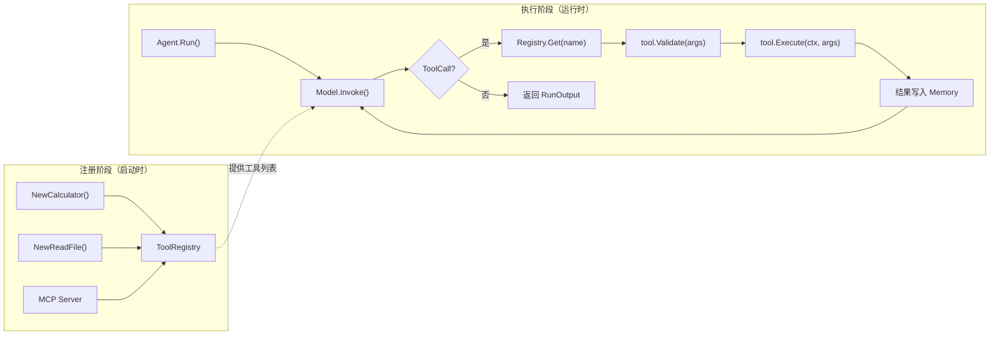
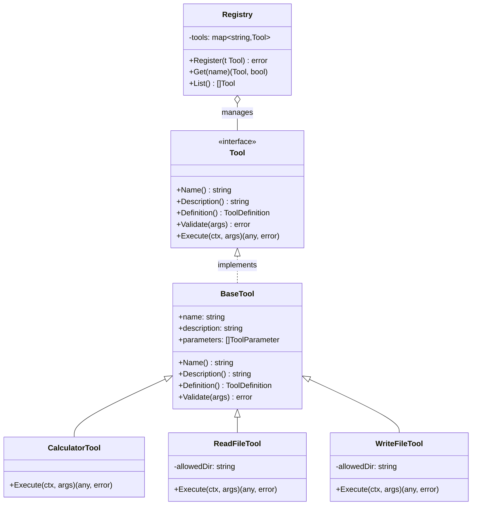

# 第 4 章 工具层

### 设计思路：工具是 Agent 与现实世界的桥梁

大模型只能生成文本。它不能查数据库、不能读文件、不能调用 API。工具层的存在就是让 Agent 拥有"手和脚"——通过统一接口与外部世界交互。

设计工具层时的核心权衡：

| 方案 | 优点 | 缺点 |
|------|------|------|
| 内嵌在 Agent 中 | 简单 | 不可复用、不可测试 |
| 独立 Tool 接口 | 可复用、可测试 | 需要 Registry 管理 |
| MCP 协议 | 跨语言通用 | 复杂度高 |

我们选择方案 2（独立 Tool 接口）作为核心，方案 3（MCP）作为扩展。这是**渐进信任原则**的体现——先保证核心工具可靠，再逐步接入外部能力。

工具层是 Agent 与外部世界交互的桥梁。没有工具，Agent 只是一个"会说话的聊天机器人"。

---

## 4.1 工具层的设计目标

工具层需要解决三个核心问题：

| 问题 | 方案 |
|------|------|
| **统一抽象** | 无论内部工具还是外部 API，都通过同一个 `Tool` 接口暴露 |
| **可发现性** | Agent 需要知道有哪些工具可用、每个工具的入参是什么 |
| **安全执行** | 参数校验、权限检查、错误处理 |

### 4.1.1 什么是工具？

在 Harness 体系中，**工具** 是 Agent 可以调用的外部能力单元。每个工具：
- 有唯一的名称（用于模型引用）
- 有明确的入参定义（JSON Schema 格式）
- 接受上下文和参数，返回结构化结果

### 4.1.2工具与 API 的关系

```
Agent ←→ Tool Interface ←→ 具体实现（计算器/文件API/HTTP客户端/MCP）
```

工具接口是适配器模式的核心——它将千差万别的外部系统统一为相同的调用方式。

---

## 4.2 Tool 接口设计

```go
type Tool interface {
	Name() string                                           // 工具名称（模型通过名称调用）
	Description() string                                    // 工具描述（模型理解工具用途）
	Definition() model.ToolDefinition                       // 模型可识别的定义（JSON Schema）
	Validate(args map[string]any) error                     // 参数校验
	Execute(ctx context.Context, args map[string]any) (any, error) // 执行
}
```

### 方法职责分析

**Name()**
- 必须是唯一的（Registry 以此索引）
- 推荐使用小写字母和下划线，如 `query_order`、`track_logistics`

**Description()**
- 模型通过描述理解工具的用途
- 描述应简洁但清晰："查询订单信息，包括订单状态、商品、金额等"

**Definition()**
- 返回 OpenAI Tool Definition 格式
- 包含参数 Schema，模型据此生成参数

**Validate()**
- `BaseTool.Validate` 校验必填字段、JSON 基本类型、有限数值、整数语义和字符串 Enum
- 数值范围、字段间关系、资源归属等领域规则由具体 Tool 继续校验；Definition 中的 Schema 是给模型的约束提示，不能替代执行端校验
- 在校验通过后才执行，避免无效调用

**Execute()**
- 实际执行工具逻辑
- 返回 `any` 类型，因为不同工具的返回千差万别

---

## 4.3 BaseTool 基类

为了避免每个工具都重复实现 `Name()`、`Description()`、`Definition()` 等通用方法，我们提供一个 `BaseTool` 结构体。

这里选择“嵌入小型基类”而不是反射自动生成 Tool，是为了让公开 Schema 保持显式、容易审查。代价是复杂参数校验仍要在具体 Tool 中编写；这恰好把通用的类型/必填/Enum 校验与领域规则分开。

```go
type BaseTool struct {
	name        string
	description string
	parameters  []model.ToolParameter
}

func NewBaseTool(name, description string, params []model.ToolParameter) BaseTool {
	return BaseTool{
		name:        name,
		description: description,
		parameters:  params,
	}
}

func (b BaseTool) Name() string        { return b.name }
func (b BaseTool) Description() string { return b.description }

// Definition 将内部参数格式转换为模型的 ToolDefinition 格式
func (b BaseTool) Definition() model.ToolDefinition {
	props := make(map[string]model.ToolParameter)
	required := make([]string, 0)
	for _, p := range b.parameters {
		props[p.Name] = p
		if p.Required {
			required = append(required, p.Name)
		}
	}
	return model.ToolDefinition{
		Name:        b.name,
		Description: b.description,
		Parameters: model.ToolParameters{
			Type:       "object",
			Properties: props,
			Required:   required,
		},
	}
}

// 教学简化：真实实现还会按 Type 检查 string/number/integer/
// boolean/object/array，并检查字符串 Enum。
func (b BaseTool) Validate(args map[string]any) error {
	for _, p := range b.parameters {
		if p.Required {
			if _, ok := args[p.Name]; !ok {
				return &ValidationError{
					Field:   p.Name,
					Message: "required field missing",
				}
			}
		}
	}
	return nil
}
```

**设计要点**：

`Definition()` 输出的是 OpenAI 兼容的 JSON Schema 格式。这是关键设计决策——我们直接输出模型 API 所需的格式，避免中间转换。

```go
// Definition 的输出示例：
{
  "name": "calculator",
  "description": "执行算术计算",
  "parameters": {
    "type": "object",
    "properties": {
      "expression": {
        "type": "string",
        "description": "算术表达式"
      }
    },
    "required": ["expression"]
  }
}
```

### 工具注册与执行流水线



**设计要点**：
- 注册阶段是一次性的，执行阶段是循环的
- Registry 解耦了工具的创建和使用
- Validate 和 Execute 分离，确保不执行非法参数
- 多 Agent 共用 Registry 时，用 Agent 工具白名单同时约束“模型可见”和“程序可执行”

---

## 4.4 ToolParameter 定义

```go
type ToolParameter struct {
	Name        string   `json:"-"`           // 参数名（不参与序列化，由 Properties map 的 key 承载）
	Type        string   `json:"type"`        // 参数类型：string/number/boolean
	Description string   `json:"description"` // 参数描述
	Required    bool     `json:"-"`           // 是否必需
	Enum        []string `json:"enum,omitempty"` // 枚举值
}
```

---

## 4.5 Registry：工具注册中心

Registry 是工具层的核心组件，管理所有可用的工具。

```go
type Registry struct {
	mu    sync.RWMutex    // 并发安全
	tools map[string]Tool
}

func NewRegistry() *Registry {
	return &Registry{
		tools: make(map[string]Tool),
	}
}

func (r *Registry) Register(t Tool) error {
	// 真实实现先拒绝 nil/typed-nil、空名称，并确认
	// t.Definition().Name 与 t.Name() 一致。
	r.mu.Lock()
	defer r.mu.Unlock()
	name := t.Name()
	if _, exists := r.tools[name]; exists {
		return fmt.Errorf("tool %q already registered", name)
	}
	r.tools[name] = t
	return nil
}

func (r *Registry) MustRegister(t Tool) {
	if err := r.Register(t); err != nil {
		panic(err)
	}
}

func (r *Registry) Get(name string) (Tool, bool) {
	r.mu.RLock()
	defer r.mu.RUnlock()
	t, ok := r.tools[name]
	return t, ok
}

func (r *Registry) List() []Tool {
	r.mu.RLock()
	defer r.mu.RUnlock()
	// 真实实现先排序名称，再按名称取 Tool，避免 map 随机顺序
	// 改变每次发送给 Model 的工具列表。
	result := toolsSortedByName(r.tools) // 教学简写
	return result
}
```

### 为什么使用 `sync.RWMutex`？

Registry 是**读多写少**的典型场景：
- Agent 每次循环都调用 `List()` 获取工具列表（读）
- 工具注册仅在启动时或插件加载时调用（写）

`RWMutex` 允许多个读操作同时进行，只在写操作时互斥，性能优于 `sync.Mutex`。

Registry 是能力目录，不等于每个 Agent 的授权集合。根 Harness 的 `CreateAgentWithTools(name, prompt, names...)` 会先确认名称已注册且无重复，再构造受限 Agent。Agent 发给 Model 的定义只包含白名单；即使自定义 Model 伪造白名单外的 ToolCall，执行阶段也会返回 `SECURITY_VIOLATION`。这种“双检查”避免把安全完全寄托在 Prompt 或模型行为上。

### 为什么 Register 返回 error 而非 panic？

工具名冲突或 Definition 不一致通常是配置错误。在 Harness 初始化时注册工具，不应该让整个系统 panic。返回 error 让上层在接受流量前失败。`MustRegister` 只适合测试或编译期固定集合。

---

## 4.6 实现内置工具

### 4.6.1 计算器工具

计算器是 Agent 最常用的工具之一。实现一个支持 +、-、\*、/、括号的表达式计算器：

```go
type CalculatorTool struct {
	BaseTool
}

func NewCalculator() *CalculatorTool {
	return &CalculatorTool{
		BaseTool: NewBaseTool(
			"calculator",
			"Perform arithmetic calculations. Supports +, -, *, / and parentheses.",
			[]model.ToolParameter{
				{
					Name:        "expression",
					Type:        "string",
					Description: "Arithmetic expression to evaluate (e.g. 25 * 4 + 15)",
					Required:    true,
				},
			},
		),
	}
}

func (c *CalculatorTool) Execute(ctx context.Context, args map[string]any) (any, error) {
	expr, _ := args["expression"].(string)
	if expr == "" {
		return nil, fmt.Errorf("expression is required")
	}

	result, err := evaluate(expr)
	if err != nil {
		return nil, fmt.Errorf("calculation error: %w", err)
	}

	return map[string]any{
		"expression": expr,
		"result":     result,
	}, nil
}
```

**为什么不用第三方表达式库？**
- 减少依赖
- 递归下降解析器是实现简单表达式求值的最佳选择
- 完整的错误处理（除零、语法错误）

`evaluate()` 实现了一个递归下降解析器，支持完整的四则运算和括号：

```go
type parser struct {
	input string
	pos   int
}

func evaluate(expr string) (float64, error) {
	p := &parser{input: expr}
	return p.parseExpr()
}

// parseExpr 解析加减法表达式
func (p *parser) parseExpr() (float64, error) {
	result, err := p.parseTerm()
	// 循环处理 + 和 -
}

// parseTerm 解析乘除法表达式
func (p *parser) parseTerm() (float64, error) {
	result, err := p.parseFactor()
	// 循环处理 * 和 /
}

// parseFactor 处理括号和数字
func (p *parser) parseFactor() (float64, error) {
	// '(' expr ')'
	// 或 number
}
```

### 4.6.2 文件操作工具

文件操作是 Agent 访问本地文件系统的桥梁。必须考虑安全限制：

```go
type ReadFileTool struct {
	BaseTool
	allowedDir string  // 安全限制：只允许读此目录下的文件
}

func NewReadFile(allowedDir string) *ReadFileTool {
	return &ReadFileTool{
		BaseTool: NewBaseTool(...),
		allowedDir: allowedDir,
	}
}

func (t *ReadFileTool) Execute(ctx context.Context, args map[string]any) (any, error) {
	path, _ := args["path"].(string)
	root, err := os.OpenRoot(t.allowedDir)
	if err != nil {
		return nil, err
	}
	defer root.Close()
	file, err := root.Open(path)
	// 真实实现使用 LimitReader，单文件最多读取 1 MiB。
	return readAtMost1MiB(file, err) // 教学简写
}
```

**为什么不能只检查 `..`？**

词法路径检查可以挡住 `../../outside`，却挡不住“允许目录中的符号链接指向目录外”。当前实现使用 Go 1.26 的 `os.OpenRoot`：所有打开、创建父目录和读写操作都相对于目录根完成；越界 `..`、绝对链接和指向根外的符号链接会被标准库拒绝。Read/Write 单文件限制为 1 MiB，ListDir 最多返回 1000 项，避免工具结果耗尽内存或上下文。

### 4.6.3 其他常用内置工具

除计算器与文件读写外，Harness 还提供以下内置工具（通过 `allowed_tools` 按需启用）：

| 工具名 | 作用 | 关键参数 | 权限 |
|--------|------|----------|------|
| `get_current_time` | 获取当前时间（可选 IANA 时区） | `timezone` | 无 |
| `list_dir` | 列出目录条目（同文件沙箱） | `path` | `read_file` |
| `http_get` | 有界 HTTP(S) GET；默认拒绝私网，最多 5 次重定向 | `url`, `timeout_seconds` | `network_access` |
| `json_parse` | 将 JSON 字符串解析为结构化值 | `text` | 无 |

`list_dir` 与 `read_file` / `write_file` 共用安全目录根。`http_get` 默认超时 10 秒、策略上限 30 秒、正文上限 64 KiB；默认拒绝回环、私网、链路本地、组播、未指定地址和 CGNAT，并在每次重定向时重新检查 Host。需要访问可信内网时，应显式使用 `NewHTTPGetWithConfig` 配置 allowlist/网络策略，而不是修改全局默认。非 2xx 仍返回 `status` + 截断后的 `body`，由业务决定含义。

### 工具类图



**继承关系**：CalculatorTool、ReadFileTool 继承 BaseTool 的公共方法（Name、Description、Definition、Validate），只需实现 Execute。

---

## 4.7 工具在 Agent 中的调用流程

```
Agent.Run()
  │
  ├─ buildToolDefinitions()
  │     ├─ Registry.List()
  │     └─ 每个 Tool.Definition() → []ModelToolDefinition
  │
  ├─ Model.Invoke(req)  ← 工具定义作为参数传入
  │
  ├─ 模型返回 ToolCall
  │     └─ executeToolCall()
  │           ├─ Registry.Get(name)
  │           ├─ json.Unmarshal(arguments)
  │           ├─ tool.Validate(args)
  │           └─ tool.Execute(ctx, args) → result
  │
  └─ 工具结果 → RoleTool 消息 → 记忆 → 下一轮循环
```

---

## 4.8 工具的错误处理

工具执行过程中可能出现多种错误：

| 错误类型 | 处理方式 |
|---------|---------|
| 参数缺失 | 在 Validate 阶段返回，不执行 |
| 参数基本类型/Enum 错误 | BaseTool.Validate 返回，不执行 |
| 参数范围/领域关系错误 | 具体 Tool 的 Validate 或 Execute 返回错误 |
| 外部系统不可用 | Execute 返回错误；Agent 将错误写回模型，由下一轮决定解释或换方案 |
| 结果过大 | 可能需要截断（避免超过 Token 限制） |
| 权限不足 | 在安全层拦截，不执行 |

---

## 4.9 本章小结

- 设计并实现了 `Tool` 接口，统一了所有外部能力的调用方式
- 实现了 `BaseTool` 基类，减少重复代码
- 实现了线程安全的 `Registry` 工具注册中心
- 实现了计算器、文件操作、时间、列目录、HTTP GET、JSON 解析等内置工具
- 建立了目录根、符号链接越界防护、结果上限和 HTTP SSRF 默认防护

---

## 练习

1. 为 `http_get` 编写 DNS 返回“一个公网地址 + 一个私网地址”的测试，解释为什么应整体拒绝
2. 为 Registry 添加 `ListByPermission(perm string) []Tool` 方法，方便权限控制
3. 实现工具结果截断机制：当工具返回超过 2000 字符时，自动截断并添加 `[truncated]` 标记
