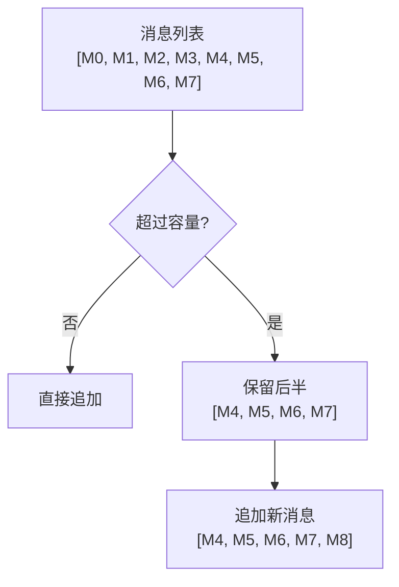
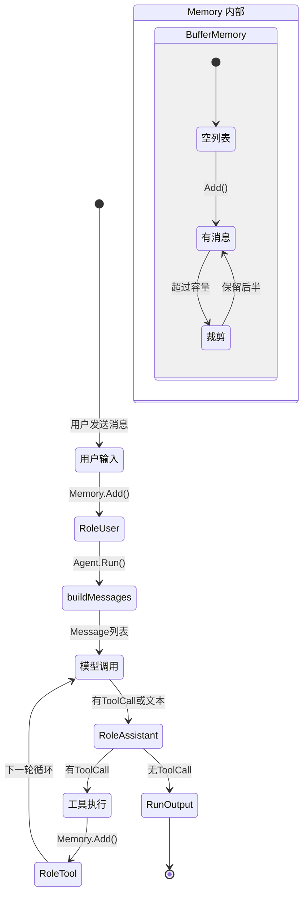

# 第 5 章 记忆子系统

### 设计思路：记忆是 Agent 的"短期工作记忆"

大模型的上下文窗口是有限的。每次 Agent 循环都会新增消息——用户输入、模型回复、工具调用、工具结果。多轮交互后上下文很容易耗尽。

Memory 子系统的核心设计决策是**裁剪策略**——当消息数超过容量时，丢弃哪些消息？

我们的选择是**保留后半**：丢弃最早的对话，保留最新的交互。原因：



**为什么丢弃最早而非最旧？**
- 在验证循环中，最新的消息（工具结果、模型回复）比最早的对话更有价值
- System Prompt 每次 Run 时由 Agent 重新注入，不会被裁剪
- 用户最近的需求比开场白更重要

记忆是 Agent 的"短期工作记忆"。没有记忆，Agent 每次对话都是一次"失忆症"发作。

---

## 5.1 记忆的工程挑战

### 5.1.1 大模型的上下文窗口限制

所有大模型都有上下文窗口限制（Context Window）：
- GPT-4o-mini: 128K tokens
- DeepSeek-V3: 128K tokens
- Claude 3.5 Sonnet: 200K tokens

虽然这些窗口看起来很大，但每次 Agent 循环都会新增消息——用户输入、模型回复、工具调用、工具结果。多轮交互后上下文很容易耗尽。

### 5.1.2 记忆的三个层次

```
┌──────────────────────────────────────────┐
│           短期记忆 (Buffer)                │
│  当前会话的所有消息，带容量限制               │
│  用于保持当前对话的连续性                     │
├──────────────────────────────────────────┤
│           中期记忆 (Summary)                │
│  历史会话的压缩摘要                          │
│  用于跨会话的上下文保持                       │
├──────────────────────────────────────────┤
│           长期记忆 (Storage)                │
│  持久化存储（数据库/文件）                    │
│  用于用户画像、知识积累                       │
└──────────────────────────────────────────┘
```

本章实现**短期记忆（Buffer）**，这是验证循环运转的基础。

### 5.1.3 关键问题：何时丢弃？

当消息数超过容量时，需要做裁剪决策。裁剪策略的选择直接影响 Agent 的表现：

| 策略 | 做法 | 后果 |
|------|------|------|
| 丢弃最早 | 删除头部消息 | 丢失对话上下文 |
| 丢弃中间 | 保留开头和结尾 | 实现复杂，上下文断裂 |
| 保留后半 | 丢弃前一半，保留后一半 | 保留最新交互，但丢失开场信息 |

我们选择**保留后半**策略——当消息超过容量时，丢弃前半部分，保留后半部分。原因是循环中最新的消息（包括工具调用结果）比最早的消息更重要。

---

## 5.2 Memory 接口

```go
type Memory interface {
	Add(msg types.Message)                     // 添加一条消息
	Get(index int) (types.Message, bool)       // 按索引获取
	Recent(n int) []types.Message              // 获取最近 n 条
	Snapshot() []types.Message                 // 获取全部消息的副本
	Clear()                                    // 清空
	Len() int                                  // 当前消息数
}
```

**为什么 Snapshot 返回副本？**

如果返回原始 slice，外部代码可以修改 Memory 内部状态，导致数据竞争。返回副本以保障封装性。

---

## 5.3 BufferMemory 实现

```go
type BufferMemory struct {
	messages []types.Message
	capacity int
}

func NewBufferMemory(capacity int) *BufferMemory {
	if capacity <= 0 {
		capacity = 100
	}
	return &BufferMemory{
		messages: make([]types.Message, 0, capacity),
		capacity: capacity,
	}
}
```

**为什么 capacity 默认 100？**

100 条消息的经验估算：
- 一个典型的 Agent 交互约 3-5 条消息/循环
- `MaxLoops` 默认 10 → 约 30-50 条消息/次运行
- 100 条可容纳 2-3 次完整的验证循环

### 5.3.1 Add 方法——裁剪策略的核心

```go
func (m *BufferMemory) Add(msg types.Message) {
	if len(m.messages) >= m.capacity {
		// 超过容量时，丢弃前半部分
		keep := m.messages[m.capacity/2:]
		m.messages = keep
	}
	m.messages = append(m.messages, msg)
}
```

**裁剪策略示例**（capacity=10）：

```
添加前: [M0, M1, M2, M3, M4, M5, M6, M7, M8, M9]  (10 条)
触发裁剪 → 保留 [M5, M6, M7, M8, M9]  (5 条)
添加后: [M5, M6, M7, M8, M9, M10]     (6 条)
```

**决策依据**：
- 验证循环中，最新的消息是工具调用结果和模型回复，比最早的对话更有价值
- 系统提示词（System Prompt）不在 Memory 中——它在每次 Run 时由 Agent 重新注入

### 5.3.2 Recent 方法

```go
func (m *BufferMemory) Recent(n int) []types.Message {
	if n <= 0 {
		return nil
	}
	if n >= len(m.messages) {
		result := make([]types.Message, len(m.messages))
		copy(result, m.messages)
		return result
	}
	result := make([]types.Message, n)
	copy(result, m.messages[len(m.messages)-n:])
	return result
}
```

`Recent(5)` 返回最后 5 条消息，用于需要快速查看最新上下文的场景。

### 5.3.3 Snapshot 方法

```go
func (m *BufferMemory) Snapshot() []types.Message {
	result := make([]types.Message, len(m.messages))
	copy(result, m.messages)
	return result
}
```

深度复制，确保外部修改不影响内部状态。

---

## 5.4 消息的生命周期

在 Agent 的一次 Run 调用中，消息的流转如下：

```
用户输入 → RoleUser 消息 → Memory.Add()
                                       ↓
                  buildMessages() → Memory.Snapshot() → 模型调用
                                                             ↓
                          模型返回内容 + ToolCalls → RoleAssistant → Memory.Add()
                                                             ↓
                          执行工具 → 结果 → RoleTool → Memory.Add()
                                                             ↓
                                        (有 ToolCall 则继续循环)
                                                             ↓
                                         (无 ToolCall 则返回)
```

### 消息生命周期图



---

## 5.5 在 Agent 中使用 Memory

```go
func (a *Agent) Run(ctx context.Context, input string) *RunOutput {
	// 用户消息入记忆
	a.Memory.Add(types.Message{
		Role:      types.RoleUser,
		Content:   input,
		CreatedAt: time.Now(),
	})

	// 构建消息：从 Memory 获取 + 注入 System Prompt
	msgs := a.buildMessages()

	// ... 模型调用 ...

	// 模型回复入记忆
	a.Memory.Add(assistantMsg)

	// 工具结果入记忆
	a.Memory.Add(toolMsg)
}
```

**Agent 和 Memory 的关系**：
- Agent 持有 Memory 的引用（结构体字段）
- 同一个 Memory 实例可以被多次 Run 调用共享
- 如果需要"新对话"，可以调用 `Memory.Clear()` 或创建新的 Memory

---

## 5.6 扩展：多会话支持

生产环境中，不同用户应该有不同的 Memory。可以通过 `map[string]Memory` 实现：

```go
type SessionManager struct {
	mu       sync.RWMutex
	sessions map[string]memory.Memory
}

func (sm *SessionManager) GetOrCreate(sessionID string) memory.Memory {
	sm.mu.Lock()
	defer sm.mu.Unlock()
	if mem, ok := sm.sessions[sessionID]; ok {
		return mem
	}
	mem := memory.NewBufferMemory(100)
	sm.sessions[sessionID] = mem
	return mem
}
```

---

## 5.7 本章小结

- 理解了记忆在 Agent 系统中的三个层次：短期/中期/长期
- 实现了 BufferMemory，采用"保留后半"裁剪策略
- 确保了 Memory 的封装性（Snapshot 返回副本）
- 理解了消息在验证循环中的完整生命周期

---

## 练习

1. 为 BufferMemory 添加 `sync.RWMutex` 实现并发安全
2. 实现 `TTLMemory`：每条消息带有 TTL（Time To Live），过期后自动淘汰
3. 实现 `SummaryMemory`：当消息超限时，自动调用 LLM 生成摘要，用摘要替换旧消息
