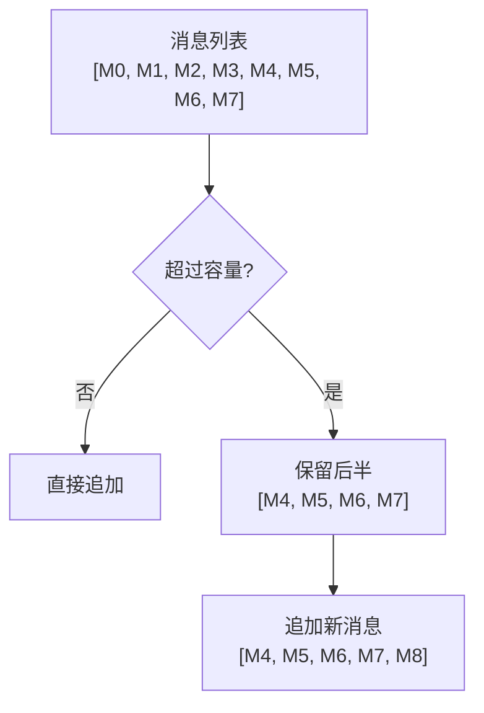
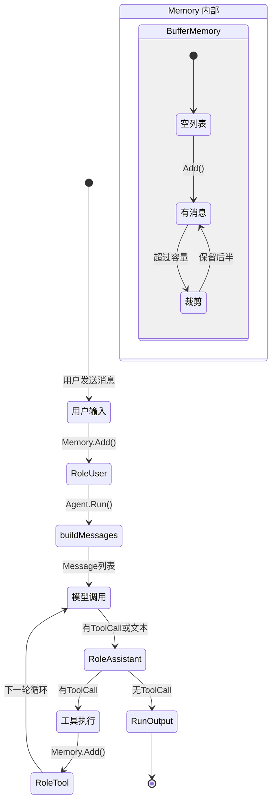

# 第 5 章 记忆子系统

### 设计思路：记忆是 Agent 的"短期工作记忆"

大模型的上下文窗口是有限的。每次 Agent 循环都会新增消息——用户输入、模型回复、工具调用、工具结果。多轮交互后上下文很容易耗尽。

Memory 子系统的核心设计决策是**裁剪策略**——当消息数超过容量时，丢弃哪些消息？

我们的选择是**保留后半**：丢弃最早的对话，保留最新的交互。原因：



**为什么丢弃旧消息而不是最新消息？**
- 在验证循环中，最新的消息（工具结果、模型回复）比最早的对话更有价值
- AgentConfig 的 System Prompt 每次 Run 时由 Agent 重新注入；显式写入 Memory 开头的连续 System 消息也会被裁剪逻辑保留
- 用户最近的需求比开场白更重要

记忆是 Agent 的"短期工作记忆"。没有记忆，Agent 每次对话都是一次"失忆症"发作。

---

## 5.1 记忆的工程挑战

### 5.1.1 大模型的上下文窗口限制

所有大模型都有上下文窗口限制（Context Window），具体上限随模型版本变化，应以所接 Provider 的模型文档和响应错误为准。工程上不能因为某个模型窗口较大，就取消 Memory 预算。

虽然这些窗口看起来很大，但每次 Agent 循环都会新增消息——用户输入、模型回复、工具调用、工具结果。多轮交互后上下文很容易耗尽。

### 5.1.2 记忆的三个层次

```
┌──────────────────────────────────────────┐
│           短期记忆 (Buffer)                │
│  当前会话的所有消息，带容量限制               │
│  用于保持当前对话的连续性                     │
├──────────────────────────────────────────┤
│           中期记忆 (Summary)                │
│  历史会话的压缩摘要                          │
│  用于跨会话的上下文保持                       │
├──────────────────────────────────────────┤
│           长期记忆 (Storage)                │
│  持久化存储（数据库/文件）                    │
│  用于用户画像、知识积累                       │
└──────────────────────────────────────────┘
```

本章实现**短期记忆（Buffer）**，这是验证循环运转的基础。

### 5.1.3 关键问题：何时丢弃？

当消息数超过容量时，需要做裁剪决策。裁剪策略的选择直接影响 Agent 的表现：

| 策略 | 做法 | 后果 |
|------|------|------|
| 丢弃最早 | 删除头部消息 | 丢失对话上下文 |
| 丢弃中间 | 保留开头和结尾 | 实现复杂，上下文断裂 |
| 保留后半 | 丢弃前一半，保留后一半 | 保留最新交互，但丢失开场信息 |

我们选择**保留后半**策略——当消息超过容量时，丢弃前半部分，保留后半部分。原因是循环中最新的消息（包括工具调用结果）比最早的消息更重要。

---

## 5.2 Memory 接口

```go
type Memory interface {
	Add(msg types.Message)                     // 添加一条消息
	Get(index int) (types.Message, bool)       // 按索引获取
	Recent(n int) []types.Message              // 获取最近 n 条
	Snapshot() []types.Message                 // 获取全部消息的副本
	Clear()                                    // 清空
	Len() int                                  // 当前消息数
}
```

**为什么 Snapshot 返回副本？**

如果返回原始 slice，外部代码可以修改 Memory 内部状态，导致数据竞争。返回副本以保障封装性。

---

## 5.3 BufferMemory 实现

```go
type BufferMemory struct {
	messages []types.Message
	capacity int
}

func NewBufferMemory(capacity int) *BufferMemory {
	if capacity <= 0 {
		capacity = 100
	}
	return &BufferMemory{
		messages: make([]types.Message, 0, capacity),
		capacity: capacity,
	}
}
```

**为什么 capacity 默认 100？**

这里的 100 是直接调用 `memory.NewBufferMemory(0)` 时的兜底值。通过 `agent.DefaultConfig()` / `Harness.CreateAgent` 创建时，配置默认容量是 50；两条构造路径不要混为一谈。

容量按“消息条数”而不是 Token 计算。一轮没有工具调用时通常增加 user + assistant；有工具调用时，每个 ToolCall 还会增加一条 tool 消息，而且一次模型响应可以包含多个 ToolCall。因此不能从 `MaxLoops=10` 推导固定消息数量。50/100 只是保守起点，生产应用应根据实际消息大小、工具并行度和模型上下文预算选择容量。

### 5.3.1 Add 方法——裁剪策略的核心

```go
func (m *BufferMemory) Add(msg types.Message) {
	m.mu.Lock()
	defer m.mu.Unlock()

	if len(m.messages) >= m.capacity {
		cut := m.capacity / 2
		if cut < 1 { cut = 1 }

		// 保留开头连续的 System 消息，再丢弃旧的非 System 消息。
		start := 0
		for start < len(m.messages) && m.messages[start].Role == types.RoleSystem {
			start++
		}
		if start < cut {
			m.messages = append(m.messages[:start], m.messages[cut:]...)
		} else {
			m.messages = m.messages[cut:]
		}
	}
	m.messages = append(m.messages, msg)
}
```

**裁剪策略示例**（capacity=10）：

```
添加前: [M0, M1, M2, M3, M4, M5, M6, M7, M8, M9]  (10 条)
触发裁剪 → 保留 [M5, M6, M7, M8, M9]  (5 条)
添加后: [M5, M6, M7, M8, M9, M10]     (6 条)
```

**决策依据**：
- 验证循环中，最新的消息是工具调用结果和模型回复，比最早的对话更有价值
- AgentConfig 中的 SystemPrompt 通常不写入 Memory，而是在 `buildMessages` 时注入
- 调用 `AddSystemMessage` 可以显式写入 System 消息，因此裁剪算法会保留开头连续的 System 消息

### 5.3.2 Recent 方法

```go
func (m *BufferMemory) Recent(n int) []types.Message {
	if n <= 0 {
		return nil
	}
	if n >= len(m.messages) {
		result := make([]types.Message, len(m.messages))
		copy(result, m.messages)
		return result
	}
	result := make([]types.Message, n)
	copy(result, m.messages[len(m.messages)-n:])
	return result
}
```

`Recent(5)` 返回最后 5 条消息，用于需要快速查看最新上下文的场景。

### 5.3.3 Snapshot 方法

```go
func (m *BufferMemory) Snapshot() []types.Message {
	result := make([]types.Message, len(m.messages))
	copy(result, m.messages)
	return result
}
```

这里是 **slice 的浅拷贝**：外部增删或替换 `Message` 元素不会改变 Memory 中的 slice；但 `Message.ToolCalls` 等元素内部的引用字段并未递归深拷贝。当前运行时把消息当作值读取，已经满足封装需要；如果未来允许调用方修改嵌套字段，应增加真正的深拷贝。

---

## 5.4 消息的生命周期

在 Agent 的一次 Run 调用中，消息的流转如下：

```
用户输入 → RoleUser 消息 → Memory.Add()
                                       ↓
                  buildMessages() → Memory.Snapshot() → 模型调用
                                                             ↓
                          模型返回内容 + ToolCalls → RoleAssistant → Memory.Add()
                                                             ↓
                          执行工具 → 结果 → RoleTool → Memory.Add()
                                                             ↓
                                        (有 ToolCall 则继续循环)
                                                             ↓
                                         (无 ToolCall 则返回)
```

### 消息生命周期图



---

## 5.5 在 Agent 中使用 Memory

```go
// 结构示意：真实字段是私有的，并带有 RWMutex 保护。
func (a *Agent) Run(ctx context.Context, input string) *RunOutput {
	// 用户消息入记忆
	a.Memory.Add(types.Message{
		Role:      types.RoleUser,
		Content:   input,
		CreatedAt: time.Now(),
	})

	// 构建消息：从 Memory 获取 + 注入 System Prompt
	msgs := a.buildMessages()

	// ... 模型调用 ...

	// 模型回复入记忆
	a.Memory.Add(assistantMsg)

	// 工具结果入记忆
	a.Memory.Add(toolMsg)
}
```

**Agent 和 Memory 的关系**：
- Agent 持有 Memory 的引用（结构体字段）
- 同一个 Memory 实例可以被多次 Run 调用共享
- `engine.Agent` 没有公开 `ClearMemory` 方法；自定义组装 Agent 时可保留 Memory 引用并调用 `Clear()`，使用 `Harness.CreateAgent` 时通常为新会话创建新的 Agent
- 同一个 Agent 的 `Run` 由内部运行闸门串行化：第二个调用会等待前一个调用结束，等待期间仍能被 Context 取消
- 串行化只解决“消息交错”和数据竞态，不解决会话隔离；两个用户复用同一个 Agent，仍会依次看到同一份历史

---

## 5.6 同步 API 的多会话扩展

不使用 Task 模式时，生产环境仍需让不同会话使用不同 Memory。可以通过 `map[string]Memory` 实现会话路由；下面是同步 API 的应用层扩展示例。Task 模式已经用 `(TaskID, AgentID)` 内置隔离，不需要这段 SessionManager：

```go
type SessionManager struct {
	mu       sync.RWMutex
	sessions map[string]memory.Memory
}

func (sm *SessionManager) GetOrCreate(sessionID string) memory.Memory {
	sm.mu.Lock()
	defer sm.mu.Unlock()
	if mem, ok := sm.sessions[sessionID]; ok {
		return mem
	}
	mem := memory.NewBufferMemory(100)
	sm.sessions[sessionID] = mem
	return mem
}
```

初学者容易把“并发安全”和“会话安全”当成同一件事。两者的区别是：

| 问题 | 同步 Agent 的保证 | Task 模式的保证 |
|---|---|---|
| 两个 goroutine 同时调用同一 Agent 会不会破坏内部状态？ | 不会；Run 会串行，Memory 自身也有锁 | 同一 Task/Agent 串行，不同 Task 可并行 |
| 两个任务会不会读到对方的历史？ | 会，只要它们复用同一个 Agent/Memory | 不会；TaskID 是上下文隔离键 |
| 不同会话能否并行执行？ | 可以，前提是使用不同 Agent 实例 | 管理实例生命周期与容量 |

设计思路是让库守住通用的并发正确性，把“什么叫一个会话、何时过期、存到哪里”留给应用决定。后者依赖具体产品，放进通用 Harness 反而会制造错误假设。

---

## 5.7 本章小结

- 理解了记忆在 Agent 系统中的三个层次：短期/中期/长期
- 实现了 BufferMemory，采用"保留后半"裁剪策略
- 确保了 Memory 的封装性（Snapshot 返回副本）
- 理解了消息在验证循环中的完整生命周期
- 区分了数据结构并发安全、单 Agent 串行执行和多会话语义隔离

---

## 练习

1. 为 BufferMemory 编写并发读写测试，使用 `go test -race ./...` 验证现有 `sync.RWMutex`
2. 实现 `TTLMemory`：每条消息带有 TTL（Time To Live），过期后自动淘汰
3. 为 `SummaryMemory` 注入一个确定性测试摘要器，验证成功压缩与硬上限失败

---

## 5.8 Task 模式为什么不能继续共享 Agent Memory

旧同步 API 把 `BufferMemory` 放在 Agent 实例上，并用 Agent 级运行闸门串行化访问。这适合单会话示例，却不适合一个 Agent 同时服务多个任务：串行只能防止数据交错，不能阻止 Task A 读取 Task B 的历史。

Task 模式把所有权改为 `(TaskID, AgentID)`：

```text
Task A ─ assistant → 独立 SummaryMemory + 独立运行闸门
Task B ─ assistant → 独立 SummaryMemory + 独立运行闸门
```

因此同一 Task 内同一 Agent 的 Turn 保持顺序，不同 Task 可以并发且上下文隔离。普通 `RunAgent` 仍使用 Agent 自己的 `BufferMemory`，这是“旧同步 API 保持兼容”的具体含义之一。

## 5.9 Summary Memory 的失败边界

默认策略是超过 50 条消息时尝试摘要，摘要成功后保留最近 20 条原文，100 条是硬上限。默认摘要器使用当前 Model、`temperature=0`、不提供任何业务工具；调用方也可通过 `task.Options.Summarizer` 注入实现。

关键设计不是“会摘要”，而是“摘要失败时不丢数据”：

- 未达到硬上限：保留全部原文，当前 Turn 继续；
- 达到硬上限：返回 `SUMMARY_FAILED`，明确停止；
- 摘要成功：先更新内存，再发送 `checkpoint.ready` 让上层决定保存摘要、近期消息或两者。

库的 SummaryMemory 是进程内运行状态，不是持久化产品。上层拥有正式聊天记录，可以保存完整消息；库只需要恢复模型继续工作所需的摘要和近期上下文。
