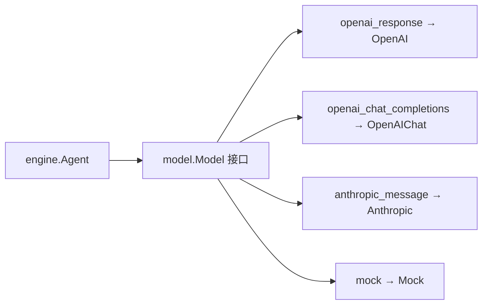

# 第 6 章 模型集成

### 核心思路：为什么要模型抽象层？

Agent 运行时只依赖 **model.Model 接口**，不关心底层是 OpenAI Responses、OpenAI Chat Completions 还是 Anthropic Messages。配置里用 **vendor** 记录「谁在提供服务」，用 **api_format** 选择「用哪套 HTTP 协议客户端」——两者解耦，便于同一 vendor 换协议或同一协议对接不同网关。



---

## 6.1 Model 接口

定义位于 `model/interface.go`：

```go
type Model interface {
	Invoke(ctx context.Context, req *InvokeRequest) (*InvokeResponse, error)
	InvokeStream(ctx context.Context, req *InvokeRequest) (<-chan ResponseChunk, error)
	Provider() string
	ModelID() string
}
```

- **InvokeRequest**：消息历史、[]ToolDefinition、温度、MaxTokens、是否流式等。
- **InvokeResponse**：文本、[]types.ToolCall、Usage、FinishReason。
- **Provider()**：实现返回协议/实现名（如 openai、openai_chat、anthropic、mock），供日志和错误定位。

引擎在 Run 循环中只调用 Invoke / InvokeStream，不引用具体 HTTP 包。

---

## 6.2 三种 HTTP 协议（+ mock）

本仓库通过 api_format 映射到 `model` 包中的实现：

| api_format | 实现类型 | 典型场景 |
|------------|----------|----------|
| openai_response | NewOpenAI（openai.go） | OpenAI Responses / 兼容网关 |
| openai_chat_completions | NewOpenAIChat（openai_chat.go） | Chat Completions（DeepSeek 等 OpenAI 兼容） |
| anthropic_message | NewAnthropic（anthropic.go） | Anthropic Messages API |
| mock | NewMock（mock.go） | 测试与无密钥 Demo |

**vendor** 字段（如 deepseek、openai、anthropic）仅作标识与日志；**不会**自动填充 base_url。所有连接参数必须在 JSON 中显式给出。

---

## 6.3 BuildModel：按 api_format 构造

ModelConfig 与 BuildModel() 位于根包的 `config.go`：

```go
type ModelConfig struct {
	Vendor    string `json:"vendor"`
	APIFormat string `json:"api_format"`
	BaseURL   string `json:"base_url,omitempty"`
	APIKey    string `json:"api_key,omitempty"`
	ModelID   string `json:"model_id"`
	Timeout   int    `json:"timeout_seconds"`
}

func (c ModelConfig) BuildModel() (model.Model, error) {
	switch c.APIFormat {
	case "openai_response":
		return model.NewOpenAI(...)
	case "openai_chat_completions":
		return model.NewOpenAIChat(...)
	case "anthropic_message":
		return model.NewAnthropic(...)
	case "mock":
		return model.NewMock(c.ModelID), nil
	default:
		return nil, fmt.Errorf("unsupported api_format: %s", c.APIFormat)
	}
}
```

`Harness.New()` 会先自动调用 `ResolveModelDefaults`，再执行 `Config.Validate()`，最后构造并注入私有默认模型。归一化会清理 vendor/api_format 的空白与大小写并补默认超时，但**不会**根据 vendor 推断 BaseURL。校验会在启动阶段拒绝未知协议、空 ModelID、非法 URL 和负超时，避免错误延迟到第一次请求才暴露。

应用一般不必在 `agent.New` 前手动调用 `ResolveModelDefaults`。JD Demo 之所以显式调用，是因为它要在创建 Harness 之前判断归一化后的 `api_format`，以便在没有 Key 时切换到 Mock。需要查看最终归一化配置时使用 `h.Config()`，需要查看默认模型时使用 `h.Model()`。

DefaultConfig() 默认：

```go
DefaultModel: ModelConfig{
	Vendor:    "openai",
	APIFormat: "openai_response",
	ModelID:   "gpt-4o-mini",
	Timeout:   60,
},
```

---

## 6.4 配置文件：config.example.json

Demo 使用的完整配置在 `examples/config.example.json`：

```json
{
  "default_model": {
    "vendor": "deepseek",
    "api_format": "anthropic_message",
    "base_url": "https://api.deepseek.com/anthropic",
    "api_key": "",
    "model_id": "deepseek-v4-flash",
    "timeout_seconds": 60
  }
}
```

示例使用 DeepSeek 提供的 Anthropic Messages 兼容端点。真实 Key 不写入 JSON，而由 `TRACKLOGIC_AGENT_API_KEY` 在进程启动时覆盖。

---

## 6.5 Demo 硬编码加载

入口位于 `cmd/jd-cs-service/main.go`：

```go
const configFile = "examples/config.example.json"

cfg, err := agent.LoadConfig(configFile)
if apiKey := strings.TrimSpace(os.Getenv("TRACKLOGIC_AGENT_API_KEY")); apiKey != "" {
	cfg.DefaultModel.APIKey = apiKey
}
agent.ResolveModelDefaults(&cfg.DefaultModel)
if cfg.DefaultModel.APIFormat != "mock" && cfg.DefaultModel.APIKey == "" {
	cfg.DefaultModel.APIFormat = "mock"
}
```

要点：

1. **无** `-config` 命令行参数和通用 `MODEL_*` 环境变量；真实测试只允许用 `TRACKLOGIC_AGENT_API_KEY` 覆盖 Key。
2. 必须在**仓库根目录**执行 `go run ./cmd/jd-cs-service`，使相对路径 `examples/config.example.json` 可解析。
3. LoadConfig 采用「先 DefaultConfig 再 JSON 覆盖」；文件缺失时打 warn 并使用默认值。

---

## 6.6 与 Engine 的协作

engine.Agent 将 Memory 中的 types.Message 转为 InvokeRequest.Messages，把 Registry 中的工具转为 ToolDefinition。模型返回 ToolCall 时，引擎执行工具并把结果写回 Memory，进入下一轮 Invoke。

### 工具 Schema 为什么同时有结构化字段和 RawSchema

本地内置工具通常只需要 `type`、`properties`、`required`、`enum` 等常用字段，因此 `ToolParameters` 提供了便于 Go 代码构造的结构体字段。MCP Server 返回的 JSON Schema 可能还包含嵌套 `items`、`oneOf`、`$defs`、`pattern` 等任意关键字；如果先反序列化到简化结构体再序列化，这些约束会静默丢失。

因此 `ToolParameters` 还提供 `RawSchema` 和 `Schema()`：

```go
type ToolParameters struct {
	Type       string
	Properties map[string]ToolParameter
	Required   []string
	RawSchema  map[string]any
}

func (p ToolParameters) Schema() map[string]any {
	if p.RawSchema != nil {
		return shallowCopy(p.RawSchema) // 概念示意
	}
	return schemaFromTypedFields(p) // 概念示意
}
```

三个 Provider 在生成请求时都调用 `Parameters.Schema()`。MCP 工具发现会保存完整 RawSchema，因此例如“商品数组中的每个对象必须包含 id/quantity”这样的嵌套约束可以原样传给模型。这里的设计原则是：**公共协议适配层不能只保留自己认识的字段**。

流式路径：传入 `engine.WithStream(fn)` 时，Agent 调用 `InvokeStream`，由 `consumeStream` 按 chunk 拼接 content / 合并增量 ToolCall，并把非空文本立即转发给 `fn`。`Run` 仍同步返回完整 `RunOutput`。Demo 批处理（`jd-cs-service`）通过 `WithStream` 边收边打印 token。

---

## 6.7 HTTP 边界为什么必须由 Provider 守住

模型接口虽然很小，但具体 Provider 位于不可信网络响应进入 Harness 的第一道边界。它不能只负责“拼 JSON”，还必须统一处理资源上限、取消和错误分类。当前三个 HTTP Provider 采用相同策略：

| 风险 | 当前处理 | 设计原因 |
|---|---|---|
| 服务端迟迟不返回 | 默认 HTTP 超时 60 秒，同时服从调用方 Context | 单次网络预算与整次 Run 预算都要能终止请求 |
| 成功响应异常巨大 | 非流式响应最多读取 16 MiB | 防止错误网关或恶意响应耗尽内存 |
| 错误正文异常巨大 | 最多保留 8 KiB | 错误要可诊断，但不能无界进入日志和内存 |
| HTTP 非 2xx | 返回包装后的 `*model.HTTPError` | 调用方无需解析错误字符串即可读取状态码 |
| 流式 JSON 损坏 | 通过 `ResponseChunk.Error` 明确失败并停止 | 不能把不完整回答伪装成成功 |
| 消费者停止读取流 | 发送 chunk 时同时监听 Context | 避免 Provider goroutine 永久阻塞 |
| 自定义 Model 返回 nil response/channel | Engine 转成 `API_ERROR` | 防止错误实现导致 panic 或永久等待 |

`HTTPError` 保留 `Provider`、`StatusCode`、`RequestID`、`RetryAfter` 和有界的 `Body`。应用可以同时识别 Harness 错误码和上游细节：

```go
response, err := runtimeModel.Invoke(ctx, request)
if err != nil {
	var upstream *model.HTTPError
	if errors.As(err, &upstream) {
		log.Printf("provider=%s status=%d request_id=%s retryable=%t",
			upstream.Provider,
			upstream.StatusCode,
			upstream.RequestID,
			upstream.Retryable(),
		)
	}
	return err
}
_ = response
```

`Retryable()` 只做保守的协议级分类：408、425、429、500、502、503、504 返回 true。它**不会自动重试**。是否重试还取决于剩余时间、请求幂等性和应用自己的重试预算，所以策略所有权仍在应用层。

### 注入自定义 HTTP Client，而不污染全局状态

Responses 与 Chat Completions 共用的 `OpenAIConfig`，以及 `AnthropicConfig`，都支持 `HTTPClient` 与 `Headers`。构造函数会复制传入的 `http.Client`；当副本没有 Timeout 时才应用 Provider 的 Timeout，因此不会修改调用方共享的 Client。自定义 Header 可用于网关鉴权或租户路由。

如果应用使用根 Harness 的 JSON 配置路径，但又需要自定义传输层、代理、证书或 Provider 包装器，应先构造 `model.Model`，再通过 `agent.WithModel` 注入：

```go
runtimeModel := model.NewOpenAI(model.OpenAIConfig{
	APIKey:    key,
	BaseURL:   baseURL,
	ModelID:   modelID,
	Timeout:   30 * time.Second,
	HTTPClient: applicationHTTPClient,
})

h, err := agent.New(cfg, agent.WithModel(runtimeModel))
```

这里的设计分工是：JSON 配置保存可序列化的普通参数；带连接池、证书和回调的运行时依赖通过构造选项注入。这样配置文件不会承担它无法安全表达的对象生命周期。

---

## 6.8 本章小结

- 用 **Model 接口** 隔离 LLM 供应商差异。
- 用 **vendor + api_format** 分离「身份」与「协议」；BuildModel **只**看 api_format。
- 三种 HTTP 协议 + **mock** 覆盖主要接入方式；BuildModel 只读取传入的 Config，环境变量覆盖由应用层完成。
- JD Demo 通过硬编码路径加载 **examples/config.example.json**，空密钥自动 mock。
- Provider 对成功响应、错误正文和流式解析设置边界，并返回可识别的结构化错误。
- 自定义 Client/Model 通过依赖注入进入 Harness，不修改调用方对象或进程全局状态。

---

## 练习

1. 在 config.example.json 中把 api_format 改为 mock，观察日志中的 vendor/api_format。
2. 给 `Config.Validate` 增加一个你自己的跨字段规则，并为成功、失败路径写表驱动测试。
3. 构造一个包含数组 `items` 和 `pattern` 的 RawSchema，验证三个 Provider 生成的请求都保留这些关键字。
4. 扩展 Mock，使其根据输入关键词返回固定 ToolCall，用于无网络集成测试。
5. 用 `httptest.Server` 返回 429 和超大正文，分别验证 `HTTPError` 与响应大小上限。
