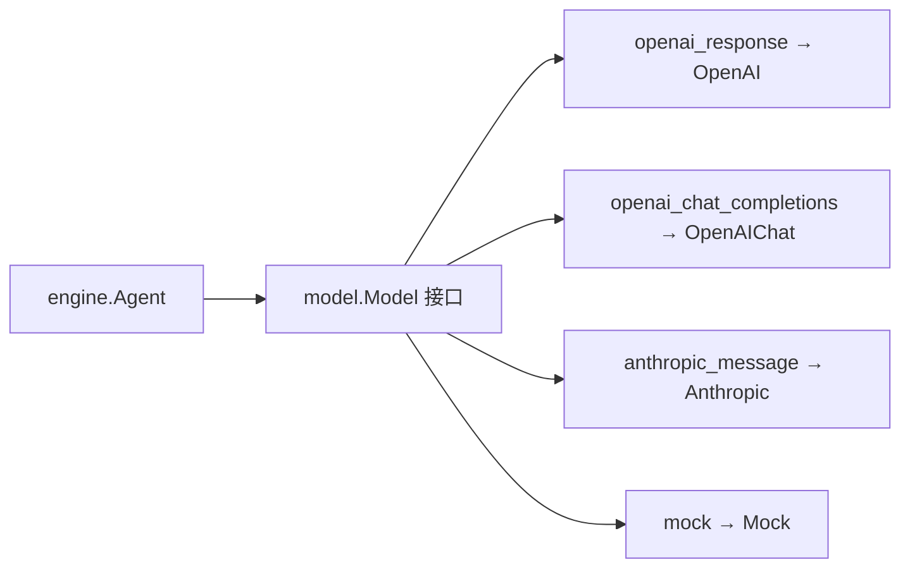

# 第 6 章 模型集成

### 核心思路：为什么要模型抽象层？

Agent 运行时只依赖 **model.Model 接口**，不关心底层是 OpenAI Responses、OpenAI Chat Completions 还是 Anthropic Messages。配置里用 **vendor** 记录「谁在提供服务」，用 **api_format** 选择「用哪套 HTTP 协议客户端」——两者解耦，便于同一 vendor 换协议或同一协议对接不同网关。



---

## 6.1 Model 接口

定义位于 `model/interface.go`：

```go
type Model interface {
	Invoke(ctx context.Context, req *InvokeRequest) (*InvokeResponse, error)
	InvokeStream(ctx context.Context, req *InvokeRequest) (<-chan ResponseChunk, error)
	Provider() string
	ModelID() string
}
```

- **InvokeRequest**：消息历史、[]ToolDefinition、温度、MaxTokens、是否流式等。
- **InvokeResponse**：文本、[]types.ToolCall、Usage、FinishReason。
- **Provider()**：实现返回协议/实现名（如 openai、openai_chat、anthropic、mock），供日志与观测。

引擎在 Run 循环中只调用 Invoke / InvokeStream，不引用具体 HTTP 包。

---

## 6.2 三种 HTTP 协议（+ mock）

本仓库通过 api_format 映射到 `model` 包中的实现：

| api_format | 实现类型 | 典型场景 |
|------------|----------|----------|
| openai_response | NewOpenAI（openai.go） | OpenAI Responses / 兼容网关 |
| openai_chat_completions | NewOpenAIChat（openai_chat.go） | Chat Completions（DeepSeek 等 OpenAI 兼容） |
| anthropic_message | NewAnthropic（anthropic.go） | Anthropic Messages API |
| mock | NewMock（mock.go） | 测试与无密钥 Demo |

**vendor** 字段（如 deepseek、openai、anthropic）仅作标识与日志；**不会**自动填充 base_url。所有连接参数必须在 JSON 中显式给出。

---

## 6.3 BuildModel：按 api_format 构造

ModelConfig 与 BuildModel() 位于根包的 `config.go`：

```go
type ModelConfig struct {
	Vendor    string `json:"vendor"`
	APIFormat string `json:"api_format"`
	BaseURL   string `json:"base_url,omitempty"`
	APIKey    string `json:"api_key,omitempty"`
	ModelID   string `json:"model_id"`
	Timeout   int    `json:"timeout_seconds"`
}

func (c ModelConfig) BuildModel() (model.Model, error) {
	switch c.APIFormat {
	case "openai_response":
		return model.NewOpenAI(...)
	case "openai_chat_completions":
		return model.NewOpenAIChat(...)
	case "anthropic_message":
		return model.NewAnthropic(...)
	case "mock":
		return model.NewMock(c.ModelID), nil
	default:
		return nil, fmt.Errorf("unsupported api_format: %s", c.APIFormat)
	}
}
```

Harness.New() 在启动时调用 cfg.DefaultModel.BuildModel() 并注入私有默认模型。ResolveModelDefaults 会规范化 vendor/api_format 大小写并补默认超时，**不**推断 BaseURL；需要查看默认模型时使用 `h.Model()`。

DefaultConfig() 默认：

```go
DefaultModel: ModelConfig{
	Vendor:    "openai",
	APIFormat: "openai_response",
	ModelID:   "gpt-4o-mini",
	Timeout:   60,
},
```

---

## 6.4 配置文件：config.example.json

Demo 使用的完整配置在 `examples/config.example.json`：

```json
{
  "default_model": {
    "vendor": "deepseek",
    "api_format": "anthropic_message",
    "base_url": "https://api.deepseek.com/anthropic",
    "api_key": "",
    "model_id": "deepseek-v4-flash",
    "timeout_seconds": 60
  }
}
```

示例使用 DeepSeek 提供的 Anthropic Messages 兼容端点。真实 Key 不写入 JSON，而由 `TRACKLOGIC_AGENT_API_KEY` 在进程启动时覆盖。

---

## 6.5 Demo 硬编码加载

入口位于 `cmd/jd-cs-service/main.go`：

```go
const configFile = "examples/config.example.json"

cfg, err := agent.LoadConfig(configFile)
if apiKey := strings.TrimSpace(os.Getenv("TRACKLOGIC_AGENT_API_KEY")); apiKey != "" {
	cfg.DefaultModel.APIKey = apiKey
}
agent.ResolveModelDefaults(&cfg.DefaultModel)
if cfg.DefaultModel.APIFormat != "mock" && cfg.DefaultModel.APIKey == "" {
	cfg.DefaultModel.APIFormat = "mock"
}
```

要点：

1. **无** `-config` 命令行参数和通用 `MODEL_*` 环境变量；真实测试只允许用 `TRACKLOGIC_AGENT_API_KEY` 覆盖 Key。
2. 必须在**仓库根目录**执行 `go run ./cmd/jd-cs-service`，使相对路径 `examples/config.example.json` 可解析。
3. LoadConfig 采用「先 DefaultConfig 再 JSON 覆盖」；文件缺失时打 warn 并使用默认值。

---

## 6.6 与 Engine 的协作

engine.Agent 将 Memory 中的 types.Message 转为 InvokeRequest.Messages，把 Registry 中的工具转为 ToolDefinition。模型返回 ToolCall 时，引擎执行工具并把结果写回 Memory，进入下一轮 Invoke。

流式路径：传入 `engine.WithStream(fn)` 时，Agent 调用 `InvokeStream`，由 `consumeStream` 按 chunk 拼接 content / 合并增量 ToolCall，并把非空文本立即转发给 `fn`。`Run` 仍同步返回完整 `RunOutput`。Demo 批处理（`jd-cs-service`）通过 `WithStream` 边收边打印 token。

---

## 6.7 本章小结

- 用 **Model 接口** 隔离 LLM 供应商差异。
- 用 **vendor + api_format** 分离「身份」与「协议」；BuildModel **只**看 api_format。
- 三种生产协议 + **mock** 覆盖主要接入方式；连接信息全部来自 JSON。
- JD Demo 通过硬编码路径加载 **examples/config.example.json**，空密钥自动 mock。

---

## 练习

1. 在 config.example.json 中把 api_format 改为 mock，观察日志中的 vendor/api_format。
2. 为 ModelConfig 增加校验函数：未知 api_format 在 LoadConfig 后立刻报错。
3. 扩展 Mock，使其根据输入关键词返回固定 ToolCall，用于无网络集成测试。
