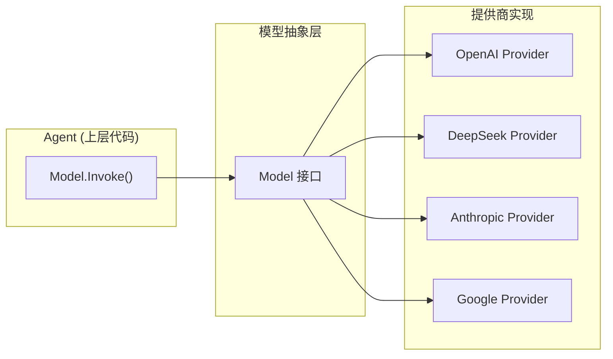
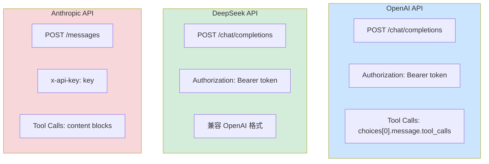

# 第 6 章 模型集成

### 设计思路：为什么需要模型抽象层？

不同 LLM 提供商的 API 差异显著：



**抽象带来的好处**：
1. **切换成本为零**：改配置文件即可切换模型
2. **测试友好**：注入 MockModel 无需真实 API
3. **渐进集成**：先实现一个提供商，后续按需扩展

模型集成层是 Harness 中最关键的抽象——它隔离了 LLM 提供商的差异，让上层代码无需关心背后是 OpenAI 还是 DeepSeek。

---

## 6.1 为什么需要模型抽象？

### 6.1.1 提供商差异

不同 LLM 提供商在 API 设计上存在显著差异：

| 提供商 | API 风格 | Tool Call 格式 | 流式方式 | 认证方式 |
|--------|---------|----------------|---------|---------|
| OpenAI | Chat Completions | 独立字段 | SSE events | Bearer Token |
| DeepSeek | 兼容 OpenAI | 兼容 OpenAI | 兼容 OpenAI | Bearer Token |
| Anthropic | Messages API | 独立块 | SSE events | x-api-key |
| Google | Generative AI | 函数声明 | SSE | API Key |

模型集成层的任务就是将这些差异统一到同一个 `Model` 接口背后。

### 提供商 API 差异可视化



DeepSeek（绿色）与 OpenAI（蓝色）API 高度兼容——只需修改 base URL。Anthropic（红色）格式差异较大，需要更多适配代码。

### 6.1.2 抽象的好处

1. **切换成本为零**：更改配置文件中的 `provider` 字段即可切换模型
2. **测试友好**：可以注入 `MockModel` 在无需真实 API 的情况下测试 Agent
3. **渐进集成**：先实现最常用的 OpenAI，后续按需扩展

---

## 6.2 Model 接口设计

```go
type Model interface {
	// Invoke 同步调用模型，返回完整响应
	Invoke(ctx context.Context, req *InvokeRequest) (*InvokeResponse, error)

	// InvokeStream 流式调用模型，返回结果通道
	InvokeStream(ctx context.Context, req *InvokeRequest) (<-chan ResponseChunk, error)

	// Provider 返回提供商名称（如 "openai"）
	Provider() string

	// ModelID 返回具体模型标识（如 "gpt-4o-mini"）
	ModelID() string
}
```

### 为什么把 Stream 和 Sync 分开两个方法？

- **流式和非流式是两种不同的调用模式**。同步方法返回完整结构体，流式方法返回 channel
- **调用方按需选择**。Agent 的 `Run()` 用同步方法，`RunStream()` 用流式方法
- **Provider 可以分别优化**。同步方式不需要处理 SSE 解析，流式方式不需要等待完整响应

---

## 6.3 请求与响应类型

### InvokeRequest

```go
type InvokeRequest struct {
	Messages    []types.Message    // 完整消息列表（System + User + Assistant + Tool）
	Tools       []ToolDefinition   // 可用工具定义
	Temperature float64            // 温度参数（0.0 - 2.0）
	MaxTokens   int                // 最大生成 Token 数
	Stream      bool               // 是否流式调用
	Extra       map[string]any     // 提供商特定参数
}
```

**为什么要保留 Extra 字段？**

不同 LLM 有各自的独特参数——OpenAI 的 `response_format`、Anthropic 的 `thinking`、Google 的 `safety_settings`。`Extra` 字段为 Provider-specific 参数提供了逃生舱。

### InvokeResponse

```go
type InvokeResponse struct {
	Content      string            // 模型生成的文本内容
	ToolCalls    []types.ToolCall  // 工具调用列表
	Usage        *types.Usage      // Token 用量
	FinishReason string            // 终止原因（stop / tool_calls / length）
	Metadata     map[string]any    // 额外元数据
}
```

### ResponseChunk（流式）

```go
type ResponseChunk struct {
	Content      string           // 本次 chunk 的文本片段
	ToolCall     *types.ToolCall  // 工具调用（流式中可能增量出现）
	FinishReason string           // 流结束时设置
	Usage        *types.Usage     // 流结束时设置
	Done         bool             // 流是否结束
	Error        error            // 流错误
}
```

---

## 6.4 ToolDefinition — 工具描述的 JSON Schema 格式

```go
type ToolDefinition struct {
	Name        string          `json:"name"`
	Description string          `json:"description"`
	Parameters  ToolParameters  `json:"parameters"`
}

type ToolParameters struct {
	Type       string                    `json:"type"`       // 固定为 "object"
	Properties map[string]ToolParameter  `json:"properties"`
	Required   []string                  `json:"required,omitempty"`
}
```

这个格式直接对应 OpenAI 的 `tools` 参数和 DeepSeek 的 `tools` 参数。因为两者兼容，转换工作极少。

---

## 6.5 OpenAI Provider 实现

### 6.5.1 结构体

```go
type OpenAIProvider struct {
	apiKey     string        // API 密钥
	baseURL    string        // API 端点（默认 https://api.openai.com/v1）
	modelID    string        // 模型标识
	httpClient *http.Client  // HTTP 客户端
	logger     *slog.Logger
}

type OpenAIConfig struct {
	APIKey   string        // OpenAI API 密钥
	BaseURL  string        // 可选，用于代理
	ModelID  string        // 模型名，默认 gpt-4o-mini
	Timeout  time.Duration // 超时时间，默认 60s
}
```

### 6.5.2 内部类型

模型集成层需要将内部 `[]types.Message` 转换为 OpenAI API 的 `[]chatMessage`：

```go
type chatMessage struct {
	Role       string         `json:"role"`                  // system/user/assistant/tool
	Content    string         `json:"content"`
	ToolCallID string         `json:"tool_call_id,omitempty"`
	ToolCalls  []toolCallJSON `json:"tool_calls,omitempty"`
	Name       string         `json:"name,omitempty"`
}
```

**角色映射**：

| types.Role | OpenAI chatMessage.Role |
|-----------|------------------------|
| `RoleSystem` | `"system"` |
| `RoleUser` | `"user"` |
| `RoleAssistant` | `"assistant"` |
| `RoleTool` | `"tool"` |

完全一致，无需转换。

### 6.5.3 Invoke 实现

```go
func (p *OpenAIProvider) Invoke(ctx context.Context, req *InvokeRequest) (*InvokeResponse, error) {
	// 步骤 1：将内部请求转换为 OpenAI 格式
	chatReq := p.buildRequest(req)
	body, err := json.Marshal(chatReq)
	if err != nil {
		return nil, fmt.Errorf("marshal request: %w", err)
	}

	p.logger.Debug("invoking model",
		"messages", len(req.Messages),
		"tools", len(req.Tools),
	)

	// 步骤 2：发送 HTTP 请求
	httpReq, err := http.NewRequestWithContext(ctx,
		http.MethodPost,
		p.baseURL+"/chat/completions",
		bytes.NewReader(body),
	)
	if err != nil {
		return nil, fmt.Errorf("create request: %w", err)
	}
	httpReq.Header.Set("Content-Type", "application/json")
	httpReq.Header.Set("Authorization", "Bearer "+p.apiKey)

	resp, err := p.httpClient.Do(httpReq)
	if err != nil {
		return nil, types.WrapError(types.ErrAPIError, "http request failed", err)
	}
	defer resp.Body.Close()

	// 步骤 3：错误处理
	if resp.StatusCode == 401 {
		return nil, types.NewError(types.ErrAPIError, "authentication failed")
	}
	if resp.StatusCode == 429 {
		return nil, types.NewError(types.ErrRateLimit, "rate limit exceeded")
	}
	if resp.StatusCode != 200 {
		body, _ := io.ReadAll(resp.Body)
		return nil, types.WrapError(types.ErrAPIError,
			fmt.Sprintf("API returned status %d", resp.StatusCode),
			fmt.Errorf("%s", string(body)))
	}

	// 步骤 4：解析响应
	var chatResp chatResponse
	if err := json.NewDecoder(resp.Body).Decode(&chatResp); err != nil {
		return nil, fmt.Errorf("decode response: %w", err)
	}

	if len(chatResp.Choices) == 0 {
		return &InvokeResponse{}, nil
	}

	// 步骤 5：转换为内部格式
	msg := chatResp.Choices[0].Message
	result := &InvokeResponse{Content: msg.Content}

	for _, tc := range msg.ToolCalls {
		result.ToolCalls = append(result.ToolCalls, types.ToolCall{
			ID:   tc.ID,
			Type: "function",
			Function: types.ToolCallFunction{
				Name:      tc.Function.Name,
				Arguments: tc.Function.Arguments,
			},
		})
	}

	if chatResp.Usage != nil {
		result.Usage = &types.Usage{
			PromptTokens:     chatResp.Usage.PromptTokens,
			CompletionTokens: chatResp.Usage.CompletionTokens,
			TotalTokens:      chatResp.Usage.TotalTokens,
		}
	}

	return result, nil
}
```

### 6.5.4 流式实现

流式调用使用 Server-Sent Events（SSE）协议：

```go
func (p *OpenAIProvider) InvokeStream(ctx context.Context, req *InvokeRequest) (<-chan ResponseChunk, error) {
	chatReq := p.buildRequest(req)
	chatReq.Stream = true

	body, _ := json.Marshal(chatReq)
	httpReq, _ := http.NewRequestWithContext(ctx, "POST",
		p.baseURL+"/chat/completions", bytes.NewReader(body))
	httpReq.Header.Set("Authorization", "Bearer "+p.apiKey)

	resp, err := p.httpClient.Do(httpReq)
	if err != nil {
		return nil, err
	}

	ch := make(chan ResponseChunk, 64)

	go func() {
		defer close(ch)
		defer resp.Body.Close()

		scanner := bufio.NewScanner(resp.Body)
		for scanner.Scan() {
			line := scanner.Text()
			if !strings.HasPrefix(line, "data: ") {
				continue
			}

			data := strings.TrimPrefix(line, "data: ")
			if data == "[DONE]" {
				ch <- ResponseChunk{Done: true}
				return
			}

			var chunk streamChunk
			if err := json.Unmarshal([]byte(data), &chunk); err != nil {
				continue
			}

			if len(chunk.Choices) == 0 {
				continue
			}

			delta := chunk.Choices[0].Delta
			ch <- ResponseChunk{
				Content: delta.Content,
				Done:    chunk.Choices[0].FinishReason != nil,
			}
		}
	}()

	return ch, nil
}
```

**SSE 数据流示例**：

```
data: {"choices":[{"delta":{"content":"你好"},"finish_reason":null}]}
data: {"choices":[{"delta":{"content":"，我"},"finish_reason":null}]}
data: {"choices":[{"delta":{"content":"是客服助手"},"finish_reason":null}]}
data: {"choices":[{"delta":{},"finish_reason":"stop"}]}
data: [DONE]
```

---

## 6.6 DeepSeek Provider

DeepSeek 兼容 OpenAI 的 API 格式，只需修改 base URL：

```go
func NewDeepSeek(cfg OpenAIConfig) *OpenAIProvider {
	if cfg.BaseURL == "" {
		cfg.BaseURL = "https://api.deepseek.com/v1"
	}
	if cfg.ModelID == "" {
		cfg.ModelID = "deepseek-chat"
	}
	return NewOpenAI(cfg)
}
```

**这是"适配器模式的极致体现"**——当两个 API 完全兼容时，适配器仅仅是一个不同的配置。

---

## 6.7 配置驱动的模型构建

```go
func (c ModelConfig) BuildModel() (model.Model, error) {
	timeout := time.Duration(c.Timeout) * time.Second
	if timeout <= 0 { timeout = 60 * time.Second }

	switch c.Provider {
	case "openai":
		return model.NewOpenAI(model.OpenAIConfig{
			APIKey:  c.APIKey,
			BaseURL: c.BaseURL,
			ModelID: c.ModelID,
			Timeout: timeout,
		}), nil
	case "deepseek":
		return model.NewDeepSeek(model.OpenAIConfig{
			APIKey:  c.APIKey,
			ModelID: c.ModelID,
			Timeout: timeout,
		}), nil
	default:
		return nil, fmt.Errorf("unsupported provider: %s", c.Provider)
	}
}
```

在 `config.json` 中切换模型：

```json
{
  "default_model": {
    "provider": "deepseek",
    "model_id": "deepseek-chat",
    "api_key": "sk-xxx"
  }
}
```

仅仅改一行配置，Harness 就从 OpenAI 切换到 DeepSeek，无需任何代码修改。

---

## 6.8 错误映射

不同 API 的错误需要映射为统一的 Harness 错误码：

| HTTP Status | OpenAI 错误 | Harness 错误码 |
|------------|------------|----------------|
| 401 | Invalid API Key | `ErrAPIError` |
| 429 | Rate limit | `ErrRateLimit` |
| 500 | Server error | `ErrAPIError` |
| 超时 | Request timed out | `ErrModelTimeout` |

```go
if errors.Is(err, context.DeadlineExceeded) {
	return nil, types.NewError(types.ErrModelTimeout, "request timed out")
}
```

---

## 6.9 本章小结

- 设计并实现了 `Model` 接口，统一了 LLM 调用抽象
- 实现了 OpenAI Provider，支持同步和流式调用
- 理解了 OpenAI 与 DeepSeek 的 API 兼容性，实现了零代码切换
- 建立了统一的错误映射机制

---

## 练习

1. 实现 `MockModel`——不调用真实 API，根据输入返回固定响应，用于测试
2. 为 OpenAI Provider 添加重试逻辑：遇到 429（限流）时自动等待重试
3. 为 `InvokeRequest` 添加 `ResponseFormat` 字段，支持 OpenAI 的 `json_object` 响应格式
