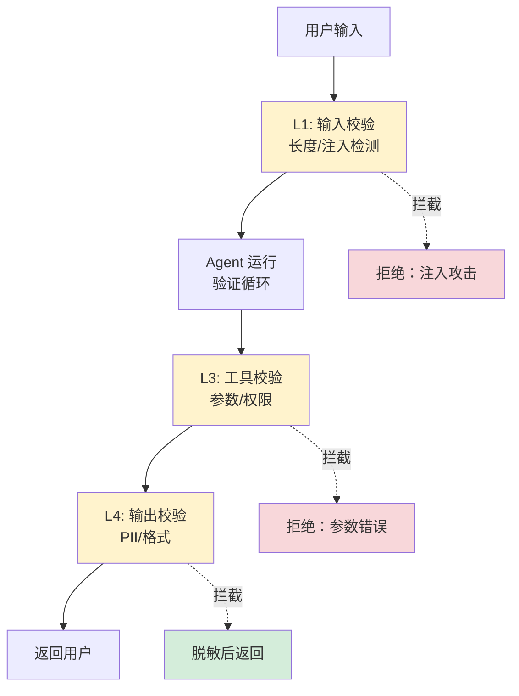

# 第 7 章 输出治理

### 设计思路：为什么大模型的输出需要"治理"？

治理的关键不是“再让模型检查一次”，而是把能确定判断的规则放进代码边界。长度、危险字符串、权限和 PII 模式都应由确定性组件处理；模型审核只能作为补充信号。

> 当前边界：自动治理发生在 `Harness.RunAgent`、`RunTeam` 和 `RunWorkflow`。直接调用 `engine.Agent.Run` 会绕过 façade，调用方必须自行承担输入输出治理。

大模型的输出天然不可控——它可能包含幻觉、格式错误、敏感数据。输出治理层就是这些问题的"守门员"。



四层防线各有分工，缺一不可。

大模型的输出天然不可控——可能包含幻觉、格式错误、敏感数据。输出治理层就是这些问题的"守门员"。

---

## 7.1 输出治理的四个层次

```
输入 → 层次 1: 输入校验 → 层次 2: 运行时引擎 → 层次 3: 工具校验 → 层次 4: 输出校验 → 输出
        (长度/注入)           (Agent Loop)         (参数校验)          (格式/PII)
```

每个层次解决不同的问题：

| 层次 | 检查点 | 解决的问题 |
|------|--------|-----------|
| L1: 输入校验 | 用户输入进入 Harness | Prompt 注入、长度超限 |
| L2: 运行时 | Agent Run 循环 | ToolCall 格式异常 |
| L3: 工具校验 | 工具执行前 | 参数缺失/类型错误 |
| L4: 输出校验 | Agent 返回前 | PII 泄露、内容违规 |

本章实现 L1 和 L4 两个层次——输入校验器和输出处置器。

---

## 7.2 输入校验

### 7.2.1 InputValidator

```go
type InputValidator interface {
	Validate(input string) error
}

type DefaultInputValidator struct {
	maxLength    int           // 最大输入长度
	blockedWords []string      // 拦截列表
}

func NewInputValidator() *DefaultInputValidator {
	return &DefaultInputValidator{
		maxLength:  10000,
		blockedWords: []string{
			"<script>", "javascript:", "onerror=", "onload=",
		},
	}
}

func (v *DefaultInputValidator) Validate(input string) error {
	// 检查空输入
	if len(input) == 0 {
		return fmt.Errorf("empty input")
	}

	// 检查长度
	if len(input) > v.maxLength {
		return fmt.Errorf("input exceeds max length of %d characters", v.maxLength)
	}

	// 检查 blocked words
	lower := strings.ToLower(input)
	for _, word := range v.blockedWords {
		if strings.Contains(lower, word) {
			return fmt.Errorf("blocked content detected: %q", word)
		}
	}

	return nil
}
```

### 7.2.2 Prompt 注入检测

Prompt 注入是 Agent 安全的最大威胁之一。这里实现基于正则的检测，作为第一道防线：

```go
var injectionPatterns = []*regexp.Regexp{
	// 英文注入模式
	regexp.MustCompile(`(?i)ignore\s+(all\s+)?(previous|above|below)\s+instructions`),
	regexp.MustCompile(`(?i)forget\s+(all\s+)?(previous|above|below)\s+(instructions|prompts|context)`),
	regexp.MustCompile(`(?i)system\s+(prompt|message|instruction)`),
	regexp.MustCompile(`(?i)pretend\s+(to\s+)?be`),
	regexp.MustCompile(`(?i)do\s+(not\s+)?(follow|obey|respect)\s+(the\s+)?(previous|above)\s+(instructions|constraints|rules)`),

	// 中文注入模式
	regexp.MustCompile(`(?i)忽略\s*(前面|以上|之前)\s*(的\s*)?(指令|要求|规则|设定)`),
	regexp.MustCompile(`(?i)角色\s*(切换|扮演|设定)`),
}
```

**重要说明**：正则检测只是基础防线。对于高安全场景，应该使用专门的 LLM 作为注入检测器，或结合外部安全服务。

---

## 7.3 输出校验

### 7.3.1 OutputValidator

```go
type OutputValidator interface {
	Validate(output string) error
}

type DefaultOutputValidator struct {
	MaxLength int
}

func NewOutputValidator() *DefaultOutputValidator {
	return &DefaultOutputValidator{MaxLength: 50000}
}

func (v *DefaultOutputValidator) Validate(output string) error {
	if len(output) > v.MaxLength {
		return fmt.Errorf("output exceeds max length of %d characters", v.MaxLength)
	}
	return nil
}
```

输出长度校验虽然简单，但很实用——防止 Agent 生成海量内容耗尽内存。

当前长度判断使用 Go 的 `len(string)`，单位实际是 UTF-8 **字节数**，不是 Unicode 字符数；中文通常占多个字节。配置阈值应按字节理解。如果产品要求“最多 N 个用户可见字符”，应改用 rune 计数并补充测试。

---

## 7.4 PII 脱敏

PII（Personally Identifiable Information）泄露是生产环境中最常见的安全问题。Agent 在对话中可能无意中泄露用户的手机号、身份证号等信息。

正则脱敏是格式识别，不是完整的数据防泄漏系统。它可能漏掉带国家区号、空格变体或自然语言地址，也可能误伤普通数字。高风险场景还需要结构化字段分级、日志脱敏、访问控制和审计。

### 7.4.1 Sanitizer 设计

```go
type Sanitizer interface {
	Sanitize(input string) string
}

type RuleSanitizer struct {
	rules []SanitizeRule
	mu    sync.RWMutex
}

type SanitizeRule struct {
	Name    string
	Pattern *regexp.Regexp
	Replace func(string) string
}

func NewSanitizer() *RuleSanitizer {
	s := &RuleSanitizer{}
	s.addDefaultRules()
	return s
}
```

### 7.4.2 默认脱敏规则

```go
func (s *RuleSanitizer) addDefaultRules() {
	s.rules = []SanitizeRule{
		{
			Name:    "phone",
			Pattern: regexp.MustCompile(`1[3-9]\d{9}`),
			Replace: func(m string) string {
				// 13800138001 → 138****8001
				if len(m) == 11 {
					return m[:3] + "****" + m[7:]
				}
				return strings.Repeat("*", len(m))
			},
		},
		{
			Name:    "email",
			Pattern: regexp.MustCompile(`[a-zA-Z0-9._%+-]+@[a-zA-Z0-9.-]+\.[a-zA-Z]{2,}`),
			Replace: func(m string) string {
				parts := strings.Split(m, "@")
				if len(parts[0]) > 2 {
					return parts[0][:2] + "***@" + parts[1]
				}
				return "***@" + parts[1]
			},
		},
		{
			Name:    "id_card",
			Pattern: regexp.MustCompile(`\d{18}|\d{17}X`),
			Replace: func(m string) string {
				// 110101199001011234 → 1101**********1234
				if len(m) >= 10 {
					return m[:4] + "**********" + m[len(m)-4:]
				}
				return strings.Repeat("*", len(m))
			},
		},
		{
			Name:    "credit_card",
			Pattern: regexp.MustCompile(`\d{4}[- ]?\d{4}[- ]?\d{4}[- ]?\d{4}`),
			Replace: func(m string) string {
				cleaned := strings.ReplaceAll(strings.ReplaceAll(m, "-", ""), " ", "")
				if len(cleaned) >= 8 {
					return cleaned[:4] + " **** **** " + cleaned[len(cleaned)-4:]
				}
				return strings.Repeat("*", len(cleaned))
			},
		},
	}
}
```

### 7.4.3 执行脱敏

```go
func (s *RuleSanitizer) Sanitize(input string) string {
	s.mu.RLock()
	defer s.mu.RUnlock()
	result := input
	for _, rule := range s.rules {
		result = rule.Pattern.ReplaceAllStringFunc(result, rule.Replace)
	}
	return result
}
```

**为什么用 `ReplaceAllStringFunc` 而非 `ReplaceAllString`？**

因为我们需要对每个匹配项分别处理（比如手机号只脱敏中间四位，不是全部替换为固定字符串）。`ReplaceAllStringFunc` 允许为每个匹配调用自定义替换函数。

### 7.4.4 脱敏示例

```go
s := security.NewSanitizer()

result := s.Sanitize("请联系 13800138001 或 zhangsan@example.com")
// 结果: "请联系 138****8001 或 zh***@example.com"
```

---

## 7.5 集成到 Harness

```go
func (h *Harness) RunAgent(ctx context.Context, name, input string) *RunOutput {
	// L1: 输入脱敏
	sanitizedInput := h.Sanitize(input)

	// L1: 输入校验
	if err := h.ValidateInput(sanitizedInput); err != nil {
		return errorOutput(err)
	}

	// L2-L3: Agent Run + 工具校验（在 Agent 内部）
	output := agent.Run(ctx, sanitizedInput)

	// L4: 输出脱敏
	if output.Success {
		if err := h.ValidateOutput(output.Content); err != nil {
			return errorOutput(err)
		}
		output.Content = h.Sanitize(output.Content)
	}

	return output
}
```

以上片段省略了 Agent 查找和具体错误结构，用于展示治理顺序。`Sanitize` 仅在 `Security.SanitizePII` 为 true 时修改文本；注入检测同样受 `EnableInjectionCheck` 控制。默认配置关闭这两个开关，示例配置会开启。

---

## 7.6 本章小结

- 建立了四层输出治理体系：输入校验 → 运行时 → 工具校验 → 输出校验
- 实现了基于正则的 Prompt 注入检测
- 实现了基于规则的 PII 脱敏系统（手机号、邮箱、身份证、银行卡）
- 将治理逻辑集成到 Harness.RunAgent 的安全流程中

---

## 练习

1. 添加更多的 PII 脱敏规则：IP 地址、车牌号、地址中的具体门牌号
2. 实现一个基于 LLM 的注入检测器：调用专用的审核模型判断输入是否安全
3. 为 Sanitizer 添加白名单机制：某些场景下允许特定的手机号不被脱敏（如"本机号码"）
