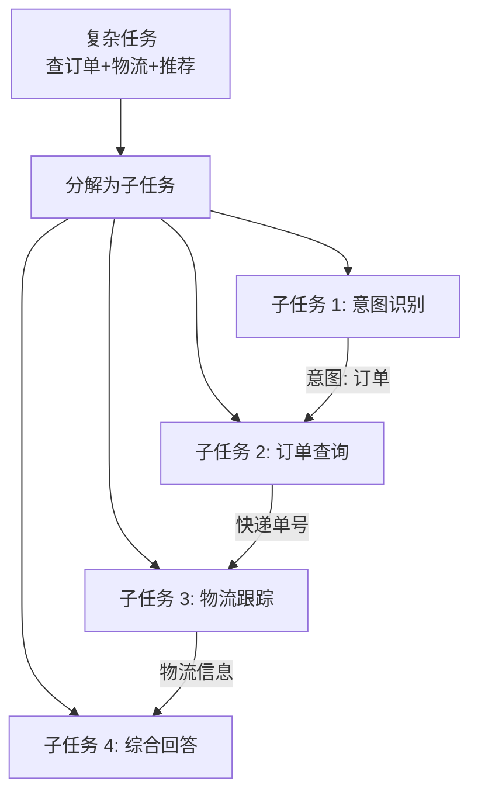
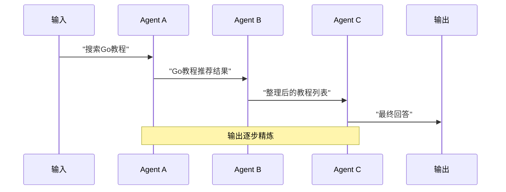
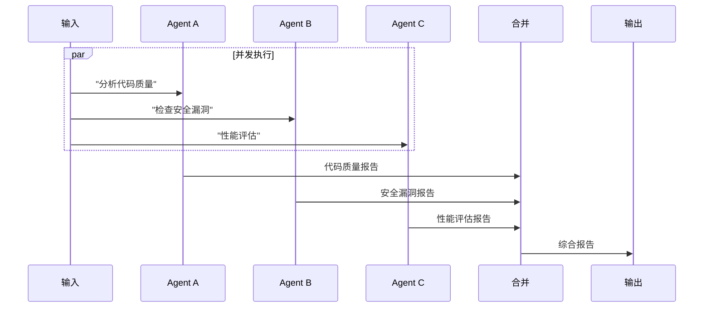
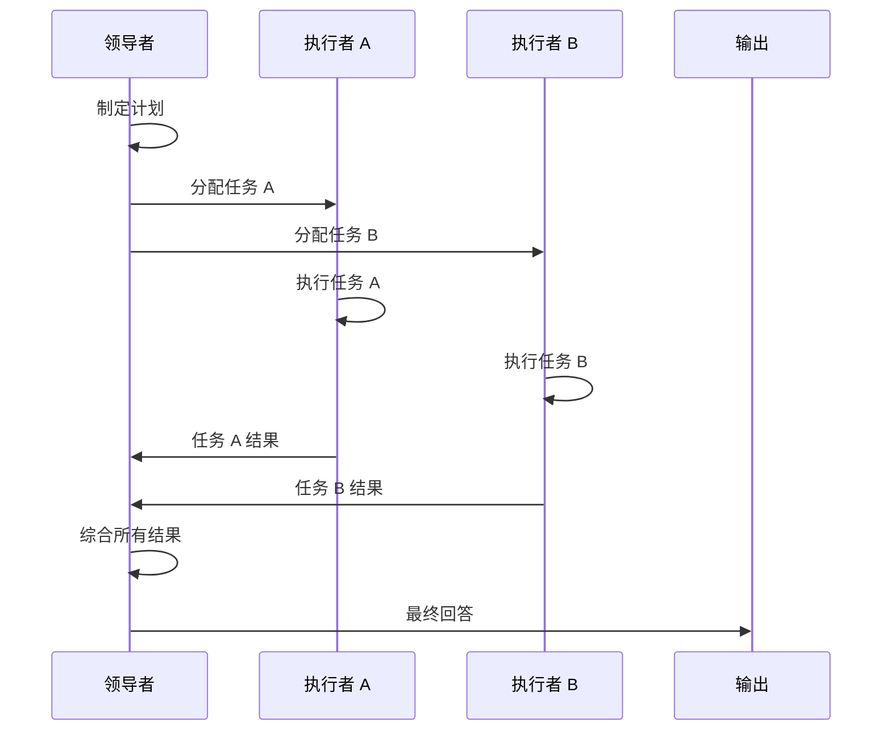
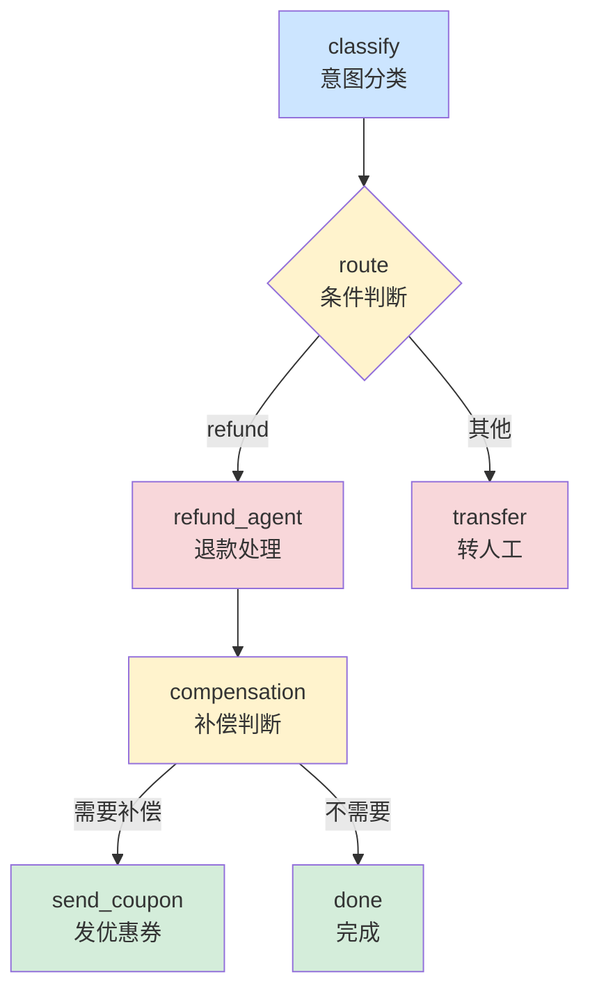

# 第 8 章 编排引擎

### 设计思路：为什么需要编排？

单 Agent 的局限在于：
1. **上下文窗口限制**：复杂流程需要多轮对话，单 Agent 难以管理
2. **专业分工**：一个 Agent 不可能在所有领域都专业
3. **并行处理**：单 Agent 串行执行，无法利用并发优势
4. **容错**：单点故障导致整体失败

编排引擎的核心价值是**将复杂任务分解为可管理的子任务**，每个子任务由专门的 Agent 负责。



单 Agent 的能力是有限的。编排引擎让多个 Agent 协同工作，完成单 Agent 无法胜任的复杂任务。

---

## 8.1 为什么需要编排？

### 8.1.1 单 Agent 的局限

| 场景 | 单 Agent 的问题 |
|------|----------------|
| 复杂多步骤流程 | 上下文窗口限制，单 Agent 难以管理长流程 |
| 专业分工 | 一个 Agent 不可能在所有领域都专业 |
| 并行处理 | 单 Agent 串行执行，无法并行 |
| 容错 | 单 Agent 故障导致整体失败 |

### 8.1.2 编排的两个层次

Harness 提供两种编排能力：**Team（团队协作）** 和 **Workflow（可组合控制流）**。

```
Team: 固定模式的 Agent 协作
  Sequential: A → B → C（串行管道）
  Parallel: A || B || C（并发执行）
  LeaderFollower: 领导者规划 + 执行者执行 + 领导者综合

Workflow: 顺序步骤 + 可组合控制节点
  Step: 执行一个 Agent
  Condition: 条件分支
  Loop: 循环执行
  Parallel: 并行分支
```

---

## 8.2 Team 设计

### 8.2.1 Team 结构体

```go
type TeamMode string

const (
	ModeSequential     TeamMode = "sequential"       // 串行传递
	ModeParallel       TeamMode = "parallel"         // 并发执行
	ModeLeaderFollower TeamMode = "leader_follower"  // 领导-追随者
)

type Team struct {
	ID          string         // 团队标识
	Name        string         // 名称
	Mode        TeamMode       // 协作模式
	Agents      []*engine.Agent // 团队成员
	Leader      *engine.Agent  // 领导者（仅 leader_follower 模式）
	SharedModel model.Model    // 共享模型（可选）
	logger      *slog.Logger
}
```

### 8.2.2 三种协作模式

**Sequential 模式**：

```
输入 → Agent A → Agent B → Agent C → 输出
```

每个 Agent 的输出成为下一个 Agent 的输入。这种模式适合流水线式处理：

```go
func (t *Team) runSequential(ctx context.Context, input string) *TeamOutput {
	agents := append([]*engine.Agent(nil), t.Agents...)
	if len(agents) == 0 {
		return &TeamOutput{Success: false, Error: "no agents configured"}
	}
	currentInput := input
	outputs := make(map[string]*engine.RunOutput)

	for _, agent := range agents {
		name := agent.Name()
		output := t.runAgent(ctx, agent, currentInput)
		outputs[name] = output

		if !output.Success {
			return &TeamOutput{
				AgentOutputs: outputs,
				FinalOutput:  output.Content,
				Success:      false,
				Error:        fmt.Sprintf("agent %s failed: %s", name, output.Error),
			}
		}

		currentInput = output.Content // 传递输出
	}

	return &TeamOutput{
		AgentOutputs: outputs,
		FinalOutput:  currentInput,
		Success:      true,
	}
}
```

**Parallel 模式**：

```
输入 → Agent A ──┐
输入 → Agent B ──┤→ 合并 → 输出
输入 → Agent C ──┘
```

所有 Agent 通过 goroutine 并发执行，结果合并：

```go
func (t *Team) runParallel(ctx context.Context, input string) *TeamOutput {
	outputs := make(map[string]*engine.RunOutput)
	mu := sync.Mutex{}
	wg := sync.WaitGroup{}

	for _, agent := range t.Agents {
		wg.Add(1)
		a := agent
		go func() {
			defer wg.Done()
			output := t.runAgent(ctx, a, input)
			mu.Lock()
			outputs[a.Name()] = output
			mu.Unlock()
		}()
	}
	wg.Wait()

	// 合并所有 Agent 的输出
	var parts []string
	allSuccess := true
	for _, agent := range t.Agents {
		name := agent.Name()
		out := outputs[name]
		if out == nil || !out.Success {
			allSuccess = false
			continue
		}
		parts = append(parts, fmt.Sprintf("**%s**: %s", name, out.Content))
	}

	return &TeamOutput{
		AgentOutputs: outputs,
		FinalOutput:  strings.Join(parts, "\n\n"),
		Success:      allSuccess,
	}
}
```

**LeaderFollower 模式**：

```
         ┌─ Agent B（执行）─┐
Leader A ── Agent C（执行）──┤→ Leader A → 输出
         └─ Agent D（执行）─┘
```

领导者规划 → 追随者执行 → 领导者综合：

```go
func (t *Team) runLeaderFollower(ctx context.Context, input string) *TeamOutput {
	outputs := make(map[string]*engine.RunOutput)

	// 阶段 1：领导者制定计划
	planOutput := t.runAgent(ctx, t.Leader,
		fmt.Sprintf("Plan the approach for: %s\n\nProvide a step-by-step plan.", input))
	leaderName := t.Leader.Name()
	outputs[leaderName] = planOutput
	if !planOutput.Success {
		return &TeamOutput{AgentOutputs: outputs, Success: false, Error: "leader planning failed"}
	}

	// 阶段 2：追随者执行
	for _, agent := range t.Agents {
		name := agent.Name()
		if name == leaderName { continue }
		followerInput := fmt.Sprintf(
			"Plan: %s\n\nTask: %s\n\nYour role: %s",
			planOutput.Content, input, agent.SystemPrompt())
		output := t.runAgent(ctx, agent, followerInput)
		outputs[name] = output
	}

	// 阶段 3：领导者综合结果
	synthOutput := t.runAgent(ctx, t.Leader,
		fmt.Sprintf("Synthesize results for: %s\n\nResults:\n%s",
			input, t.formatOutputs(outputs)))

	return &TeamOutput{AgentOutputs: outputs, FinalOutput: synthOutput.Content, Success: synthOutput.Success}
}
```

`t.runAgent` 的存在是为了按单次 Run 注入 `SharedModel`，不会修改 Agent 自己的默认 Model。Parallel 虽然并发写结果，但最终按 `Agents` 的声明顺序合并，从而保持可重复的输出顺序；只要任一成员失败，Team 的 Success 就是 false。

### 三种模式的可视化对比

#### Sequential 模式（串行传递）



#### Parallel 模式（并发执行）



#### LeaderFollower 模式（领导-追随者）



**如何选择模式？**

| 场景 | 推荐模式 | 理由 |
|------|---------|------|
| 流水线处理 | Sequential | 前一步的输出是后一步的输入 |
| 多角度分析 | Parallel | 同时从不同角度分析，结果合并 |
| 复杂决策 | LeaderFollower | 需要规划者统筹全局 |

---

## 8.3 Workflow 设计

与 Team 的固定模式不同，Workflow 提供显式步骤和可组合控制节点。当前实现不是任意连边的 DAG 调度器：顶层节点严格按 `AddNode` 顺序执行，分支、循环和局部并发由节点内部组合表达。

这个设计有意选择“小而可预测”的执行模型：不需要拓扑排序、边存储和环检测，阅读 `Nodes` 列表就能知道顶层顺序；代价是不能声明任意节点依赖，也不支持断点恢复。需要真正 DAG 调度时，应把它作为新的扩展层，而不是依赖当前 Workflow 的隐含行为。

### 8.3.1 Node 接口

```go
type NodeType string

const (
	NodeTypeStep      NodeType = "step"
	NodeTypeCondition NodeType = "condition"
	NodeTypeLoop      NodeType = "loop"
	NodeTypeParallel  NodeType = "parallel"
)

type Node interface {
	ID() string                                    // 节点唯一标识
	Type() NodeType                                // 节点类型
	Execute(ctx context.Context, input string, state *State) (string, error)
}
```

**state 参数**：Workflow 通过并发安全的 `State` 在节点间共享数据。使用 `Get`、`Set` 和 `Snapshot` 访问，避免 ParallelNode 读写裸 map 时产生竞态。

### 8.3.2 四种节点实现

**StepNode**：执行一个 Agent

```go
type StepNode struct {
	id    string
	Agent *engine.Agent
}

func (n *StepNode) Execute(ctx context.Context, input string, state *State) (string, error) {
	if n.Agent == nil {
		return "", fmt.Errorf("step %s has no agent", n.id)
	}
	output := n.Agent.Run(ctx, input)
	if !output.Success {
		return "", fmt.Errorf("step %s failed: %s", n.id, output.Error)
	}
	return output.Content, nil
}
```

**ConditionNode**：条件分支

```go
type ConditionNode struct {
	id         string
	Condition  func(input string, state *State) (bool, error)
	TrueNode   Node
	FalseNode  Node
}

func (n *ConditionNode) Execute(ctx context.Context, input string, state *State) (string, error) {
	result, err := n.Condition(input, state)
	if err != nil { return "", err }
	if result && n.TrueNode != nil { return n.TrueNode.Execute(ctx, input, state) }
	if !result && n.FalseNode != nil { return n.FalseNode.Execute(ctx, input, state) }
	// 选中的分支为 nil 时直接透传输入
	return input, nil
}
```

**LoopNode**：条件循环

```go
type LoopNode struct {
	id         string
	BodyNode   Node
	Condition  func(iteration int, input string, state *State) (bool, error)
	MaxIter    int
}

func (n *LoopNode) Execute(ctx context.Context, input string, state *State) (string, error) {
	if n.Condition == nil { return input, fmt.Errorf("loop %s has no condition", n.id) }
	if n.BodyNode == nil { return input, fmt.Errorf("loop %s has no body", n.id) }
	current := input
	for i := 0; i < n.MaxIter; i++ {
		shouldContinue, err := n.Condition(i, current, state)
		if err != nil { return current, err }
		if !shouldContinue { break }

		current, err = n.BodyNode.Execute(ctx, current, state)
		if err != nil { return current, err }
	}
	return current, nil
}
```

**ParallelNode**：并行执行

```go
type ParallelNode struct {
	id    string
	Nodes []Node
}

func (n *ParallelNode) Execute(ctx context.Context, input string, state *State) (string, error) {
	type nodeResult struct { output string; err error }
	results := make([]nodeResult, len(n.Nodes))
	var wg sync.WaitGroup

	for i, node := range n.Nodes {
		if node == nil {
			results[i] = nodeResult{err: fmt.Errorf("child %d is nil", i)}
			continue
		}
		wg.Add(1)
		go func(idx int, nd Node) {
			defer wg.Done()
			out, err := nd.Execute(ctx, input, state)
			results[idx] = nodeResult{out, err}
		}(i, node)
	}
	wg.Wait()

	var parts []string
	for i, r := range results {
		if r.err != nil {
			parts = append(parts, fmt.Sprintf("[%s] error: %v", n.Nodes[i].ID(), r.err))
		} else {
			parts = append(parts, fmt.Sprintf("[%s] %s", n.Nodes[i].ID(), r.output))
		}
	}
	return strings.Join(parts, "\n"), nil
}
```

### 8.3.3 Workflow 引擎

```go
type Workflow struct {
	ID           string
	Name         string
	Nodes        []Node
	initialState *State // 每次运行从初始状态复制
	logger       *slog.Logger
}

func (w *Workflow) Run(ctx context.Context, input string) *WorkflowResult {
	start := time.Now()
	current := input
	state := NewState(w.initialState.Snapshot())
	state.Set("user_input", input)

	for _, node := range w.Nodes {
		select {
		case <-ctx.Done():
			return &WorkflowResult{
				Output: current, Success: false,
				Error: "workflow cancelled",
			}
		default:
		}

		output, err := node.Execute(ctx, current, state)
		if err != nil {
			return &WorkflowResult{
				Output: current, Success: false,
				Error: fmt.Sprintf("node %s failed: %s", node.ID(), err),
			}
		}
		current = output
	}

	return &WorkflowResult{
		Output:   current,
		Success:  true,
		State:    state.Snapshot(),
		Duration: time.Since(start),
	}
}
```

### 8.3.4 构建 Workflow 示例

```go
// 先构建节点
classify := workflow.NewStepNode("classify", triageAgent)
handleQuery := workflow.NewStepNode("handle", orderAgent)
transfer := workflow.NewStepNode("transfer", orderAgent)

// 条件判断：是否转人工
route := workflow.NewConditionNode("route",
	func(input string, state *workflow.State) (bool, error) {
		value, _ := state.Get("intent")
		intent, _ := value.(string)
		return intent == "refund", nil
	},
	handleQuery,  // 需要退款 → 订单处理
	transfer,     // 否则 → 转人工
)

// 完整结构一次性交给 Harness：先校验，再注册。
wf, err := h.CreateWorkflow(workflow.WorkflowConfig{
	ID:    "customer-service",
	Name:  "智能客服工作流",
	Nodes: []workflow.Node{classify, route},
})
if err != nil {
	return err
}

result := wf.Run(ctx, "我想退货")
```

不使用 Harness 时，也可以先 `workflow.NewWorkflow`、再 `AddNode`，最后调用 `Validate` 或 `h.RegisterWorkflow`。关键不是具体构造函数，而是遵守“**完整构建 → 校验 → 发布 → 只读运行**”的生命周期。

### Workflow 可视化



**节点颜色含义**：
- 蓝色：Step 节点（执行 Agent）
- 黄色：Condition 节点（条件分支）
- 红色：需要关注的节点（退款/转人工）
- 绿色：正常结束节点

---

## 8.4 为什么要在运行前验证结构

Team 和 Workflow 都是长生命周期对象。名称、成员、节点 ID 等结构错误如果等到执行中才暴露，不仅浪费模型调用，还可能让流程执行到一半才失败。因此当前实现会在 `Create*` / `Register*` 时验证，`Run` 入口也会再次防御性验证。

| 对象 | 会拒绝的结构问题 |
|---|---|
| Team | 空白名称、未知模式、空成员列表、nil Agent、重名 Agent、LeaderFollower 没有 Leader |
| Workflow | 空白名称、nil 节点、空节点 ID、重复节点 ID |
| Node 执行 | Step 没有 Agent、Condition 没有判断函数、Loop 没有条件或主体、Parallel 含 nil 子节点 |

根 Harness 的 `CreateAgent`、`CreateTeam`、`CreateWorkflow` 会在持锁期间检查重名并注册，失败时不会覆盖旧对象。兼容方法 `NewAgent`、`NewTeam`、`NewWorkflow` 仍然存在，但只能记录错误并返回 nil；生产代码应使用返回 error 的 `Create*`。

这些对象的公开字段和 `AddNode` 是为了让组合保持简单，但代价是调用方必须把它们视为“发布后不可变”：注册或首次运行后，不再修改 `Agents`、`Leader`、`Mode`、`Nodes`。构造函数会复制传入的 Agent/Node 切片，避免调用方随后修改原切片；但直接修改对象的公开字段仍不受支持。每次 Workflow Run 会创建独立的 `State`，所以在结构不变的前提下，多次 Run 可以安全并发。

这套设计没有引入复杂的冻结器或构建器类型。理由是 Go 的配置结构体适合声明式组装，而明确的构建生命周期已经能守住边界；如果未来需要动态热更新，应通过构造新对象并原子替换注册项实现，而不是原地修改正在运行的对象。

---

## 8.5 Team 与 Workflow 的选择

| 场景 | 推荐方式 | 理由 |
|------|---------|------|
| 固定流程的流水线 | Team Sequential | 简单、直接 |
| 需要并行处理 | Team Parallel | 天然并发 |
| 领导-下属模式 | Team LeaderFollower | 明确分工 |
| 需要条件分支 | Workflow Condition | 灵活 |
| 需要循环 | Workflow Loop | 内置循环 |
| 分支、循环、局部并发 | Workflow | 控制流显式、状态可共享 |
| 任意 DAG、拓扑依赖、断点恢复 | 当前未内置 | 需要扩展调度与持久化层 |

---

## 8.6 本章小结

- 实现了 Team 三种协作模式：Sequential、Parallel、LeaderFollower
- 实现了 Workflow 四种节点：Step、Condition、Loop、Parallel
- 理解了 Team 与 Workflow 的适用场景区别
- 通过 state 机制实现了工作流节点间的数据共享
- 理解了“完整构建、校验、发布、只读运行”的编排对象生命周期

---

## 练习

1. 为 Team 添加 Consensus（共识）模式：所有 Agent 多轮讨论，每轮并行执行，直到达成共识
2. 为 Workflow 添加 Resume 功能：每步执行后保存快照，失败后可从断点恢复
3. 实现 Workflow 的 `RouterNode`：根据 state 中的值路由到不同的子节点路径
