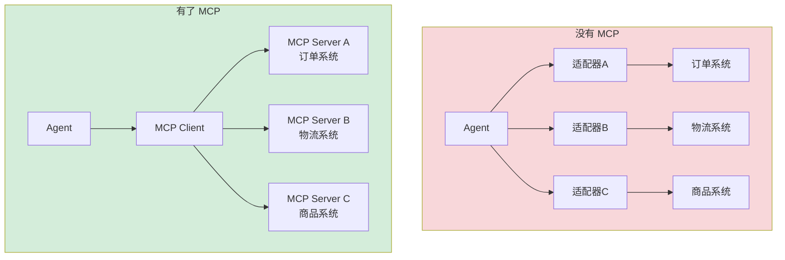

# 第 9 章 MCP 协议集成

### 设计思路：MCP 是 Agent 世界的"USB 接口"

没有 MCP 之前，每个外部系统都需要单独编写适配器。MCP 提供了统一的"即插即用"能力。



MCP 的核心价值：**一次接入，所有能力**。

MCP（Model Context Protocol）是 AI 应用与外部工具/数据源之间的标准通信协议。它让 Agent 可以通过统一协议发现和调用外部能力。

---

## 9.1 MCP 协议概述

### 9.1.1 为什么需要 MCP？

在没有 MCP 之前，每个外部系统都需要单独编写适配器：

```
Agent → 适配器 A（订单系统）→ 订单 API
Agent → 适配器 B（物流系统）→ 物流 API
Agent → 适配器 C（商品系统）→ 商品 API
```

MCP 提供统一协议，一次接入即可访问所有 MCP 服务器的能力：

```
Agent → MCP Client → MCP Server A（订单系统）
                   → MCP Server B（物流系统）
                   → MCP Server C（商品系统）
```

### 9.1.2 MCP 核心概念

| 概念 | 说明 |
|------|------|
| Tool | Agent 可调用的函数 |
| Resource | 可读取的数据（文件、数据库记录） |
| Prompt | 预定义的提示词模板 |
| Transport | HTTP/SSE 或 Stdio |

本章主要实现 Tool 的发现和调用。

### 9.1.3 通信协议

MCP 使用 **JSON-RPC 2.0** 协议。基本通信流程：

```
Client → Server: {"jsonrpc": "2.0", "id": 1, "method": "initialize", "params": {...}}
Server → Client: {"jsonrpc": "2.0", "id": 1, "result": {...}}

Client → Server: {"jsonrpc": "2.0", "id": 2, "method": "tools/list"}
Server → Client: {"jsonrpc": "2.0", "id": 2, "result": {"tools": [...]}}

Client → Server: {"jsonrpc": "2.0", "id": 3, "method": "tools/call", "params": {"name": "...", "arguments": {...}}}
Server → Client: {"jsonrpc": "2.0", "id": 3, "result": {"content": [...]}}
```

---

## 9.2 JSON-RPC 协议基础类型

```go
type Request struct {
	JSONRPC string `json:"jsonrpc"`          // 固定为 "2.0"
	ID      int    `json:"id"`               // 请求标识
	Method  string `json:"method"`           // 方法名
	Params  any    `json:"params,omitempty"` // 参数
}

type Response struct {
	JSONRPC string          `json:"jsonrpc"`
	ID      int             `json:"id"`
	Result  json.RawMessage `json:"result,omitempty"` // 成功时
	Error   *RPCError       `json:"error,omitempty"`  // 失败时
}

type RPCError struct {
	Code    int    `json:"code"`
	Message string `json:"message"`
	Data    any    `json:"data,omitempty"`
}
```

---

## 9.3 协议交互类型

### Initialize

```go
type InitializeParams struct {
	ProtocolVersion string            `json:"protocolVersion"` // 协议版本
	Capabilities    ClientCapabilities `json:"capabilities"`   // 客户端能力声明
	ClientInfo      Implementation    `json:"clientInfo"`     // 客户端信息
}

type InitializeResult struct {
	ProtocolVersion string            `json:"protocolVersion"`
	Capabilities    ServerCapabilities `json:"capabilities"`  // 服务端能力
	ServerInfo      Implementation    `json:"serverInfo"`
}

type ServerCapabilities struct {
	Tools     *ToolsCapability     `json:"tools,omitempty"`
	Resources *ResourcesCapability `json:"resources,omitempty"`
	Prompts   *PromptsCapability   `json:"prompts,omitempty"`
}
```

### tools/list

```go
type ListToolsResult struct {
	Tools []ToolDescription `json:"tools"`
}

type ToolDescription struct {
	Name        string `json:"name"`
	Description string `json:"description"`
	InputSchema any    `json:"inputSchema"` // JSON Schema
}
```

### tools/call

```go
type CallToolParams struct {
	Name      string `json:"name"`
	Arguments any    `json:"arguments"`
}

type CallToolResult struct {
	Content []ToolContent `json:"content"`
	IsError bool          `json:"isError"`
}

type ToolContent struct {
	Type string `json:"type"` // "text" / "image" / "resource"
	Text string `json:"text,omitempty"`
}
```

---

## 9.4 MCP Client 实现

```go
type Client struct {
	mu          sync.Mutex
	baseURL     string
	httpClient  *http.Client
	reqID       int
	capabilities ServerCapabilities
	initialized bool
	logger      *slog.Logger
}

func NewClient(baseURL string, timeout time.Duration) *Client {
	return &Client{
		baseURL:    strings.TrimRight(baseURL, "/"),
		httpClient: &http.Client{Timeout: timeout},
		logger:     slog.With("component", "mcp_client", "url", baseURL),
	}
}
```

### Initialize 流程

```go
func (c *Client) Initialize(ctx context.Context) error {
	c.mu.Lock()
	defer c.mu.Unlock()

	params := InitializeParams{
		ProtocolVersion: "2025-03-26",
		ClientInfo: Implementation{
			Name:    "tracklogic-agent",
			Version: "1.0.0",
		},
	}

	resp, err := c.call(ctx, "initialize", params)
	if err != nil {
		return fmt.Errorf("initialize failed: %w", err)
	}

	var result InitializeResult
	if err := json.Unmarshal(resp.Result, &result); err != nil {
		return err
	}

	c.capabilities = result.Capabilities
	c.initialized = true
	c.logger.Info("MCP server initialized", "server", result.ServerInfo.Name)
	return nil
}
```

### 工具发现和调用

```go
func (c *Client) ListTools(ctx context.Context) ([]ToolDescription, error) {
	if !c.initialized {
		return nil, fmt.Errorf("client not initialized")
	}
	resp, err := c.call(ctx, "tools/list", nil)
	if err != nil { return nil, err }

	var result ListToolsResult
	json.Unmarshal(resp.Result, &result)
	return result.Tools, nil
}

func (c *Client) CallTool(ctx context.Context, name string, args map[string]any) (string, error) {
	if !c.initialized {
		return "", fmt.Errorf("client not initialized")
	}
	resp, err := c.call(ctx, "tools/call", CallToolParams{Name: name, Arguments: args})
	if err != nil { return "", err }

	var result CallToolResult
	json.Unmarshal(resp.Result, &result)

	if result.IsError {
		return "", fmt.Errorf("tool %q returned error", name)
	}

	var texts []string
	for _, content := range result.Content {
		if content.Type == "text" {
			texts = append(texts, content.Text)
		}
	}
	return strings.Join(texts, "\n"), nil
}
```

### JSON-RPC 核心调用

```go
func (c *Client) call(ctx context.Context, method string, params any) (*Response, error) {
	c.mu.Lock()
	c.reqID++
	id := c.reqID
	c.mu.Unlock()

	req := Request{
		JSONRPC: "2.0",
		ID:      id,
		Method:  method,
		Params:  params,
	}

	body, _ := json.Marshal(req)
	httpReq, _ := http.NewRequestWithContext(ctx, "POST",
		c.baseURL+"/mcp", bytes.NewReader(body))
	httpReq.Header.Set("Content-Type", "application/json")

	httpResp, err := c.httpClient.Do(httpReq)
	if err != nil { return nil, err }
	defer httpResp.Body.Close()

	respBody, _ := io.ReadAll(httpResp.Body)
	var response Response
	json.Unmarshal(respBody, &response)

	if response.Error != nil {
		return nil, fmt.Errorf("RPC error [%d]: %s",
			response.Error.Code, response.Error.Message)
	}
	return &response, nil
}
```

---

## 9.5 MCP 工具注入到 Harness

### 工具适配器

```go
type mcpToolAdapter struct {
	name   string
	client *mcpclient.Client
	defs   []model.ToolDefinition
}

func (m *mcpToolAdapter) Name() string { return "mcp_" + m.name }
func (m *mcpToolAdapter) Description() string {
	return "MCP tools from " + m.name
}
func (m *mcpToolAdapter) Definition() model.ToolDefinition {
	if len(m.defs) > 0 { return m.defs[0] }
	return model.ToolDefinition{Name: m.Name(), Description: m.Description()}
}
func (m *mcpToolAdapter) Validate(args map[string]any) error { return nil }
func (m *mcpToolAdapter) Execute(ctx context.Context, args map[string]any) (any, error) {
	return m.client.CallTool(ctx, args["tool"].(string), args)
}
```

### 在 Harness 初始化时连接 MCP

```go
func (h *Harness) InitMCPClients(ctx context.Context) error {
	for name, client := range h.MCPClients {
		if err := client.Initialize(ctx); err != nil {
			return fmt.Errorf("initialize MCP client %q: %w", name, err)
		}
		// 发现的工具自动注册到 Registry
		tools, err := client.ToToolDefinitions(ctx)
		if err != nil { return err }
		mcpTool := &mcpToolAdapter{name, client, tools}
		h.ToolRegistry.Register(mcpTool)
	}
	return nil
}
```

---

## 9.6 本章小结

- 理解了 MCP 协议的核心概念和通信流程
- 实现了 JSON-RPC 2.0 客户端
- 实现了工具发现（tools/list）和工具调用（tools/call）
- 通过适配器模式将 MCP 工具注入到 Harness 的工具注册中心

---

## 9.7 练习

1. 实现 Stdio 传输：启动 MCP Server 子进程，通过 stdin/stdout 通信
2. 实现 SSE 事件流：通过 Server-Sent Events 接收服务端的推送通知（如工具列表变更）
3. 完善 mcpToolAdapter：支持单个客户端对应多个工具（目前只注册了第一个）
