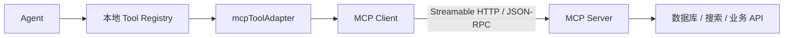
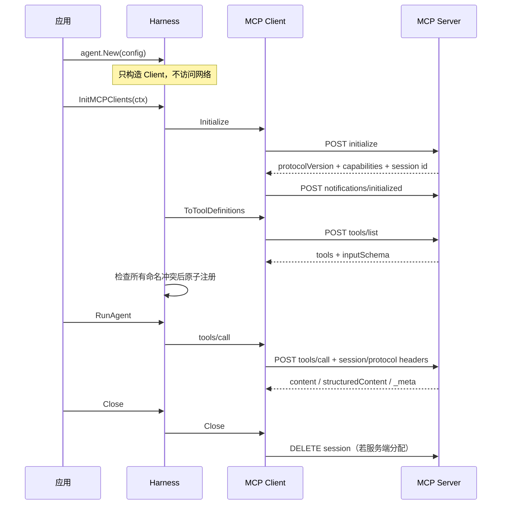

# 第 9 章 MCP 协议集成

### 设计思路：MCP 统一的是能力协议，不是安全责任

没有 MCP 时，每个外部系统都要编写一套“发现能力、描述参数、发送请求、解析结果”的适配器。MCP 把这部分统一为标准协议：Client 先初始化会话，再发现 Tool，最后按同一套 JSON-RPC 方法调用。



MCP 并不意味着远端工具天然可信。Harness 仍然负责命名空间、权限检查、输入输出治理和生命周期；MCP Client 负责协议正确性。把两者分开，是本章最重要的设计思想。

当前实现聚焦 **Streamable HTTP Tool**：

- 支持 `initialize`、`notifications/initialized`、`tools/list`、`tools/call`；
- 支持 JSON 响应和 `text/event-stream` 响应；
- 支持有状态 Session、协议版本 Header 和 Session 关闭；
- 保留完整输入 JSON Schema 和结构化 Tool 结果；
- Stdio、Resource、Prompt、订阅通知和自动重连尚未完整实现。

协议细节可对照 MCP 官方的[版本说明](https://modelcontextprotocol.io/docs/learn/versioning)、[生命周期](https://modelcontextprotocol.io/specification/2025-06-18/basic/lifecycle)和[Streamable HTTP 传输](https://modelcontextprotocol.io/specification/2025-06-18/basic/transports)。

## 9.1 先理解四层边界

初学者容易把“远端工具”当成一个整体。代码实际分为四层：

| 层 | 负责什么 | 不负责什么 |
|---|---|---|
| JSON-RPC 类型 | request ID、method、result/error 的数据契约 | HTTP、重试、权限 |
| MCP Client | 握手、会话 Header、HTTP/SSE、协议校验 | Harness 注册、安全治理 |
| Tool Adapter | 把远端 Definition/Result 转为本地 Tool | 决定远端业务是否安全 |
| Harness | 启动编排、命名空间、冲突检测、权限与关闭 | 猜测协议或偷偷发网络请求 |

这样分层后，故障归属也更清楚：响应 ID 不匹配属于协议错误；HTTP 503 属于传输/上游错误；本地同名 Tool 属于注册冲突；工具没有权限属于安全错误。

## 9.2 一次完整生命周期



这里有三个关键取舍：

1. **构造与联网分离**：`agent.New` 可用于离线测试；启动失败策略由应用决定。
2. **必须发送 initialized 通知**：收到 InitializeResult 不代表生命周期已经完成。
3. **发现后再整体注册**：如果第 5 个工具冲突，不能让前 4 个残留在 Registry，形成半初始化状态。

## 9.3 JSON-RPC 与协议版本

MCP 请求基于 JSON-RPC 2.0：有 ID 的是请求，需要匹配响应；没有 ID 的是通知，不期待 JSON-RPC 响应体。

```go
type Request struct {
	JSONRPC JSONRPCVersion `json:"jsonrpc"`
	ID      int            `json:"id"`
	Method  string         `json:"method"`
	Params  any            `json:"params,omitempty"`
}

type Notification struct {
	JSONRPC JSONRPCVersion `json:"jsonrpc"`
	Method  string         `json:"method"`
	Params  any            `json:"params,omitempty"`
}
```

仓库当前支持三个 Streamable HTTP 修订：

```go
const (
	ProtocolVersion20250326 = "2025-03-26"
	ProtocolVersion20250618 = "2025-06-18"
	ProtocolVersion20251125 = "2025-11-25"
	CurrentProtocolVersion  = ProtocolVersion20251125
)
```

`CurrentProtocolVersion` 是本客户端默认请求版本，不表示可以忽略协商结果。Server 返回版本后，Client 必须确认它属于支持集合，随后请求使用协商版本设置 `MCP-Protocol-Version`。如果服务端返回未知版本，当前实现选择失败，而不是假装兼容。

为什么不简单接受任意版本？因为版本变化可能修改必需 Header、生命周期或消息格式。显式失败能把兼容性问题留在启动阶段。

## 9.4 Client 的并发与状态设计

Client 中有两类状态：

```go
type Client struct {
	mu           sync.Mutex // request id、session、协商版本和 initialized
	initializeMu sync.Mutex // 串行化完整首次握手
	// endpoint、httpClient、headers、logger ...
}
```

只用一把锁并把网络请求包进去会有两个问题：

- `Initialize` 持锁时，底层 `call` 还要取锁生成 request ID，可能自锁死；
- 慢网络会阻塞所有读取 Session 和生成 ID 的 goroutine。

因此 `initializeMu` 只负责确保“首次完整握手”只有一个执行者；`mu` 只保护短暂的本地状态读写；HTTP 往返始终在状态锁外。第二个 goroutine 会等第一个握手完成，随后看到 `initialized=true` 并直接返回。

这不是通用 singleflight：失败不会被长期缓存，后续调用可以重新初始化。这样的语义适合启动阶段的显式重试，但应用仍需控制退避和总预算。

## 9.5 Streamable HTTP 的防御性检查

`send` 并不只是 `http.Post`。它依次完成：

1. 在锁内生成单调递增 request ID；
2. 用 `http.NewRequestWithContext` 传播取消和截止时间；
3. 添加自定义 Header、Content-Type、Accept、协议版本和 Session ID；
4. 检查 HTTP 状态码；
5. 将响应体限制在 16 MiB；
6. 根据 Content-Type 解析 JSON 或 SSE；
7. 校验 JSON-RPC 版本和响应 ID；
8. 将 JSON-RPC error 转为 Go error；

这些检查各自防止不同问题。只检查 `json.Unmarshal` 会把 503 HTML 错误页误报成 JSON 错误；不校验 ID 会在并发或错误 Server 下把响应配错请求；无限制读取响应会让异常服务端耗尽内存。

通知没有响应 ID。当前实现对成功通知只消费并丢弃有界响应体；请求则必须拿到与 ID 匹配的 JSON-RPC Response。

## 9.6 Session、SSE 与关闭

服务端可在 initialize 的 HTTP 响应中返回 `Mcp-Session-Id`。Client 保存它，并在后续 POST、GET、DELETE 中继续发送。`Harness.Close()` 会给所有 MCP Client 一个总计 5 秒的关闭 Context，并用 `errors.Join` 汇总错误；某个 Server 关闭失败不会阻止其他 Client 尝试关闭。

`SSEStream(ctx)` 用 GET 打开可选的 Server-to-Client 流，只提供原始逐行读取。它会验证初始化状态、HTTP 200 和 `text/event-stream` Content-Type，但尚未实现：

- 完整 SSE event/id/retry 语义；
- 自动断线重连；
- `tools/list_changed` 等通知分发；
- Last-Event-ID 恢复。

因此它是公共底层能力，不等于一个完整订阅运行时。

## 9.7 Schema 保真：不能丢掉不认识的约束

MCP 的 `inputSchema` 是任意 JSON Schema。一个批量查询工具可能包含嵌套数组：

```json
{
  "type": "object",
  "properties": {
    "item_ids": {
      "type": "array",
      "items": {"type": "string", "pattern": "^[a-z0-9_.-]+$"}
    }
  },
  "required": ["item_ids"]
}
```

如果适配层只认识 `type/properties/required`，`items` 和 `pattern` 就会丢失，模型看到的参数契约比 Server 实际要求更宽。`ToToolDefinitions` 因此同时解析常用字段并保存 `RawSchema`；OpenAI Responses、Chat Completions 和 Anthropic Provider 最终都通过 `ToolParameters.Schema()` 发送完整 Schema。

RawSchema 返回浅拷贝，防止调用方直接增删顶层键；嵌套对象仍应视为只读。若需要修改，应做深拷贝后构造新的 Definition。

## 9.8 结果适配：优先结构化数据

MCP Tool 结果可能同时包含：

```go
type CallToolResult struct {
	Content           []ToolContent  `json:"content"`
	StructuredContent any            `json:"structuredContent,omitempty"`
	IsError           bool           `json:"isError"`
	Meta              map[string]any `json:"_meta,omitempty"`
}
```

Harness Adapter 的优先级是：

1. 有 `structuredContent`：直接作为工具结果返回，随后由 Engine 序列化为 JSON Tool Message；
2. 否则拼接所有 text content；
3. 再否则保留原始 Content 数组。

业务数据应优先使用结构化结果。文本表格适合人读，但会丢失单位、时间戳和字段类型；结构化结果更适合模型二次计算、业务规则和审计。

`_meta` 由公共 `CallToolResult` 暴露给直接 Client 调用方，但当前 Harness Adapter 不把它写回模型，避免把仅供客户端使用的元数据意外暴露到 Prompt 上下文。

## 9.9 注入到 Harness：命名、冲突与权限

每个远端工具变成一个本地 Adapter：

```text
client name = catalog
remote tool = query_items
local tool  = mcp_catalog_query_items
```

命名空间解决不同 Server 都提供 `search` 的常见冲突，也让权限与日志能定位来源。MCP Client 名称只允许字母、数字、下划线和连字符，以避免生成模型 Provider 不接受的函数名。

`InitMCPClients` 会按 Client 名称排序，依次初始化和发现工具；先检查全部本地名称是否与已有 Registry 或待注册集合冲突，确认无冲突后才注册。如果注册中途仍发生错误，会撤销本轮已经注册的工具。

所有 `mcp_` 前缀工具默认映射到 MCP 权限。`strict` 模式下必须显式开放权限；远端工具自己的业务鉴权仍由 MCP Server 或自定义策略负责。

如果使用 `CreateAgentWithTools` 限制 Agent 能力，应先完成 `InitMCPClients`，再把生成后的本地名称（例如 `mcp_catalog_query_items`）放入 Agent 白名单。这样创建阶段能确认远端工具确实已经发现并注册。

## 9.10 认证与自定义网络栈

JSON 配置适合保存非秘密连接信息：

```json
{
  "name": "catalog",
  "base_url": "https://mcp.example.com",
  "timeout_seconds": 10,
  "protocol_version": "2025-11-25"
}
```

Token、mTLS、代理和自定义 CA 不应硬编码在示例 JSON。应用可预构造 Client 再注入 Harness：

```go
httpClient := &http.Client{
	Timeout:   10 * time.Second,
	Transport: customTransport, // mTLS、代理、自定义 CA 等
}

catalogClient := mcp.NewClient(
	"https://mcp.example.com",
	10*time.Second,
	mcp.WithHTTPClient(httpClient),
	mcp.WithHeader("Authorization", "Bearer "+token),
	mcp.WithProtocolVersion(mcp.CurrentProtocolVersion),
	mcp.WithLogger(logger),
)

h, err := agent.New(
	cfg,
	agent.WithLogger(logger),
	agent.WithMCPClient("catalog", catalogClient),
)
```

同名注入 Client 会替换 JSON 配置创建的 Client。这使部署配置仍能描述逻辑端点，而秘密和运行时连接依赖由应用安全提供。需要注意：预构造 Client 不会被 Harness 反向改写 logger，调用方应在 `mcp.NewClient` 时显式传入。

## 9.11 本章小结

- MCP Client 负责协议，Harness 负责注册、治理和生命周期，两者不能混成一层。
- 初始化是显式 I/O，并包含版本协商、Session 捕获和 initialized 通知。
- 状态锁只保护本地状态，首次完整初始化由独立锁串行化，慢 I/O 不持状态锁。
- HTTP 状态、响应大小、JSON-RPC 版本和响应 ID 都需要验证。
- MCP Schema 必须原样保留未知关键字；结果优先使用 structuredContent。
- 认证和自定义网络栈通过预构造 Client 注入，不把秘密写进 JSON。
- Stdio、完整 Server 通知分发、重连和 Schema 本地校验仍是扩展方向。

## 练习

1. 用 `httptest.Server` 模拟完整 initialize → initialized notification → tools/list → tools/call → DELETE 生命周期，并断言 Session Header。
2. 构造响应 ID 不匹配、HTTP 503、超过大小限制三类错误，解释它们分别属于哪一层。
3. 为一个批量查询工具设计带嵌套数组和约束的 JSON Schema，验证 RawSchema 经三个 Provider 后不丢字段。
4. 在 `SSEStream` 之上实现完整 SSE 事件解析，并设计断线重连与 Last-Event-ID 恢复策略。
5. 设计 MCP Tool Schema 的本地校验扩展，说明为什么不能只依赖远端 Server 再次拒绝参数。
