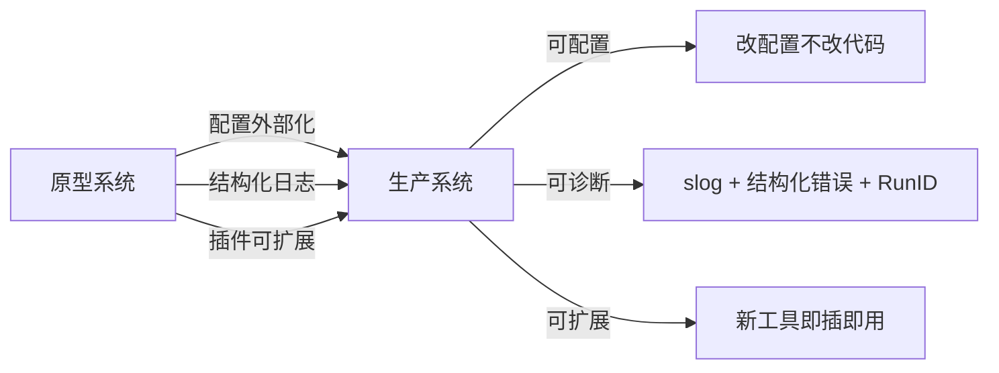

# 第 10 章 生产化

### 设计思路：从原型到生产需要补什么？

原型可以硬编码一切，但生产系统追求三个目标：



配置驱动是生产化的基石——同一个代码库，通过不同配置服务于开发、测试、生产环境。

一个原型 Agent 可以硬编码一切，但生产系统追求**可配置**、**可诊断**、**可扩展**。

---

## 10.1 配置管理

### 10.1.1 配置优先级

```
DefaultConfig → JSON 字段覆盖 → 应用层按需覆盖 → New 中归一化与校验
```

`LoadConfig` 先创建默认配置，再把 JSON 反序列化到同一个结构体，所以 JSON 中出现的字段覆盖默认值，省略的字段保留默认值。库本身不会通用地读取环境变量；JD Demo 只在应用入口用 `TRACKLOGIC_AGENT_API_KEY` 覆盖 Key。把环境变量策略留给应用层，是为了避免公共库隐式依赖某个部署平台的变量命名。

`LoadConfig` 在文件不存在时返回默认配置并记录 warn，便于本地示例启动；生产应用如果要求配置文件必需存在，应在调用前检查路径，或把“缺文件”提升为启动错误。公共库无法替所有应用决定这一策略。

### 10.1.2 配置结构体

```go
type Config struct {
	Version        string            `json:"version"`          // 配置版本号
	Name           string            `json:"name"`             // 服务名称
	LogLevel       string            `json:"log_level"`        // debug/info/warn/error
	DefaultModel   ModelConfig       `json:"default_model"`    // 默认模型配置
	AllowedTools   []string          `json:"allowed_tools"`    // 启用的内置工具
	MemoryConfig   MemoryConfig      `json:"memory"`           // 记忆配置
	PermissionMode string            `json:"permission_mode"`  // strict 或 permissive
	MCPClients     []MCPClientConfig `json:"mcp_clients"`      // MCP 客户端列表
	Security       SecurityConfig    `json:"security"`         // 安全配置
}
```

### 10.1.3 分层配置结构

```go
type ModelConfig struct {
	Vendor    string `json:"vendor"`     // deepseek / openai / anthropic / custom
	APIFormat string `json:"api_format"` // openai_response / openai_chat_completions / anthropic_message / mock
	BaseURL   string `json:"base_url,omitempty"`
	APIKey    string `json:"api_key,omitempty"`
	ModelID   string `json:"model_id"`
	Timeout   int    `json:"timeout_seconds"`
}

type MemoryConfig struct {
	Type     string `json:"type"`     // 当前仅支持 buffer
	Capacity int    `json:"capacity"` // 容量
}

type MCPClientConfig struct {
	Name            string `json:"name"`
	BaseURL         string `json:"base_url"`
	Timeout         int    `json:"timeout_seconds"`
	ProtocolVersion string `json:"protocol_version,omitempty"`
}

type SecurityConfig struct {
	MaxInputLength      int  `json:"max_input_length"`
	MaxOutputLength     int  `json:"max_output_length"`
	EnableInjectionCheck bool `json:"enable_injection_check"`
	SanitizePII         bool `json:"sanitize_pii"`
}
```

### 10.1.4 环境变量覆盖

API Key 等敏感信息不应硬编码在配置文件中。公共库不读取固定环境变量，由应用入口显式决定覆盖策略。JD Demo 的实际做法是：

```go
cfg, err := agent.LoadConfig("examples/config.example.json")
if err != nil { /* 处理错误 */ }

if apiKey := strings.TrimSpace(os.Getenv("TRACKLOGIC_AGENT_API_KEY")); apiKey != "" {
	cfg.DefaultModel.APIKey = apiKey
}
```

`BuildModel` 只按 `api_format` 选择协议实现。`vendor` 描述供应商身份，二者分离；BaseURL、ModelID 和 API Key 都不会根据 vendor 被隐式猜测。

### 10.1.5 配置示例

```json
{
  "version": "0.2.0",
  "name": "JD-CS-Production",
  "log_level": "info",
  "default_model": {
    "vendor": "openai",
    "api_format": "openai_response",
    "base_url": "https://api.openai.com/v1",
    "api_key": "",
    "model_id": "gpt-4o-mini",
    "timeout_seconds": 60
  },
  "allowed_tools": ["calculator", "read_file", "write_file", "get_current_time", "list_dir", "http_get", "json_parse"],
  "memory": {
    "type": "buffer",
    "capacity": 100
  },
  "permission_mode": "strict",
  "security": {
    "sanitize_pii": true,
    "enable_injection_check": true
  }
}
```

### 10.1.6 为什么要在构造阶段校验

`agent.New` 会自动归一化模型配置、补默认 Memory 类型并调用 `Config.Validate()`。当前校验包括：

- log level、api_format、memory type 和 permission mode 是否属于支持集合；
- ModelID 是否为空，timeout/容量/长度限制是否为负数；
- Model/MCP URL 是否为带 Host 的 HTTP(S) URL；
- 内置工具是否已知且无重复；
- MCP Client 名称、协议版本是否有效，名称是否重复。

为什么不等到组件真正使用时再报错？生产服务通常在启动后才接收流量。配置错误如果延迟到第一次用户请求，会把部署问题变成运行时故障，而且可能只影响某条低频路径。Fail fast 让健康检查和发布系统能在流量切入前发现问题。

```go
cfg, err := agent.LoadConfig(configFile)
if err != nil { return err }

// 应用层覆盖秘密或环境差异。
cfg.DefaultModel.APIKey = os.Getenv("TRACKLOGIC_AGENT_API_KEY")

// New 内部执行 ResolveModelDefaults + Validate。
h, err := agent.New(cfg)
if err != nil { return fmt.Errorf("create harness: %w", err) }
```

`Config.Validate()` 也可以被应用提前调用，但不要把它当作业务健康检查：它只验证静态结构，不会访问 Model 或 MCP 网络。

`agent.New` 会复制 `AllowedTools` 和 `MCPClients` 切片，`h.Config()` 也返回新的切片副本。这样应用在构造后修改原配置，或修改一次读取到的配置快照，都不会改变正在运行的 Harness。这个所有权规则很重要：配置是启动输入，不是绕过锁的热更新通道。

---

## 10.2 结构化日志

### 10.2.1 使用 slog

Go 1.21 起内置了 `log/slog` 包，提供结构化日志：

```go
logger := slog.New(slog.NewJSONHandler(os.Stdout, &slog.HandlerOptions{
	Level: slog.LevelInfo,
}))

h, err := agent.New(cfg, agent.WithLogger(logger))
```

公共库不能在构造时调用 `slog.SetDefault`。那会替换整个进程的全局 logger，影响 Web 框架、数据库驱动和其他 Harness 实例。当前实现把 logger 作为依赖向 Harness、Agent、Model、MCP、Team 和 Workflow 传递，并用 `With("component", ...)` 增加组件字段。未注入时，Harness 根据 `log_level` 创建自己的 TextHandler，但仍不修改进程全局状态。

### 10.2.2 日志最佳实践

每个日志条目包含关键上下文：

```go
// Agent 运行日志
a.logger.Info("agent run started",
	"input", truncate(input, 100),
)

// Agent 完成日志
a.logger.Info("agent run completed",
	"loops", loopCount,
	"tokens", totalTokens,
	"duration", time.Since(start),
)

// 错误日志只记录排障必需字段
a.logger.Error("tool execution failed",
	"tool", tc.Function.Name,
	"error", err,
)
```

**关键字段**：
- `component` — 标识日志来源（agent/tool/model/harness）
- `duration` — 操作耗时（便于性能分析）
- `error` — 错误信息（含错误码）

当前 Agent 开始日志会记录截断后的用户输入。生产环境仍需在日志出口增加脱敏策略：Harness 对最终输出的脱敏不等于所有内部日志天然安全。更严格的部署可以注入自定义 `slog.Handler`，按字段名删除或哈希敏感内容。

### 10.2.3 日志级别选择

| 级别 | 用途 | 示例 |
|------|------|------|
| Debug | 开发调式 | Token 级消息内容 |
| Info | 正常运行 | Agent 启动/完成、工具调用 |
| Warn | 异常但不影响 | 工具不存在、重试 |
| Error | 影响功能 | API 调用失败、参数校验失败 |

---

## 10.3 插件注册机制

Harness 的插件机制基于 Go 的接口，不需要复杂的 SPI 或反射：

```go
// 内置工具注册（启动时）
func (h *Harness) registerBuiltinTool(name string) {
	var t tool.Tool
	switch name {
	case "calculator":       t = builtin.NewCalculator()
	case "read_file":        t = builtin.NewReadFile(".")
	case "write_file":       t = builtin.NewWriteFile(".")
	case "get_current_time": t = builtin.NewCurrentTime()
	case "list_dir":         t = builtin.NewListDir(".")
	case "http_get":         t = builtin.NewHTTPGet()
	case "json_parse":       t = builtin.NewJSONParse()
	default:
		h.logger.Warn("unknown builtin tool", "name", name)
		return
	}
	if err := h.RegisterTool(t); err != nil {
		h.logger.Warn("failed to register tool", "name", name, "error", err)
	}
}

// 外部工具注册（通过 API）
func (h *Harness) RegisterTool(t tool.Tool) error {
	return h.toolRegistry.Register(t)
}
```

**注册模式的优势**：
- 工具按需启用（通过 `AllowedTools` 配置控制）
- 配置驱动的内置工具注册失败只记录 warn；调用方显式 `RegisterTool` 时仍会收到 error
- 运行时也可注册（通过 MCP 发现）

### 10.3.1 注册表不是可以静默覆盖的 map

生产系统中，同名对象通常意味着配置冲突，而不是“后注册者理应获胜”。因此 Tool Registry 会拒绝 nil Tool、空白名称、`Name()` 与 `Definition().Name` 不一致以及重复名称；`List` / `Names` 按名称排序，保证日志、测试和生成给模型的工具顺序可重复。

Agent、Team 与 Workflow 同样拒绝重复注册。推荐使用返回 error 的创建 API：

```go
assistant, err := h.CreateAgent("assistant", systemPrompt)
if err != nil { return err }

reviewer, err := h.CreateAgentWithTools(
	"reviewer", reviewerPrompt,
	"read_file", "list_dir",
)
if err != nil { return err }

team, err := h.CreateTeam(workflow.TeamConfig{
	Name:   "reviewers",
	Mode:   workflow.ModeParallel,
	Agents: []*engine.Agent{assistant, reviewer},
})
if err != nil { return err }

flow, err := h.CreateWorkflow(workflow.WorkflowConfig{
	Name:  "review-flow",
	Nodes: []workflow.Node{workflow.NewStepNode("review", reviewer)},
})
if err != nil { return err }
```

`Create*` 把“校验 + 重名检查 + 注册”放在同一个临界区，失败不会覆盖旧对象。兼容性的 `New*` 方法无法把 error 返回给旧调用方，只会记录错误并返回 nil，所以不适合新的生产代码。

### 10.3.2 可序列化配置与运行时依赖分开

Logger、预构造 Model、安全策略和 MCP Client 含有接口、连接池或函数，无法安全地写进 JSON。它们通过 Functional Options 注入：

```go
h, err := agent.New(cfg,
	agent.WithLogger(logger),
	agent.WithModel(runtimeModel),
	agent.WithInputValidator(inputValidator),
)
```

`WithModel` 适合自定义 HTTP Transport、证书、代理、测试替身或应用拥有的重试包装器。Harness 会验证注入依赖不是 nil，但不会修改调用方的全局 logger 或共享 `http.Client`。这体现了一个重要边界：配置描述“想要什么”，依赖注入提供“已经构造好的运行时对象”。

---

## 10.4 本章小结

- 实现了默认值 + JSON 字段覆盖；环境变量覆盖由 Demo 应用显式完成
- `agent.New` 在接受工作前归一化并校验配置
- 使用可注入 slog logger，不修改宿主进程的全局 logger
- 建立了基于接口的插件注册机制
- 创建与注册 API 会拒绝非法结构和重名，不静默覆盖既有对象
- 业务处理与报告、配置热加载和集中式密钥管理属于应用工程，不进入 Harness 核心包

---

## 练习

1. 为 Config 添加热加载：监听配置文件变化，自动重载配置
2. 注入 JSON slog Handler，并验证创建 Harness 不会改变 `slog.Default()`。
3. 添加配置文件的 `$schema` 支持，在编辑器中获得自动补全。
