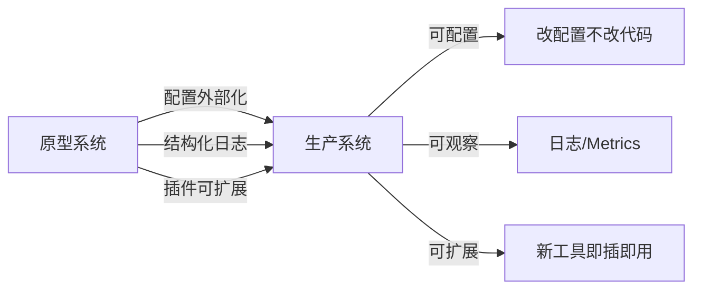

# 第 10 章 生产化

### 设计思路：从原型到生产需要补什么？

原型可以硬编码一切，但生产系统追求三个目标：



配置驱动是生产化的基石——同一个代码库，通过不同配置服务于开发、测试、生产环境。

一个原型 Agent 可以硬编码一切，但生产系统追求**可配置**、**可观察**、**可扩展**。

---

## 10.1 配置管理

### 10.1.1 配置优先级

```
JSON 配置文件 > DefaultConfig 默认值（Demo 无 -config 与环境变量覆盖）
```

### 10.1.2 配置结构体

```go
type Config struct {
	Version        string            `json:"version"`          // 配置版本号
	Name           string            `json:"name"`             // 服务名称
	LogLevel       string            `json:"log_level"`        // debug/info/warn/error
	DefaultModel   ModelConfig       `json:"default_model"`    // 默认模型配置
	AllowedTools   []string          `json:"allowed_tools"`    // 启用的内置工具
	MemoryConfig   MemoryConfig      `json:"memory"`           // 记忆配置
	PermissionMode string            `json:"permission_mode"`  // strict 或 permissive
	MCPClients     []MCPClientConfig `json:"mcp_clients"`      // MCP 客户端列表
	Security       SecurityConfig    `json:"security"`         // 安全配置
}
```

### 10.1.3 分层配置结构

```go
type ModelConfig struct {
	Vendor    string `json:"vendor"`     // deepseek / openai / anthropic / custom
	APIFormat string `json:"api_format"` // openai_response / openai_chat_completions / anthropic_message / mock
	BaseURL   string `json:"base_url,omitempty"`
	APIKey    string `json:"api_key,omitempty"`
	ModelID   string `json:"model_id"`
	Timeout   int    `json:"timeout_seconds"`
}

type MemoryConfig struct {
	Type     string `json:"type"`     // buffer
	Capacity int    `json:"capacity"` // 容量
}

type MCPClientConfig struct {
	Name    string `json:"name"`
	BaseURL string `json:"base_url"`
	Timeout int    `json:"timeout_seconds"`
}

type SecurityConfig struct {
	MaxInputLength      int  `json:"max_input_length"`
	MaxOutputLength     int  `json:"max_output_length"`
	EnableInjectionCheck bool `json:"enable_injection_check"`
	SanitizePII         bool `json:"sanitize_pii"`
}
```

### 10.1.4 环境变量覆盖

API Key 等敏感信息不应硬编码在配置文件中，通过环境变量传入：

```go
func (c ModelConfig) BuildModel() (model.Model, error) {
	// 仅根据 api_format 选择客户端；连接参数来自 JSON，不读取 MODEL_* 环境变量。
	switch c.APIFormat {
	case "openai_response":
		return model.NewOpenAI(...)
	case "openai_chat_completions":
		return model.NewOpenAIChat(...)
	case "anthropic_message":
		return model.NewAnthropic(...)
	case "mock":
		return model.NewMock(c.ModelID), nil
	default:
		return nil, fmt.Errorf("unsupported api_format: %s", c.APIFormat)
	}
}```

### 10.1.5 配置示例

```json
{
  "version": "1.0.0",
  "name": "JD-CS-Production",
  "log_level": "info",
  "default_model": {
    "vendor": "openai",
    "api_format": "openai_response",
    "base_url": "https://api.openai.com/v1",
    "api_key": "",
    "model_id": "gpt-4o-mini",
    "timeout_seconds": 60
  },
  "allowed_tools": ["calculator", "read_file", "write_file"],
  "memory": {
    "type": "buffer",
    "capacity": 100
  },
  "permission_mode": "strict",
  "security": {
    "sanitize_pii": true,
    "enable_injection_check": true
  }
}
```

---

## 10.2 结构化日志

### 10.2.1 使用 slog

Go 1.21 起内置了 `log/slog` 包，提供结构化日志：

```go
func (h *Harness) setupLogger(level string) {
	var lvl slog.Level
	switch level {
	case "debug": lvl = slog.LevelDebug
	case "info":  lvl = slog.LevelInfo
	case "warn":  lvl = slog.LevelWarn
	case "error": lvl = slog.LevelError
	default:     lvl = slog.LevelInfo
	}
	opts := &slog.HandlerOptions{Level: lvl}
	handler := slog.NewTextHandler(os.Stdout, opts)
	slog.SetDefault(slog.New(handler))
}
```

### 10.2.2 日志最佳实践

每个日志条目包含关键上下文：

```go
// Agent 运行日志
a.logger.Info("agent run started",
	"input", truncate(input, 100),
)

// Agent 完成日志
a.logger.Info("agent run completed",
	"loops", loopCount,
	"tokens", totalTokens,
	"duration", time.Since(start),
)

// 错误日志包含结构化信息
a.logger.Error("tool execution failed",
	"tool", tc.Function.Name,
	"error", err,
	"arguments", tc.Function.Arguments,
)
```

**关键字段**：
- `component` — 标识日志来源（agent/tool/model/harness）
- `duration` — 操作耗时（便于性能分析）
- `error` — 错误信息（含错误码）

### 10.2.3 日志级别选择

| 级别 | 用途 | 示例 |
|------|------|------|
| Debug | 开发调式 | Token 级消息内容 |
| Info | 正常运行 | Agent 启动/完成、工具调用 |
| Warn | 异常但不影响 | 工具不存在、重试 |
| Error | 影响功能 | API 调用失败、参数校验失败 |

---

## 10.3 插件注册机制

Harness 的插件机制基于 Go 的接口，不需要复杂的 SPI 或反射：

```go
// 内置工具注册（启动时）
func (h *Harness) registerBuiltinTool(name string) {
	var t tool.Tool
	switch name {
	case "calculator": t = builtin.NewCalculator()
	case "read_file":  t = builtin.NewReadFile(".")
	case "write_file": t = builtin.NewWriteFile(".")
	default:
		h.logger.Warn("unknown builtin tool", "name", name)
		return
	}
	if err := h.ToolRegistry.Register(t); err != nil {
		h.logger.Warn("failed to register tool", "name", name, "error", err)
	}
}

// 外部工具注册（通过 API）
func (h *Harness) RegisterTool(t tool.Tool) error {
	return h.ToolRegistry.Register(t)
}
```

**注册模式的优势**：
- 工具按需启用（通过 `AllowedTools` 配置控制）
- 失败不阻塞启动（失败只记录 warn）
- 运行时也可注册（通过 MCP 发现）

---

## 10.4 本章小结

- 实现了分层配置系统：默认值 → 配置文件 → 环境变量
- 使用 slog 实现了结构化日志，支持按级别控制输出
- 建立了基于接口的插件注册机制

---

## 练习

1. 为 Config 添加热加载：监听配置文件变化，自动重载配置
2. 实现 JSON 格式的日志输出（生产环境通常使用 JSON 格式方便日志收集）
3. 添加配置文件的 `$schema` 支持，在编辑器中获得自动补全
