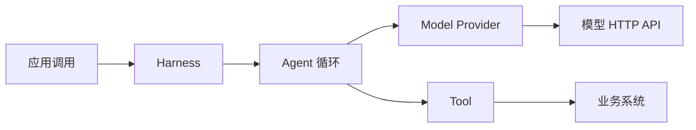
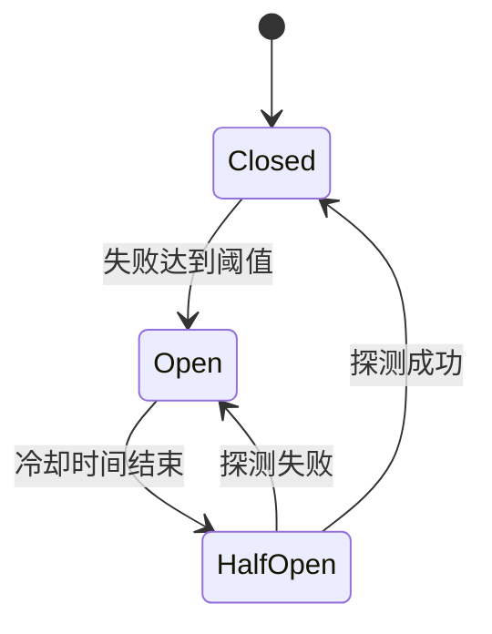

# 第 11 章 容错与可靠性

### 设计思路：先分清故障，再决定策略

> 普通同步 API 保持原有单次模型调用；Task 模式已经实现模型重试与断路器。自动降级仍由上层应用按业务语义决定。

“默认一切都会出错”不是让每个错误都重试，而是要求系统在设计阶段回答：故障发生在哪里、是否短暂、操作是否幂等、谁拥有重试预算、失败后保留什么诊断证据。

## 11.1 先画出故障边界

一次 Agent 请求跨过多个边界，每个边界的失败含义不同：



| 故障位置 | 常见错误 | 通常由谁处理 |
|---|---|---|
| Harness 输入边界 | 空输入、过长、注入模式 | 立即拒绝，不重试 |
| Agent 循环 | 取消、超过 MaxLoops | 应用调整预算或任务，不自动重试 |
| Model Provider | 网络抖动、429、5xx、响应解析失败 | Provider 分类；Task Runtime 执行模型重试预算 |
| Tool 参数 | JSON 错误、缺少必填字段 | 写回模型修正，或终止 |
| Tool 业务执行 | 订单不存在、余额不足 | 业务失败，不重试 |
| Tool 外部依赖 | 超时、连接重置、临时 503 | Tool/服务客户端在幂等前提下重试 |
| Workflow | 某步骤失败、进程重启 | 应用层决定是否重放或恢复 |

设计可靠性时最常见的错误，是只看到“发生 error”，却丢失错误所属边界。`HarnessError.Code` 的价值就在于把部分故障变成可分类数据。

## 11.2 当前代码已经提供的可靠性底座

### 11.2.1 Context 取消传播

`Agent.Run` 在每轮开始检查 `ctx.Done()`，并把同一个 Context 传给 Model 和 Tool。Team、Workflow 以及 MCP 的 HTTP 请求也继续向下传递。

```go
runCtx, cancel := context.WithTimeout(context.Background(), 30*time.Second)
defer cancel()

output := runtimeAgent.Run(runCtx, input)
if !output.Success {
	// context 取消会形成 RUN_CANCELLED，Provider/Tool 也可能直接返回 ctx.Err()
}
```

为什么使用 Context 而不是一个全局 `Stop` 标志？因为 Context 可以沿调用链传播取消和截止时间，不需要每个子系统共享可变全局状态。

当前边界也要看清：Agent 只在循环边界主动检查取消。具体 Tool 是否及时停止，取决于它是否使用传入的 Context；不理会 Context 的阻塞 Tool 仍可能拖延返回。

### 11.2.2 HTTP Client 超时

Model Provider 使用配置中的 `timeout_seconds` 构造 HTTP Client，未设置或非正数时回退为 60 秒；MCP Client 的兜底是 30 秒。

HTTP Client 超时与整次 Run 的 Context 截止时间是两个不同预算：

```text
实际可用时间 = min(HTTP Client 超时, Context 剩余时间)
```

应用通常应让整次 Run 的截止时间覆盖业务 SLO，再把单次 Provider/Tool 超时设得更短，为错误处理留出余量。

三个模型 Provider 还限制响应大小：普通成功响应最多 16 MiB，错误正文最多保留 8 KiB。限制错误正文同样重要，因为错误网关也可能返回超大 HTML；如果错误路径无界，它仍能耗尽进程内存。

### 11.2.3 最大循环上限

`MaxLoops` 防止模型不断请求工具导致无限成本。默认是 10，也可以按单次调用覆盖：

```go
output := runtimeAgent.Run(ctx, input, engine.WithMaxLoops(5))
```

达到上限返回 `MAX_LOOPS_EXCEEDED`。这通常不是网络瞬时故障，盲目重跑很可能重复消耗 Token；应检查 Prompt、工具错误消息和模型的工具选择。

### 11.2.4 失败的工具结果会反馈给模型

工具不存在、权限拒绝、参数校验失败或执行失败时，Agent 会把 `error: ...` 作为 Tool 消息写回 Memory，然后进入下一轮。这样模型有机会修正参数或向用户解释。

这是一种局部恢复机制，但也有预算：同一错误可能被模型重复触发，最终由 `MaxLoops` 截止。生产扩展可以加入重复 ToolCall 检测或每类工具的失败计数。

## 11.3 重试前必须回答的三个问题

### 问题一：错误是否可能自行恢复？

适合重试的通常是短暂故障：连接重置、429、部分 5xx、上游暂时不可用。不适合重试的是配置错误、鉴权失败、参数错误、权限拒绝和确定性的业务规则失败。

对未知错误默认重试并不安全。更稳妥的默认是“不重试”，只有明确分类为 transient 的错误才进入策略。

### 问题二：操作是否幂等？

读取订单通常可安全重试；创建退款、发送邮件、扣款等写操作可能产生重复副作用。写操作要重试，至少需要一个稳定幂等键：

```text
用户请求 RunID + 业务动作 + 业务对象 ID
               ↓
refund:run-123:order-456
```

服务端必须存储并识别这个键。仅在客户端“希望它不要重复”不构成幂等保证。

### 问题三：哪一层拥有重试？

只选择最了解错误和幂等性的层。不要让网关、应用、Agent、Provider 和 Tool 同时各重试 3 次，否则最坏会放大成乘法调用。

```text
3（应用）× 3（Provider）× 3（HTTP SDK）= 27 次上游请求
```

推荐职责：

- Provider 负责把模型 HTTP 的 429/短暂 5xx 分类为 `HTTPError`；Task 模式据此自动重试；
- 业务 Tool 负责自己依赖的短暂故障；
- Task Runtime 根据 `HTTPError.Retryable()`、Context 和本 Turn 的模型预算决定是否重试；
- Agent 循环负责“模型看到工具结果后是否换方案”，它不是网络重试器。

## 11.4 Task 模式的模型重试

默认总共尝试 5 次，第一次计入预算；使用 500ms 基础延迟、8s 普通最大延迟和 full jitter。`Retry-After` 可以覆盖普通退避，但最多接受 30s。可重试范围严格限制为连接类错误、提前 EOF、408、425、429、500、502、503、504；Context 取消、鉴权、参数和权限错误立即返回。

每次尝试发出 `model.attempt_started`，等待下一次前发出 `model.retry_waiting`，两者都是 `best_effort`。如果流式回答已经产生不完整文本后中断，库先发 `content.reset`，客户端清空临时内容，然后模型请求从头开始；只有最终完整结果才形成正式 assistant message。

这套策略只包围 Model 调用，不包围整个 Agent 循环，更不包围 Tool。否则一次写操作可能被自动执行多次。旧的 `RunAgent/Agent.Run` 同步路径继续只调用一次 Model，现有调用方不会因为升级库而突然改变请求数量。

下面的教学实现用于解释当前 `task.RetryConfig` 背后的算法；实际调用只需在 `task.Options` 中覆盖配置：

```go
type RetryStrategy struct {
	MaxAttempts int
	BaseDelay   time.Duration
	MaxDelay    time.Duration
}

func (r RetryStrategy) Do(
	ctx context.Context,
	isRetryable func(error) bool,
	fn func(context.Context) error,
) error {
	var lastErr error
	for attempt := 0; attempt < r.MaxAttempts; attempt++ {
		if err := fn(ctx); err != nil {
			lastErr = err
			if !isRetryable(err) || attempt == r.MaxAttempts-1 {
				return err
			}

			delay := r.BaseDelay * time.Duration(1<<attempt)
			if delay > r.MaxDelay { delay = r.MaxDelay }
			// 生产实现还应加入随机 jitter，避免大量实例同时重试。
			timer := time.NewTimer(delay)
			select {
			case <-ctx.Done():
				timer.Stop()
				return ctx.Err()
			case <-timer.C:
			}
			continue
		}
		return nil
	}
	return lastErr
}
```

这里有四个有意的设计：

1. 分类函数由调用层注入，通用重试器不猜测业务错误；
2. 等待受 Context 控制，取消后不会继续睡眠；
3. 延迟有上限，避免指数无限增长；
4. 最大尝试次数包含第一次调用，预算含义明确。

生产实现还应加入 full jitter，并记录 attempt、delay、最终错误和上游 request ID。

## 11.5 断路器什么时候才有价值

重试处理短暂故障，断路器处理“持续失败时不要继续施压”。它通常有三个状态：



断路器必须按依赖实例或服务端点隔离。把所有工具共用一个全局断路器，会让一个物流服务的故障错误地熔断订单查询。

实现时还要定义：

- 统计连续失败还是滑动窗口失败率；
- 哪些错误计入失败；
- HalfOpen 同时允许几个探测请求；
- Open 时返回什么可识别错误；
- 状态是否需要跨进程共享。

Task 模式已经按 Model 实例维护进程内断路器：连续 3 个逻辑模型调用耗尽重试后 Open 30 秒；随后 Half-Open 只允许 1 个探测请求。探测成功回到 Closed，失败重新 Open。永久错误和 Context 取消不计入失败，状态不跨进程保存，Open 时返回 `CIRCUIT_OPEN`。普通同步 API 不经过该断路器。

## 11.6 降级不是“返回一段看似成功的话”

可靠降级必须保留真实性。例如订单服务不可用时，可以：

- 明确告诉用户暂时无法查询；
- 返回带时间戳的缓存，并标明可能过期；
- 转人工并携带已收集的上下文；
- 对非关键推荐功能返回空结果。

不能在没有数据时让模型编造订单状态。降级结果应包含机器可识别的 `degraded` 或数据来源字段，便于调用应用区分正常成功。

## 11.7 失败证据必须能被程序识别

可靠性代码不能要求调用方解析自然语言错误字符串。当前实现提供两层机器可识别信息：

- `*types.HarnessError` 表示 Harness 语义，例如 `RATE_LIMIT`、`MODEL_TIMEOUT`、`RUN_CANCELLED`；
- `*model.HTTPError` 保存上游 `StatusCode`、`RequestID`、`RetryAfter` 和有界错误正文。

两层错误通过 `%w` 包装保留，所以应使用 `errors.As` / `errors.Is`，不要做字符串包含判断：

```go
result := h.RunAgent(ctx, "assistant", input)
var harnessErr *types.HarnessError
var upstream *model.HTTPError
err := result.Err

switch {
case errors.As(err, &upstream) && upstream.Retryable():
	// 这里只得到“协议上可能短暂”的事实；仍要检查 Context 和重试预算。
case errors.As(err, &harnessErr):
	// 按 Harness 错误码处理，例如取消、输入错误或循环超限。
default:
	// 未分类错误默认不重试。
}
```

`RunOutput`、`TeamOutput` 和 `WorkflowResult` 都保留 `Err error`，并用 `json:"-"` 排除序列化；原有 `Error string` 继续作为兼容字段。Team/Workflow 包装下层失败时使用 `%w`，并行 Team 用 `errors.Join` 聚合多个 Agent 错误，所以 `errors.As` 仍能穿过编排层找到根因。

RunID、上游 request ID 和错误码足以让应用把一次失败与自己的请求日志关联起来。Harness 只提供这些通用证据，不负责业务处理、聚合或报告。

## 11.8 推荐实施顺序

可靠性能力不是越多越好，建议按风险递增：

1. 为应用入口设置总 Context 截止时间；
2. 为每个外部 Client 设置更短的单次超时；
3. 保留结构化错误类型和上游状态码；
4. 用 `errors.As` 保留并识别上游状态、request ID 和 Harness 错误码；
5. 只对明确 transient 且幂等的请求加有限重试与 jitter；
6. 在 Task 模式按 Model 实例使用断路器，避免把不同 Model 的故障互相传播；
7. 对写操作加入幂等键、审计记录和恢复流程；
8. Workflow 需要重放时，再设计步骤持久化和补偿动作。

这个顺序体现一个原则：**先让失败可分类、可终止、可关联，再增加复杂恢复机制。**

## 11.9 本章小结

- 当前已实现：HTTP 超时、Context 取消、有界循环、响应限制、错误码和 slog 日志；
- Task 模式已内置：模型自动重试、断路器、检查点协议；缓存降级仍由上层决定；
- 重试需要同时满足短暂故障、预算可控和操作幂等；
- 重试应放在最了解错误语义的单一层级；
- 断路器按依赖隔离，降级结果必须诚实标注数据质量；
- 先保留可识别的失败证据，再增加复杂可靠性机制。

## 练习

1. 为一个只读 HTTP Tool 设计错误分类，并列出哪些状态码可重试、哪些不可重试。
2. 为上述 Tool 加入带 full jitter 的有限重试，并写一个 Context 取消测试。
3. 为“创建退款”设计幂等键，说明服务端需要保存什么状态。
4. 运行一个总超时 3 秒、Provider 超时 10 秒的示例，验证较短的 Context 先终止。
5. 用 `httptest.Server` 返回 429，验证 `HarnessError` 与 `HTTPError` 可以同时通过 `errors.As` 识别。
