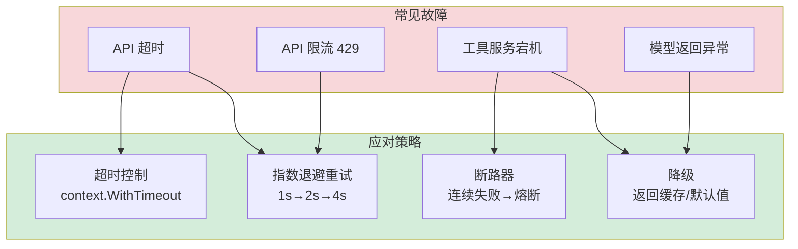

# 第 11 章 容错与可靠性

### 设计思路：默认一切都会出错

生产环境中，外部依赖的故障是常态而非异常。Harness 的可靠性设计基于"故障假设原则"：



每种故障都有对应的策略，确保系统在任何情况下都能优雅降级。

可靠性是生产系统的生命线。本章为 Harness 构建容错机制，确保 Agent 在故障面前仍能正常运行。

---

## 11.1 故障假设原则

> 默认一切都会出错。

| 故障场景 | 影响 | 应对策略 |
|---------|------|---------|
| API 超时 | 模型无响应 | 超时控制 + 重试 |
| API 限流（429） | 请求被拒绝 | 指数退避重试 |
| 工具服务宕机 | 工具调用失败 | 降级 + 错误反馈 |
| 模型返回异常 | 格式解析失败 | 优雅降级 |
| 级联故障 | 链式崩溃 | 断路器 |

### 常见故障的分布

```
用户输入错误的概率：高
模型调用超时的概率：中
工具执行失败的概率：中
API Key 错误的概率：低（但一旦发生持续失败）
```

我们的容错策略应该优先处理**高频**和**中频**故障，对低频故障提供兜底。

---

## 11.2 重试策略

### 指数退避（Exponential Backoff）

```go
type RetryStrategy struct {
	MaxAttempts int           // 最大尝试次数
	BaseDelay   time.Duration // 基础延迟
	MaxDelay    time.Duration // 最大延迟
}

func DefaultRetry() *RetryStrategy {
	return &RetryStrategy{
		MaxAttempts: 3,
		BaseDelay:   1 * time.Second,
		MaxDelay:    10 * time.Second,
	}
}

func (r *RetryStrategy) Do(ctx context.Context, fn func(context.Context) error) error {
	var lastErr error
	for attempt := 0; attempt < r.MaxAttempts; attempt++ {
		if err := fn(ctx); err != nil {
			lastErr = err
			if isRetryable(err) && attempt < r.MaxAttempts-1 {
				delay := r.BaseDelay * time.Duration(1<<attempt) // 指数: 1s, 2s, 4s
				if delay > r.MaxDelay {
					delay = r.MaxDelay
				}
				select {
				case <-ctx.Done():
					return ctx.Err()
				case <-time.After(delay):
				}
				continue
			}
			return err // 不可重试或已达最大次数
		}
		return nil
	}
	return lastErr
}
```

**指数退避计算**：

```
attempt=0: delay = 1s × 2⁰ = 1s
attempt=1: delay = 1s × 2¹ = 2s
attempt=2: delay = 1s × 2² = 4s
...
```

### 哪些错误可重试？

```go
func isRetryable(err error) bool {
	var herr *types.HarnessError
	if errors.As(err, &herr) {
		switch herr.Code {
		case types.ErrRateLimit, types.ErrModelTimeout, types.ErrAPIError:
			return true
		case types.ErrInvalidInput, types.ErrSecurityViolation, types.ErrInvalidConfig:
			return false
		}
	}
	return true // 未知错误默认可重试
}
```

---

## 11.3 断路器

断路器防止连续故障导致的级联崩溃。

```go
type CircuitBreaker struct {
	mu           sync.Mutex
	failures     int
	maxFailures  int           // 触发断路的连续失败次数
	resetTimeout time.Duration // 半开后等待恢复的时间
	lastFailure  time.Time
	state        string        // closed → open → half-open → closed
}

func NewCircuitBreaker(maxFailures int, resetTimeout time.Duration) *CircuitBreaker {
	return &CircuitBreaker{
		maxFailures:  maxFailures,
		resetTimeout: resetTimeout,
		state:        "closed",
	}
}

func (cb *CircuitBreaker) Call(ctx context.Context, fn func(context.Context) error) error {
	cb.mu.Lock()
	if cb.state == "open" {
		if time.Since(cb.lastFailure) > cb.resetTimeout {
			cb.state = "half-open" // 尝试恢复
		} else {
			cb.mu.Unlock()
			return fmt.Errorf("circuit breaker is open (service unavailable)")
		}
	}
	cb.mu.Unlock()

	err := fn(ctx)

	cb.mu.Lock()
	defer cb.mu.Unlock()

	if err != nil {
		cb.failures++
		cb.lastFailure = time.Now()
		if cb.failures >= cb.maxFailures {
			cb.state = "open" // 打开断路器
		}
		return err
	}

	// 成功调用：重置
	cb.failures = 0
	cb.state = "closed"
	return nil
}
```

**状态机**：

```
closed (正常) → failures >= maxFailures → open (熔断)
open → resetTimeout 过期 → half-open (尝试恢复)
half-open → 成功 → closed
half-open → 失败 → open (再次熔断)
```

---

## 11.4 超时控制

超时是最基本的容错机制。Go 的 `context.WithTimeout` 提供了原生支持：

```go
// 在 Agent Run 中设置总超时
runCtx, cancel := context.WithTimeout(ctx, 30*time.Second)
defer cancel()

output := agent.Run(runCtx, input)
```

每层的超时时间：

| 层 | 超时时间 | 说明 |
|----|---------|------|
| HTTP 客户端 | 60s | 单次 API 调用 |
| Agent Run | 30s | 整次运行 |
| 工具执行 | 10s | 单次工具调用 |

---

## 11.5 可观测性基础

### Metrics 收集

```go
type Metrics struct {
	mu       sync.Mutex
	counters map[string]int64      // 计数器
	timings  map[string]time.Duration // 累计耗时
}

func (m *Metrics) Inc(name string) {
	m.mu.Lock()
	m.counters[name]++
	m.mu.Unlock()
}

func (m *Metrics) Record(name string, d time.Duration) {
	m.mu.Lock()
	m.timings[name] += d
	m.mu.Unlock()
}
```

### 关键指标

| 指标 | 类型 | 含义 |
|------|------|------|
| `agent.runs.total` | Counter | Agent 总运行次数 |
| `agent.runs.success` | Counter | 成功次数 |
| `agent.runs.failed` | Counter | 失败次数 |
| `agent.run.duration` | Timing | 平均运行耗时 |
| `model.invoke.count` | Counter | 模型调用次数 |
| `model.tokens.total` | Counter | Token 消耗量 |
| `tool.invoke.count` | Counter | 工具调用次数 |
| `tool.invoke.failed` | Counter | 工具失败次数 |

---

## 11.6 本章小结

- 实现了指数退避重试策略（1s → 2s → 4s）
- 实现了断路器模式，防止级联故障
- 建立了分层超时控制体系
- 设计了基础 Metrics 收集系统

---

## 练习

1. 为重试添加 Jitter（抖动）：在基础延迟上加入随机偏移，避免请求同时重试的"惊群效应"
2. 将 Metrics 集成到 Agent.Run 中，自动记录每次运行的耗时和结果
3. 在 Model Provider 中集成重试策略：当 API 返回 429 时自动重试
