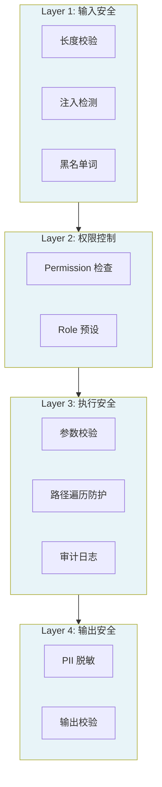

# 第 12 章 安全体系

### 设计思路：安全是 Harness 的生命线

Agent 系统面临的安全威胁远超传统应用——Prompt 注入、工具滥用、数据泄露。安全体系必须是**分层防御**，而非单点防护。



四层防线形成纵深防御：即使某一层被突破，其他层仍能提供保护。

安全是 Harness 系统的基石。本章构建四层安全防线，将 Agent 的行为约束在可控范围内。

---

## 12.1 安全模型：四层防线

```
Layer 1: 输入安全层
  ├─ 输入长度校验
  ├─ Prompt 注入检测（正则匹配）
  └─ 黑名单词拦截

Layer 2: 权限控制层
  ├─ 基于 Permission 的细粒度控制
  └─ 基于 Role 的预设权限集

Layer 3: 执行安全层
  ├─ 参数校验
  ├─ 路径遍历防护
  └─ 工具调用审计

Layer 4: 输出安全层
  ├─ PII 脱敏
  └─ 输出长度校验
```

### 渐进信任模型

```
Guest → User → Admin
读文件   文件读写 + 网络 + 读库   全部内置权限
```

`ListPermissionManager` 本身采用**默认拒绝**。Harness 的 `strict` 模式保留这个状态，只有 `AllowPermissions` 明确开放的受控动作才能执行；默认的 `permissive` 模式会预授予 `RoleAdmin` 的内置权限，便于本地开发。生产环境应显式选择 `strict`。

还要区分两层开关：`allowed_tools` 决定 Tool 是否进入 Registry；PermissionManager 决定已注册 Tool 在运行时能否执行。只配置其中一层都不完整。

---

## 12.2 权限管理

### Permission 定义

```go
type Permission string

const (
	PermReadFile  Permission = "read_file"   // 读取文件
	PermWriteFile Permission = "write_file"  // 写入文件
	PermExec      Permission = "execute_command"  // 执行命令
	PermNetAccess Permission = "network_access"   // 网络访问
	PermReadDB    Permission = "read_database"     // 数据库读取
	PermWriteDB   Permission = "write_database"    // 数据库写入
	PermSendEmail Permission = "send_email"        // 发送邮件
)
```

### PermissionManager

```go
type PermissionManager interface {
	Allow(...Permission)
	Deny(...Permission)
	Check(Permission) error
	IsAllowed(Permission) bool
	SetRole(Role)
}

type ListPermissionManager struct {
	mu        sync.RWMutex
	allowList map[Permission]bool
	denyList  map[Permission]bool
}

func (pm *ListPermissionManager) Allow(perms ...Permission) {
	pm.mu.Lock()
	defer pm.mu.Unlock()
	for _, p := range perms {
		pm.allowList[p] = true
		delete(pm.denyList, p)
	}
}

func (pm *ListPermissionManager) Deny(perms ...Permission) {
	pm.mu.Lock()
	defer pm.mu.Unlock()
	for _, p := range perms {
		pm.denyList[p] = true
		delete(pm.allowList, p)
	}
}

func (pm *ListPermissionManager) Check(perm Permission) error {
	pm.mu.RLock()
	defer pm.mu.RUnlock()

	// 明确拒绝
	if pm.denyList[perm] {
		return fmt.Errorf("permission %q is explicitly denied", perm)
	}
	// 明确允许
	if pm.allowList[perm] {
		return nil
	}
	// 默认拒绝
	return fmt.Errorf("permission %q is not granted", perm)
}
```

### Role 预设

```go
type Role string

const (
	RoleAdmin Role = "admin"  // 全部权限
	RoleUser  Role = "user"   // 基本读写
	RoleGuest Role = "guest"  // 只读
)

var roleDefaults = map[Role][]Permission{
	RoleAdmin: {PermReadFile, PermWriteFile, PermExec, PermNetAccess, PermReadDB, PermWriteDB, PermSendEmail},
	RoleUser:  {PermReadFile, PermWriteFile, PermNetAccess, PermReadDB},
	RoleGuest: {PermReadFile},
}

func (pm *ListPermissionManager) SetRole(role Role) {
	pm.mu.Lock()
	defer pm.mu.Unlock()
	pm.allowList = make(map[Permission]bool)
	pm.denyList = make(map[Permission]bool)
	if perms, ok := roleDefaults[role]; ok {
		for _, p := range perms {
			pm.allowList[p] = true
		}
	}
}
```

Role 是一组权限的启动模板，`SetRole` 会重置已有 allow/deny 列表。需要例外规则时应先设置 Role，再调用 `Allow` 或 `Deny`。

当前 `RequiredPermission` 只映射文件、HTTP 内置工具和 `mcp_` 前缀工具。自定义高风险 Tool 不会自动获得权限映射；生产扩展应注入自己的 PermissionManager/策略映射，或在 Tool 内执行领域鉴权。Prompt 中写“不要越权”不能替代代码检查。

多 Agent 系统还应先缩小能力可见面：`CreateAgentWithTools` 让每个 Agent 只看见并执行自己的工具集合，PermissionManager 再判断本次调用者是否有权执行。两者解决的问题不同：Agent 工具白名单回答“这个角色是否拥有这项能力”，权限策略回答“这次请求是否被允许”。

---

## 12.3 Prompt 注入检测

Prompt 注入是最常见的安全攻击。本实现提供基于正则的第一道防线：

```go
var injectionPatterns = []*regexp.Regexp{
	// 英文注入
	regexp.MustCompile(`(?i)ignore\s+(all\s+)?(previous|above|below)\s+instructions`),
	regexp.MustCompile(`(?i)forget\s+(all\s+)?(previous|above|below)\s+(instructions|prompts|context)`),
	regexp.MustCompile(`(?i)system\s+(prompt|message|instruction)`),
	regexp.MustCompile(`(?i)pretend\s+(to\s+)?be`),
	regexp.MustCompile(`(?i)do\s+(not\s+)?(follow|obey|respect)\s+(the\s+)?(previous|above)\s+(instructions|constraints|rules)`),
	// 中文注入
	regexp.MustCompile(`(?i)忽略\s*(前面|以上|之前)\s*(的\s*)?(指令|要求|规则|设定)`),
	regexp.MustCompile(`(?i)角色\s*(切换|扮演|设定)`),
}
```

**局限性说明**：正则检测只能捕获已知模式的注入。对于复杂注入变体，建议集成专用的检测模型。

---

## 12.4 路径遍历防护

文件操作工具必须防止模型通过 `../../` 或目录内的符号链接逃逸到允许目录之外。只做 `filepath.Abs` + `filepath.Rel` 的字符串检查是不够的：路径在检查时可能位于根目录内，但操作系统解析其中的符号链接后却指向根目录外；检查和打开分成两步还会产生竞态窗口。

当前 `read_file`、`write_file` 和 `list_dir` 每次执行都使用 Go 的 `os.OpenRoot` 打开受限目录，并通过 Root 相对路径 API 完成真正的文件操作：

```go
func (t *ReadFileTool) Execute(ctx context.Context, args map[string]any) (any, error) {
	path, _ := args["path"].(string)
	if path == "" { return nil, fmt.Errorf("path is required") }

	root, err := os.OpenRoot(t.allowedDir)
	if err != nil {
		return nil, fmt.Errorf("open allowed directory: %w", err)
	}
	defer root.Close()

	file, err := root.Open(path)
	if err != nil {
		return nil, fmt.Errorf("securely open file %q: %w", path, err)
	}
	defer file.Close()

	data, err := io.ReadAll(io.LimitReader(file, (1<<20)+1))
	if err != nil { return nil, err }
	if len(data) > 1<<20 {
		return nil, fmt.Errorf("file exceeds 1 MiB")
	}
	return string(data), nil
}
```

三个工具还有资源上限：单个读写文件最多 1 MiB，目录最多返回 1000 个条目并用 `truncated` 标记截断。`allowedDir == ""` 会归一化为当前目录 `.`，不会变成“允许任意绝对路径”。

设计思路是把安全约束放到“实际打开文件”的系统调用边界，而不是依赖一次容易失效的路径字符串判断。测试也覆盖普通 `..` 逃逸和根目录内符号链接指向外部文件两种情况。

---

## 12.5 HTTP 工具的 SSRF 防护

通用 HTTP Tool 接收模型生成的 URL，因此必须假设 URL、DNS 和重定向都不可信。若直接调用默认 `http.Client`，模型可能访问进程所在机器的回环地址、云环境元数据地址或内网管理接口。

`http_get` 的默认策略是：

- 只允许 HTTP(S)，拒绝带 `user:password@host` 的 URL；
- 默认拒绝私网、回环、链路本地、组播、未指定地址和 CGNAT；
- DNS 返回多个地址时，只要其中一个不允许就拒绝预检；真正拨号时再次筛选地址，降低 DNS 重绑定风险；
- 每次重定向都重新校验目标，最多 5 次；
- 默认请求超时 10 秒，策略上限 30 秒；正文默认最多 64 KiB，并返回 `truncated`；
- 可用精确 Host 或 `*.example.com` allowlist 进一步缩小范围。

需要访问可信内网时必须显式配置，而不是修改全局默认：

```go
internalFetch := builtin.NewHTTPGetWithConfig(builtin.HTTPGetConfig{
	AllowedHosts:         []string{"api.internal.example"},
	AllowPrivateNetworks: true,
	MaxTimeout:           5 * time.Second,
	MaxBodyBytes:         32 << 10,
})
```

注入自定义 `HTTPClient` 代表应用信任它的 Transport。工具仍会执行 URL 和重定向预检，但自定义 Transport 的实际拨号行为由应用负责；如果仍需要默认的拨号期地址校验，应使用工具自带的 Client。

---

## 12.6 集成到 Harness

```go
func (h *Harness) RunAgent(ctx context.Context, name, input string) *engine.RunOutput {
	// 先确认目标存在。
	runtimeAgent, ok := h.Agent(name)
	if !ok {
		runErr := types.NewError(types.ErrInvalidConfig, fmt.Sprintf("agent %q not found", name))
		return &engine.RunOutput{Success: false, Error: runErr.Error(), Err: runErr}
	}

	// Layer 1: 按配置脱敏，再做输入校验。
	validatedInput := h.Sanitize(input)
	if err := h.ValidateInput(validatedInput); err != nil {
		runErr := types.WrapError(types.ErrInvalidInput, "input validation failed", err)
		return &engine.RunOutput{Success: false, Error: runErr.Error(), Err: runErr}
	}

	// Layer 2-3: Agent 内部在执行受控 Tool 前检查权限和参数。
	output := runtimeAgent.Run(ctx, validatedInput)

	// Layer 4: 输出安全
	if output.Success {
		if err := h.ValidateOutput(output.Content); err != nil {
			runErr := types.WrapError(types.ErrInvalidInput, "output validation failed", err)
			output.Success = false
			output.Error = runErr.Error()
			output.Err = runErr
			return output
		}
		output.Content = h.Sanitize(output.Content)
	}
	return output
}
```

---

## 12.7 安全清单

| 检查项 | 实现位置 | 状态 |
|-------|---------|------|
| 输入长度限制 | InputValidator | ✅ |
| Prompt 注入检测 | InputValidator | ✅（由配置开关启用） |
| 权限检查 | PermissionManager.Check() | ✅（只覆盖已映射工具） |
| Agent 最小工具集合 | ToolDefinition 过滤 + 执行前复查 | ✅（使用 `CreateAgentWithTools`） |
| 路径与符号链接逃逸防护 | `os.OpenRoot` 相对操作 | ✅ |
| HTTP SSRF 防护 | URL、DNS、重定向与拨号地址校验 | ✅ |
| 文件/HTTP 响应上限 | 有界读取与截断标记 | ✅ |
| PII 脱敏 | Sanitizer | ✅（由配置开关启用） |
| 工具参数校验 | BaseTool.Validate() | ✅ |
| 基础运行日志 | slog 记录工具名和失败 | ✅ |
| 完整不可篡改审计 | 当前未内置 | 扩展 |

---

## 12.8 本章小结

- 建立了四层安全防线：输入 → 权限 → 执行 → 输出
- 实现了基于 Permission 的细粒度权限控制
- 实现了基于正则的 Prompt 注入检测
- 文件工具在真实打开边界阻止路径和符号链接逃逸，并限制资源使用
- HTTP 工具默认拒绝私网目标并重新校验重定向
- 实现了 PII 脱敏系统

---

## 练习

1. 为 PermissionManager 添加 Audit 模式——不阻断越权操作，但记录完整审计日志
2. 实现"高危操作审批"流程：写文件、发邮件等操作需要二次确认
3. 添加 IP 和用户代理的请求频率限制（Rate Limiting），防止极端情况下的滥用
4. 为 `http_get` 增加“公网 URL 重定向到回环地址”的测试，确认第二个目标被拒绝
