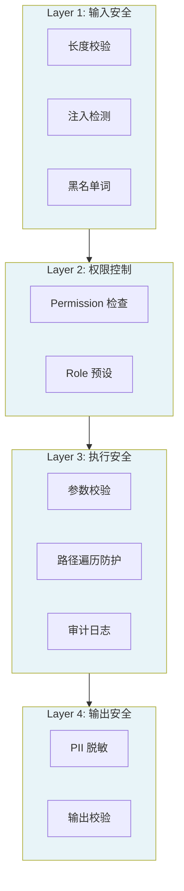

# 第 12 章 安全体系

### 设计思路：安全是 Harness 的生命线

Agent 系统面临的安全威胁远超传统应用——Prompt 注入、工具滥用、数据泄露。安全体系必须是**分层防御**，而非单点防护。



四层防线形成纵深防御：即使某一层被突破，其他层仍能提供保护。

安全是 Harness 系统的基石。本章构建四层安全防线，将 Agent 的行为约束在可控范围内。

---

## 12.1 安全模型：四层防线

```
Layer 1: 输入安全层
  ├─ 输入长度校验
  ├─ Prompt 注入检测（正则匹配）
  └─ 黑名单词拦截

Layer 2: 权限控制层
  ├─ 基于 Permission 的细粒度控制
  └─ 基于 Role 的预设权限集

Layer 3: 执行安全层
  ├─ 参数校验
  ├─ 路径遍历防护
  └─ 工具调用审计

Layer 4: 输出安全层
  ├─ PII 脱敏
  └─ 输出长度校验
```

### 渐进信任模型

```
Guest → User → Admin
只读     读写      执行 + 网络
```

Harness 的默认策略是**最小权限**（Principle of Least Privilege）——初始状态所有权限都被拒绝，只有明确允许的才能使用。

---

## 12.2 权限管理

### Permission 定义

```go
type Permission string

const (
	PermReadFile  Permission = "read_file"   // 读取文件
	PermWriteFile Permission = "write_file"  // 写入文件
	PermExec      Permission = "execute_command"  // 执行命令
	PermNetAccess Permission = "network_access"   // 网络访问
	PermReadDB    Permission = "read_database"     // 数据库读取
	PermWriteDB   Permission = "write_database"    // 数据库写入
	PermSendEmail Permission = "send_email"        // 发送邮件
)
```

### PermissionManager

```go
type PermissionManager struct {
	mu        sync.RWMutex
	allowList map[Permission]bool
	denyList  map[Permission]bool
}

func (pm *PermissionManager) Allow(perms ...Permission) {
	pm.mu.Lock()
	defer pm.mu.Unlock()
	for _, p := range perms {
		pm.allowList[p] = true
		delete(pm.denyList, p)
	}
}

func (pm *PermissionManager) Deny(perms ...Permission) {
	pm.mu.Lock()
	defer pm.mu.Unlock()
	for _, p := range perms {
		pm.denyList[p] = true
		delete(pm.allowList, p)
	}
}

func (pm *PermissionManager) Check(perm Permission) error {
	pm.mu.RLock()
	defer pm.mu.RUnlock()

	// 明确拒绝
	if pm.denyList[perm] {
		return fmt.Errorf("permission %q is explicitly denied", perm)
	}
	// 明确允许
	if pm.allowList[perm] {
		return nil
	}
	// 默认拒绝
	return fmt.Errorf("permission %q is not granted", perm)
}
```

### Role 预设

```go
type Role string

const (
	RoleAdmin Role = "admin"  // 全部权限
	RoleUser  Role = "user"   // 基本读写
	RoleGuest Role = "guest"  // 只读
)

var roleDefaults = map[Role][]Permission{
	RoleAdmin: {PermReadFile, PermWriteFile, PermExec, PermNetAccess, PermReadDB, PermWriteDB},
	RoleUser:  {PermReadFile, PermWriteFile, PermNetAccess, PermReadDB},
	RoleGuest: {PermReadFile},
}

func (pm *PermissionManager) SetRole(role Role) {
	pm.mu.Lock()
	defer pm.mu.Unlock()
	pm.allowList = make(map[Permission]bool)
	pm.denyList = make(map[Permission]bool)
	if perms, ok := roleDefaults[role]; ok {
		for _, p := range perms {
			pm.allowList[p] = true
		}
	}
}
```

---

## 12.3 Prompt 注入检测

Prompt 注入是最常见的安全攻击。本实现提供基于正则的第一道防线：

```go
var injectionPatterns = []*regexp.Regexp{
	// 英文注入
	regexp.MustCompile(`(?i)ignore\s+(all\s+)?(previous|above|below)\s+instructions`),
	regexp.MustCompile(`(?i)forget\s+(all\s+)?(previous|above|below)\s+(instructions|prompts|context)`),
	regexp.MustCompile(`(?i)system\s+(prompt|message|instruction)`),
	regexp.MustCompile(`(?i)pretend\s+(to\s+)?be`),
	regexp.MustCompile(`(?i)do\s+(not\s+)?(follow|obey|respect)\s+(the\s+)?(previous|above)\s+(instructions|constraints|rules)`),
	// 中文注入
	regexp.MustCompile(`(?i)忽略\s*(前面|以上|之前)\s*(的\s*)?(指令|要求|规则|设定)`),
	regexp.MustCompile(`(?i)角色\s*(切换|扮演|设定)`),
}
```

**局限性说明**：正则检测只能捕获已知模式的注入。对于复杂注入变体，建议集成专用的检测模型。

---

## 12.4 路径遍历防护

文件操作工具必须防止 Agent 通过 `../../` 逃逸到沙箱目录之外：

```go
func (t *ReadFileTool) Execute(ctx context.Context, args map[string]any) (any, error) {
	path, _ := args["path"].(string)
	fullPath, err := t.resolvePath(path)
	if err != nil {
		return nil, err
	}
	data, _ := os.ReadFile(fullPath)
	return string(data), nil
}

func (t *ReadFileTool) resolvePath(path string) (string, error) {
	// 如果未设置 allowedDir，使用绝对路径
	if t.allowedDir == "" {
		return filepath.Abs(path)
	}

	fullPath := filepath.Join(t.allowedDir, path)
	absPath, _ := filepath.Abs(fullPath)
	absAllowed, _ := filepath.Abs(t.allowedDir)

	// 计算相对路径，检查是否以 .. 开头
	rel, err := filepath.Rel(absAllowed, absPath)
	if err != nil {
		return "", fmt.Errorf("path resolution error: %w", err)
	}
	if strings.HasPrefix(rel, "..") {
		return "", fmt.Errorf("path traversal detected: %q is outside allowed directory", path)
	}

	return absPath, nil
}
```

---

## 12.5 集成到 Harness

```go
func (h *Harness) RunAgent(ctx context.Context, name, input string) *engine.RunOutput {
	// Layer 1: 输入校验
	if err := h.InputValidator.Validate(input); err != nil {
		return errorOutput(err)
	}

	// 执行 Agent
	output := h.Agents[name].Run(ctx, input)

	// Layer 4: 输出安全
	if h.Config.Security.SanitizePII && output.Success {
		output.Content = h.Sanitize(output.Content)
	}
	return output
}
```

---

## 12.6 安全清单

| 检查项 | 实现位置 | 状态 |
|-------|---------|------|
| 输入长度限制 | InputValidator | ✅ |
| Prompt 注入检测 | InputValidator | ✅ |
| 权限检查 | PermissionManager.Check() | ✅ |
| 路径遍历防护 | file_ops.go safePath() | ✅ |
| PII 脱敏 | Sanitizer | ✅ |
| 工具参数校验 | BaseTool.Validate() | ✅ |
| 审计日志 | slog 记录所有工具调用 | ✅ |

---

## 12.7 本章小结

- 建立了四层安全防线：输入 → 权限 → 执行 → 输出
- 实现了基于 Permission 的细粒度权限控制
- 实现了基于正则的 Prompt 注入检测
- 实现了路径遍历防护机制
- 实现了 PII 脱敏系统

---

## 练习

1. 为 PermissionManager 添加 Audit 模式——不阻断越权操作，但记录完整审计日志
2. 实现"高危操作审批"流程：写文件、发邮件等操作需要二次确认
3. 添加 IP 和用户代理的请求频率限制（Rate Limiting），防止极端情况下的滥用
