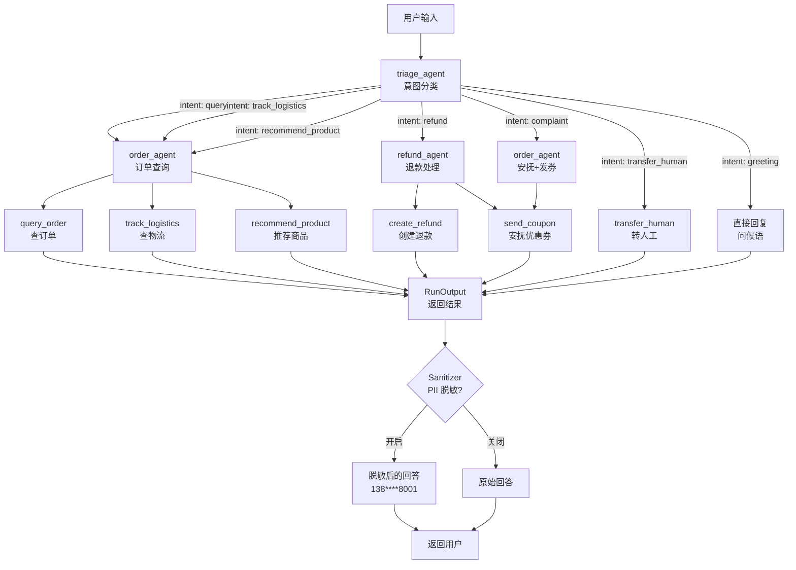
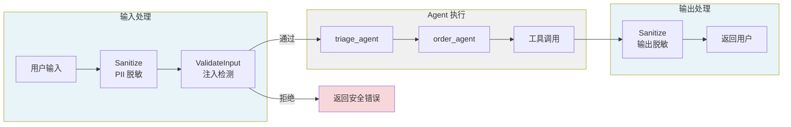

# 第 13 章 🏆 JD 智能客服 — 完整工程示例

### 设计思路：为什么选京东客服作为示例？

京东客服是 Agent Harness 系统的**理想验证场景**：

1. **多意图识别**：用户可能查订单、问物流、要退款、要推荐——需要意图分类
2. **多工具协作**：每个意图需要不同的工具组合
3. **安全敏感**：订单数据、手机号都是敏感信息，必须脱敏
4. **容错需求**：订单系统、物流系统可能不可用
5. **编排复杂**：售后流程需要多步骤、有条件分支

这个场景把 Engine、Tool、Memory、Model、Workflow、Security 和 Harness 门面组合起来。MCP、自动重试、持久化会话和生产级业务鉴权仍是扩展方向，不能因为 Demo 可运行就认为生产能力已经齐备。

本章将前面 12 章的所有子系统组装为一个有业务价值的完整系统：京东智能客服。

---

## 13.1 需求分析

### 13.1.1 业务场景

京东智能客服需要处理以下类型的用户请求：

| 场景 | 示例 | 需要的工具 |
|------|------|-----------|
| 订单查询 | "帮我查一下订单 ord1001" | `query_order` |
| 物流跟踪 | "快递到哪了？" | `track_logistics` |
| 商品推荐 | "有什么好用的机械键盘？" | `recommend_product` |
| 退款退货 | "显示器有坏点，我要退货" | `create_refund` |
| 人工客服 | "转人工！" | `transfer_human` |
| 投诉安抚 | "太慢了，我要投诉！" | `send_coupon` |

### 13.1.2 系统流程

```
用户消息 → [Harness.RunAgent]
            │
            ▼
   ┌─ triage_agent (意图分类)
   │
   ├─ 意图: 订单查询 ──→ order_agent ──→ 返回结果
   ├─ 意图: 物流跟踪 ──→ order_agent ──→ 返回结果
   ├─ 意图: 商品推荐 ──→ order_agent ──→ 返回结果
   ├─ 意图: 退款退货 ──→ refund_agent ──→ 返回结果
   ├─ 意图: 转人工   ──→ transfer ──→ 排队消息
   └─ 意图: 问候    ──→ 直接回复
```

### 完整业务流程图



### 13.1.3 安全要求与 Demo 边界

- 手机号必须脱敏（138****8001）：Demo 已通过 `SanitizePII` 覆盖最终输入输出
- 订单数据仅允许关联用户查看：**生产要求，Demo 尚无登录身份与归属校验**
- 退款操作需二次确认：**生产要求，Demo 当前会直接创建内存中的退款记录**

这里体现了一个重要设计原则：正则脱敏、工具权限和业务授权是不同安全层。框架级 Security 无法自动知道“这个订单是否属于当前用户”，领域规则必须在业务 Tool 中使用可信身份验证。

---

## 13.2 业务模型设计

### 13.2.1 数据模型

```go
type Order struct {
	OrderID     string      `json:"order_id"`
	UserID      string      `json:"user_id"`
	ProductName string      `json:"product_name"`
	Price       float64     `json:"price"`
	Quantity    int         `json:"quantity"`
	Status      OrderStatus `json:"status"`
	Phone       string      `json:"phone"`       // 敏感字段
	Address     string      `json:"address"`
	TrackingNum string      `json:"tracking_number,omitempty"`
}

type User struct {
	UserID   string `json:"user_id"`
	Name     string `json:"name"`
	Phone    string `json:"phone"`    // 敏感字段
	Level    string `json:"level"`    // gold/silver/bronze
	Points   int    `json:"points"`
}

type Product struct {
	ProductID   string  `json:"product_id"`
	Name        string  `json:"name"`
	Category    string  `json:"category"`
	Price       float64 `json:"price"`
	Stock       int     `json:"stock"`
	Rating      float64 `json:"rating"`
}

type RefundRequest struct {
	RequestID string  `json:"request_id"`
	OrderID   string  `json:"order_id"`
	Amount    float64 `json:"amount"`
	Status    string  `json:"status"`
}
```

### 13.2.2 模拟数据

用于演示的模拟数据涵盖完整业务场景：

- **5 个用户**：不同会员等级（gold/silver/bronze）
- **5 个订单**：涵盖所有订单状态（待付款/已付款/已发货/已签收）
- **6 个商品**：涵盖手机、笔记本、外设、显示器等品类
- **1 个退款申请**：用于演示退款流程
- **3 条物流记录**：含完整运输轨迹

---

## 13.3 工具实现

### 13.3.1 意图分类工具

```go
type IntentClassifierTool struct {
	tool.BaseTool
}

func (t *IntentClassifierTool) Execute(ctx context.Context, args map[string]any) (any, error) {
	input := strings.ToLower(args["input"].(string))

	intent, confidence := classifyByKeywords(input)

	return map[string]any{
		"intent":     string(intent),
		"confidence": confidence,
	}, nil
}

func classifyByKeywords(input string) (IntentType, float64) {
	patterns := []struct {
		intent   IntentType
		keywords []string
		weight   float64
	}{
		{IntentGreeting, []string{"你好", "您好", "在吗", "hi", "hello"}, 0.4},
		{IntentQueryOrder, []string{"订单", "买了", "下单", "查", "我的订单"}, 0.5},
		{IntentTrackLogistics, []string{"物流", "快递", "配送", "发货", "到哪"}, 0.6},
		{IntentRefund, []string{"退款", "退货", "退钱", "不想要"}, 0.7},
		{IntentRecommend, []string{"推荐", "有什么", "哪个好", "买什么"}, 0.5},
		{IntentComplaint, []string{"投诉", "差评", "太差", "垃圾", "不满意"}, 0.6},
		{IntentTransfer, []string{"人工", "转人工", "客服", "找人工", "活人"}, 0.8},
	}

	// 计算每个意图的匹配分数
	bestScore := 0.0
	bestIntent := IntentUnknown
	for _, p := range patterns {
		score := 0.0
		for _, kw := range p.keywords {
			if strings.Contains(input, kw) {
				score += p.weight
			}
		}
		if score > bestScore {
			bestScore = score
			bestIntent = p.intent
		}
	}

	if bestScore < 0.1 {
		bestScore = 0.1
	}
	if bestScore > 0.95 {
		bestScore = 0.95
	}

	return bestIntent, bestScore
}
```

### 13.3.2 业务工具

每个业务工具都遵循统一的 `Tool` 接口：

**订单查询工具**：

```go
type QueryOrderTool struct {
	tool.BaseTool
}

func NewQueryOrderTool() *QueryOrderTool {
	return &QueryOrderTool{
		BaseTool: tool.NewBaseTool(
			"query_order",
			"查询订单信息，包括订单状态、商品、金额等",
			[]model.ToolParameter{
				{
					Name:        "order_id",
					Type:        "string",
					Description: "订单号",
					Required:    true,
				},
			},
		),
	}
}

func (t *QueryOrderTool) Execute(ctx context.Context, args map[string]any) (any, error) {
	orderID, _ := args["order_id"].(string)
	order, ok := MockOrders[orderID]
	if !ok {
		return nil, fmt.Errorf("订单 %s 不存在", orderID)
	}
	return map[string]any{
		"order_id":     order.OrderID,
		"product_name": order.ProductName,
		"price":        order.Price,
		"quantity":     order.Quantity,
		"status":       order.Status,
		"created_at":   order.CreatedAt.Format("2006-01-02 15:04"),
		"tracking_number": order.TrackingNum,
	}, nil
}
```

**物流跟踪工具**：

```go
type TrackLogisticsTool struct {
	tool.BaseTool
}

func (t *TrackLogisticsTool) Execute(ctx context.Context, args map[string]any) (any, error) {
	trackingNum, _ := args["tracking_number"].(string)
	info, ok := MockLogistics[trackingNum]
	if !ok {
		return nil, fmt.Errorf("物流单号 %s 不存在", trackingNum)
	}

	events := make([]map[string]string, len(info.Events))
	for i, e := range info.Events {
		events[i] = map[string]string{
			"time": e.Time, "event": e.Event, "station": e.Station,
		}
	}
	return map[string]any{
		"tracking_number":  info.TrackingNum,
		"status":           info.Status,
		"location":         info.Location,
		"estimated_arrival": info.EstArrival,
		"events":           events,
	}, nil
}
```

**退款创建工具**：

```go
type CreateRefundTool struct {
	tool.BaseTool
}

func (t *CreateRefundTool) Execute(ctx context.Context, args map[string]any) (any, error) {
	orderID, _ := args["order_id"].(string)
	userID, _ := args["user_id"].(string)
	reason, _ := args["reason"].(string)
	amount, _ := args["amount"].(float64)

	// 校验订单存在
	order, ok := MockOrders[orderID]
	if !ok { return nil, fmt.Errorf("订单 %s 不存在", orderID) }

	// 校验订单归属
	if order.UserID != userID {
		return nil, fmt.Errorf("该订单不属于用户 %s", userID)
	}

	// 校验订单状态（只有已收货才能退款）
	if order.Status != OrderDelivered && order.Status != OrderCompleted {
		return nil, fmt.Errorf("订单状态为 %s，不可申请退款", order.Status)
	}

	return map[string]any{
		"request_id": "ref" + orderID,
		"order_id":   orderID,
		"amount":     amount,
		"status":     "pending",
		"message":    fmt.Sprintf("退款申请已提交，金额 ¥%.2f，预计1-3个工作日审核", amount),
	}, nil
}
```

**优惠券发放工具**（安抚用）：

```go
type SendCouponTool struct {
	tool.BaseTool
}

func (t *SendCouponTool) Execute(ctx context.Context, args map[string]any) (any, error) {
	userID, _ := args["user_id"].(string)
	amount, _ := args["amount"].(float64)
	reason, _ := args["reason"].(string)

	if _, ok := MockUsers[userID]; !ok {
		return nil, fmt.Errorf("用户 %s 不存在", userID)
	}

	return map[string]any{
		"success": true,
		"message": fmt.Sprintf("已发放 ¥%.0f 优惠券。原因：%s", amount, reason),
		"coupon_id": fmt.Sprintf("cpn_%s", userID),
	}, nil
}
```

---

## 13.4 Agent 定义

### 分流 Agent

```go
triageAgent, err := h.CreateAgentWithTools("triage_agent",
	`你是京东智能客服的分流系统。
你的职责是分析用户输入，判断用户意图。

可识别意图：
- query_order: 查询订单信息
- track_logistics: 查询物流
- refund: 退款退货
- recommend_product: 商品推荐
- complaint: 投诉/不满
- greeting: 问候/开场白
- transfer_human: 用户要求转人工

分析用户输入后，调用 classify_intent 工具返回分类结果。`,
	"classify_intent",
)
if err != nil { return err }
```

### 订单 Agent

```go
orderAgent, err := h.CreateAgentWithTools("order_agent",
	`你是京东智能客服的订单专员。
你可以查询订单信息、物流状态。
如果用户需要退款，转交给退款专员。
如果用户不满，可以发放优惠券安抚。
如果无法处理，转人工客服。
请使用工具获取数据后，用中文友好回答。`,
	"get_user_info", "query_order", "list_user_orders", "track_logistics",
	"recommend_product", "transfer_human", "send_coupon",
)
if err != nil { return err }
```

### 退款 Agent

```go
refundAgent, err := h.CreateAgentWithTools("refund_agent",
	`你是京东智能客服的退款专员。
你处理用户的退款、退货申请。
注意：
- 只有已收货的订单才能申请退款
- 退款金额不能超过订单金额
- 创建退款后告知用户审核时间（1-3个工作日）
如果用户不满，可以配合发优惠券安抚。
无法处理的请转人工。`,
	"get_user_info", "query_order", "create_refund", "transfer_human", "send_coupon",
)
if err != nil { return err }
```

---

## 13.5 Agent 注册

```go
func SetupAgents(h *agent.Harness) (*engine.Agent, *engine.Agent, *engine.Agent, error) {
	// 注册意图分类工具
	if err := h.RegisterTool(NewIntentClassifierTool()); err != nil {
		return nil, nil, nil, err
	}

	// 注册业务工具
	for _, t := range []tool.Tool{
		NewGetUserInfoTool(),
		NewQueryOrderTool(),
		NewListOrdersByUserTool(),
		NewTrackLogisticsTool(),
		NewRecommendProductTool(),
		NewCreateRefundTool(),
		NewTransferHumanTool(),
		NewSendCouponTool(),
	} {
		if err := h.RegisterTool(t); err != nil {
			return nil, nil, nil, err
		}
	}

	// 创建三个 Agent
	triage, err := h.CreateAgentWithTools("triage_agent", systemPromptTriage, "classify_intent")
	if err != nil { return nil, nil, nil, err }
	order, err := h.CreateAgentWithTools("order_agent", systemPromptOrder,
		"get_user_info", "query_order", "list_user_orders", "track_logistics",
		"recommend_product", "transfer_human", "send_coupon",
	)
	if err != nil { return nil, nil, nil, err }
	refund, err := h.CreateAgentWithTools("refund_agent", systemPromptRefund,
		"get_user_info", "query_order", "create_refund", "transfer_human", "send_coupon",
	)
	if err != nil { return nil, nil, nil, err }

	return triage, order, refund, nil
}
```

这里使用 `CreateAgentWithTools`，同时解决两个问题：名称为空或重复时初始化立刻失败；每个 Agent 只看见职责需要的工具。所有 Agent 仍可共享并发安全 Registry，但 Registry 是能力目录，不代表每个 Agent 都拥有全部能力。白名单也在执行阶段复查，所以不能靠伪造 ToolCall 绕过。

---

## 13.6 Workflow 售后处理流程

仓库提供两个 Workflow 示例。Demo 入口实际运行 `BuildCSWorkflow`：先执行 triage Step，再用 ConditionNode 路由到退款、转人工、问候或订单 Agent。`BuildAfterSalesWorkflow` 用于展示“验证 → 退款 → 条件补偿”的顺序控制流，并未在 `cmd/jd-cs-service/main.go` 中注册。

`BuildCSWorkflow` 的 `AfterExecute` 最终还会根据原始输入调用确定性的 `classifyIntent` 更新 State。这样做是为了让无真实模型的 Mock Demo 也能稳定路由。代价是模型分类结果不是唯一事实来源；生产系统应明确选择模型分类、规则分类或二者仲裁，避免两套分类器静默冲突。

```go
func BuildAfterSalesWorkflow(orderAgent, refundAgent *engine.Agent) *workflow.Workflow {
	wf := workflow.NewWorkflow(workflow.WorkflowConfig{
		ID:   "after-sales",
		Name: "售后处理工作流",
	})

	// 步骤 1: 验证订单
	verifyOrder := workflow.NewStepNode("verify_order", orderAgent)

	// 步骤 2: 处理退款
	processRefund := workflow.NewStepNode("process_refund", refundAgent)

	// 条件判断：是否需要补偿
	needsCompensation := workflow.NewConditionNode("needs_compensation",
		func(input string, state *workflow.State) (bool, error) {
			needs, _ := state.Get("needs_compensation")
			return fmt.Sprintf("%v", needs) == "true", nil
		},
		workflow.NewStepNode("compensation", orderAgent),  // true: 发优惠券
		workflow.NewStepNode("done", orderAgent),          // false: 完成
	)

	wf.AddNode(verifyOrder)
	wf.AddNode(processRefund)
	wf.AddNode(needsCompensation)

	return wf
}
```

---

## 13.7 安全配置

```go
// 在 main 函数中配置安全策略
cfg.Security.SanitizePII = true          // 开启 PII 脱敏
cfg.Security.EnableInjectionCheck = true  // 开启注入检测
cfg.PermissionMode = "strict"             // 严格权限模式

// New 会根据 SecurityConfig 构造内置 Validator 与 Sanitizer。
h, err := agent.New(cfg)
if err != nil { return err }

// strict 模式默认不授予受控权限；Demo 显式开放只读文件和网络。
h.AllowPermissions(security.PermReadFile, security.PermNetAccess)
```

Demo 的订单、退款等业务 Tool 当前没有接入领域权限映射，所以 `strict` 并不等于“订单权限已经完备”。真实系统应把登录用户身份放入可信 Context，在 `QueryOrderTool` / `CreateRefundTool` 中检查资源归属、角色、二次确认和幂等键。

### 安全集成流程图



---

## 13.8 运行与测试

### 示例效果（说明性输出）

下面展示真实模型和工具按预期协作时的理想效果，不是 Mock 模型的固定输出，也不是测试断言。实际文本、Token 和耗时会随模型与环境变化；无 API Key 时 Demo 回退到 Mock，重点验证组装和路由，不会生成同等自然语言效果。

```
═══════════════════════════════════════
🟢 场景 1: 订单查询
═══════════════════════════════════════
用户: 你好，帮我查一下订单 ord1001
客服: 您好！订单 ord1001（iPhone 16 Pro Max）
      已于 2026-06-04 签收，金额 ¥9999。
      快递单号: SF1234567890
      请问还需要其他帮助吗？
─────────────────────────────────────
响应时间: 2.3s | Token: 458 | 循环: 2

═══════════════════════════════════════
🟢 场景 2: 退款申请
═══════════════════════════════════════
用户: 显示器有坏点，我要退货
客服: 非常抱歉给您带来不便。
      订单 ord1005（戴尔 U2724D 显示器，¥3299）
      已签收，符合退货条件。
      已提交退款申请，预计1-3个工作日审核。
─────────────────────────────────────
响应时间: 3.1s | Token: 623 | 循环: 3

═══════════════════════════════════════
🟢 场景 3: 商品推荐
═══════════════════════════════════════
用户: 有什么好用的机械键盘推荐？
客服: 为您推荐机械键盘 K8 Pro，售价 ¥599，
      87键无线蓝牙双模，评分 4.5⭐，有货。
      如果预算严格在500以内，可以关注
      我们的促销活动。
─────────────────────────────────────
响应时间: 1.8s | Token: 387 | 循环: 2
```

---

## 13.9 知识点回顾

从第 1 章到第 13 章，我们构建了一个完整的 Go Harness Agent 框架：

| 章节 | 成果 | 在 JD 客服中的应用 |
|------|------|-------------------|
| 01 | 项目结构、核心类型 | `types.Message` 承载用户对话 |
| 02 | Harness 门面设计 | `Harness.RunAgent()` 统一入口 |
| 03 | 运行时引擎 | 每个客服 Agent 的运行循环 |
| 04 | 工具层 | 8 个客服业务工具 |
| 05 | 记忆子系统 | 维护对话上下文 |
| 06 | 模型集成 | 调用 LLM 理解自然语言 |
| 07 | 输出治理 | 手机号脱敏、注入检测 |
| 08 | 编排引擎 | 售后处理 Workflow |
| 09 | MCP 协议 | 可用于未来对接外部物流系统；当前 Demo 使用内存 Tool |
| 10 | 生产化 | JSON 配置、可注入的 slog 日志 |
| 11 | 容错 | 当前使用超时、Context 与循环上限；自动重试待扩展 |
| 12 | 安全 | 权限、脱敏、校验 |

---

## 13.10 扩展方向

1. **AgentOS Server** — 添加 Gin HTTP 服务，将 Agent 暴露为 REST API
2. **长期记忆** — 接入 PostgreSQL/MongoDB 持久化会话历史
3. **RAG 知识库** — 接入 ChromaDB，回答产品知识问题
4. **多会话隔离** — 同一 Agent 的多次 Run 会共享 Memory；增加 Session → Memory/Agent 路由，避免不同用户串线
5. **运行排错** — 在应用入口集中记录 RunID、结构化错误和必要的安全日志
6. **A/B 测试** — 同时在两个模型上运行，对比效果

---

## 13.11 练习

1. 添加"改地址"功能：实现 `UpdateAddressTool`，注意权限控制
2. 添加"取消订单"功能：仅允许取消未发货的订单
3. 实现简单 Dashboard：统计每日客服对话量、平均响应时间、满意度
4. 集成真实 API：将 MockOrders 替换为 HTTP 调用真实订单系统
